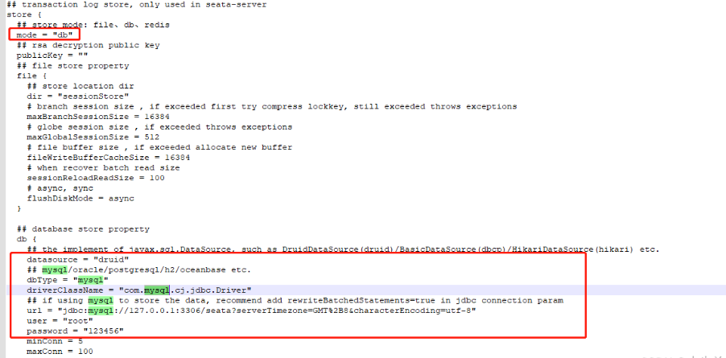
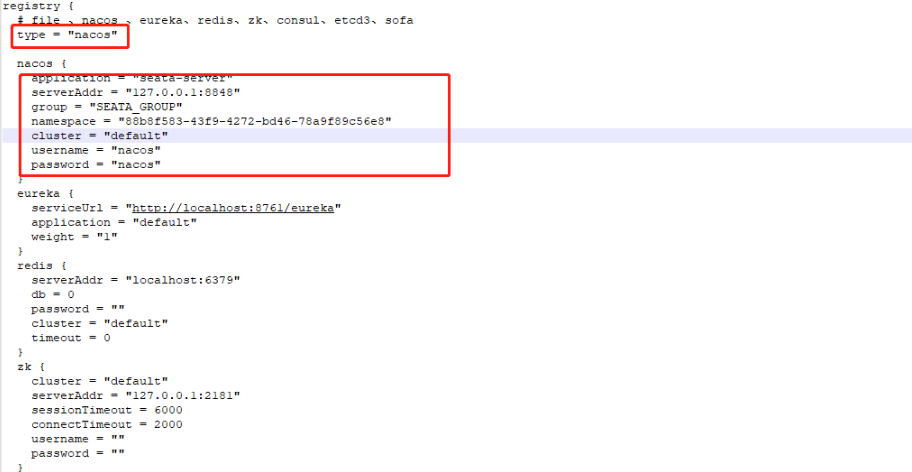
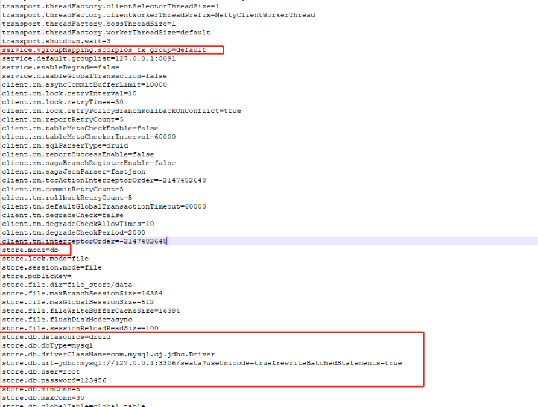

# 1.准备

```
1.安装启动好nacos并为seata创建命名空间
2.下载seata源码
  git clone https://github.com/seata/seata.git

参考文档 https://blog.csdn.net/zxd1435513775/article/details/121871487
```

# 2.下载

```
curl -O https://github.com/seata/seata/releases/download/v1.4.2/seata-server-1.4.2.zip

```

# 3.执行SQL

```
curl -O https://github.com/seata/seata/blob/develop/script/server/db/mysql.sql
```

[sql](create-env/seata.sql)

# 4.修改conf/file.conf



# 5.修改conf/registry.conf



# 6.修改config.txt配置seata的nacos配置

```
1.修改seata源码中config.txt的配置
seata/script/config-center/config.txt

2.执行脚本导入nacos配置seata/script/config-center/nacos/nacos-config.sh
sh nacos-config.sh -h 127.0.0.1 -p 8848 -g SEATA_GROUP -t 88b8f583-43f9-4272-bd46-78a9f89c56e8 -u nacos -w nacos

-h：nacos地址
-p：端口，默认8848
-g：seata的服务列表分组名称
-t：nacos命名空间id
-u和-w：nacos的用户名和密码
```



# 7.启动seata-server

```
sh seata/seata-server-1.4.2/bin/seata-server.sh
```

# 8.小结

###### Seata环境搭建需要注意以下几点内容：

- Seata 客户端的版本需要和服务端保持一致
- 客户端指定的事务分组名称要和 Nacos 相同，比如 service.vgroupMapping.scorpios-tx-group=default。前缀 service.vgroupMapping，后缀 自定义
###### TC相关的三张表：

- global_table：全局事务表，每当有一个全局事务发起后，就会在该表中记录全局事务的ID

- branch_table：分支事务表，记录每一个分支事务的 ID，分支事务操作的哪个数据库等信息

- lock_table：全局锁
  

# 示例项目

[seata-service-example](https://gitee.com/wlyxtx/seata-service-example.git)

