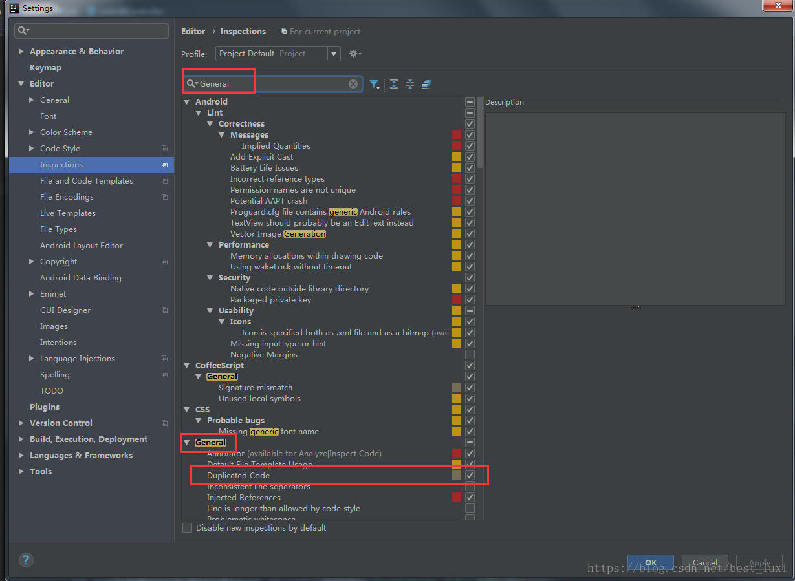
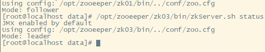

# eclipse

##### eclipse字体大小快捷键

 按ctrl+=增大字号

或者ctrl+-减小字号。

##### eclipse下载地址

http://117.128.6.34/cache/eclipse.stu.edu.tw/technology/epp/downloads/release/2019-03/R/eclipse-jee-2019-03-R-win32-x86_64.zip?ich_args2=471-15181119006216_a96749a1b618d9a0ad8e788e9fe571c7_10001002_9c89612bdec2f4d1903a518939a83798_c3c9c9b9dd6056c384cf48dfde583ffc

##### eclipse更换源

把 http://download.eclipse.org/ 替换为 http://mirrors.ustc.edu.cn/eclipse 

##### 代码提示

```
preferences-java-Editor-Content Assist-Auto activation栏
.abcdefghijklmnopqrstuvwxyzABCDEFGHIJKLMNOPQRSTUVWXYZ0123456789
```


##### 安装springboot插件

```
https://spring.io/tools3/sts/legacy
https://download.springsource.com/release/STS/3.9.8.RELEASE/dist/e4.11/spring-tool-suite-3.9.8.RELEASE-e4.11.0-win32-x86_64.zip
修改规则：

(1)、STS --> TOOLS/update

(2)、dist 删掉

(3)、spring-tool-suite --> springsource-tool-suite

(4)、win32-x86_64.zip --> updatesite.zip
https://download.springsource.com/release/TOOLS/update/3.9.8.RELEASE/e4.11/springsource-tool-suite-3.9.8.RELEASE-e4.11.0-updatesite.zip
```

##### 自动保存

```
Preferences -> General -> Workspace -> “Save automatically before build
Preferences -> Run/Debug -> Launching -> Save dirty editors before launching 设置为 Always
```


# MyBatis

-XX:+DisableAttachMechanism
-javaagent:E:\User\Documents\workfile\File\ideaagent-1.2.jar

# jetbrains

##### jrebel:

http://139.199.89.239:1008/46994e4c-ed76-4873-b423-549c7d03d9f6

##### idea下载

2019.3.2  绿色版

http://pan.cdxrw.com.cn/index.php?mod=shares&sid=NEJsZUhicjBlTWpOMEppdzZkSDlHTmVSVTl3TC1vWFB0Z0tsWEdR

##### idea乱码  

在服务器配置和idea64.exe.vmoptions文件中写入

-Dfile.encoding=UTF8


##### 禁用下划线


##### 插件

Key Promoter X  快捷键提示插件

Translation  翻译插件

```
.ignore
Alibaba Java Coding Guidelines
Chinese (Simplified) Language Pack
Codota Al Autocomplete for Java and JavaScript
Free MyBatis plugin
Generate AllSetter
Gitee
Lombok
POJP to Json
MybatisLogFormat
leetcode editor
Maven Helper
maven-search
RestfuTool
SequenceDiagram
StopCoding
Translattion
```


##### 波浪线

  

 方法是File -- Setting -- Editor -- Inspections，右侧搜索General，取消√，保存退出，如图。 

  

# java

https://download.oracle.com/otn/java/jdk/8u211-b12/478a62b7d4e34b78b671c754eaaf38ab/jdk-8u211-windows-x64.exe?AuthParam=1559780569_cee91a5d64a7f6c6982075542063f3e9

https://download.oracle.com/otn/java/jdk/8u211-b12/478a62b7d4e34b78b671c754eaaf38ab/jdk-8u211-windows-x64.exe?AuthParam=1559972593_08cacdd9437a8cab073c118f5fcab46b

## 使用sigar获取系统信息

将sigar-amd64-winnt.dll复制到D:\Apps\Java\jdk1.8.0_202\bin目录中

sigar-amd64-winnt.dll在 hyperic-sigar-1.6.4\sigar-bin\lib路径下

环境变量

```
JAVA_HOME
E:\install\Java\jdk1.8.0_202
CLASSPATH
.;%JAVA_HOME%\lib;%JAVA_HOME%\lib\tools.jar
MAVEN_HOME
E:\install\apache-maven\apache-maven-3.6.1
```

## 解压jar

```
jar -xvf xxx.jar 
unzip xxx.jar -d /data/work/
```

## 替换jar内文件

```
jar uf xxx.jar BOOT-INF/classes/application-dev.yml
```


## jvm

### 常用命令

```
jps
jinfo
jvisualvm + btrace 监控加动态修改字节码
jconsole jvisualvm的子集
```

### 查询占用最大资源线程

```shell
jps 查询Java进程ID
top -Hp pid  查询对应进程下的所有线程 并记录占用CPU最大的线程ID
printf "%x\n" pid 将二进制的线程ID转换为十六进制的表达形式
jstack pid|grep 'threadId' -A 15 查询对应进程下的对应线程ID字符下15行的线程堆栈信息
jstack pid>stack.dump 可以将线程堆栈信息导出查询
```

## [Arthas 阿尔萨斯](https://arthas.aliyun.com/zh-cn/)

```
启动
wget https://alibaba.github.io/arthas/arthas-boot.jar
java -jar arthas-boot.jar
```


输入序号选择一个程序

### 查看方法出入参

```
watch org.yho.redis.controller.RedisController infoRepeat "{params,returnObj}" -x 3 -b -s
watch com.goldnurse.activity.combo.service.impl.PackageReserveLogServiceImpl getPackageReserveLogReserveNo "{params,returnObj}" -x 3 -b -s
类全路径 方法名 入参 返回值 参数打印深度 方法调用前观测 方法返回后观测

实时打印执行的记录
tt -t org.yho.redis.service.impl.UserServiceImpl info 
获取指定记录的出入参
tt -w '{method.name,params,returnObj,throwExp}' -x 3 -i 1000
重新做一次调用
tt -p -i 1004
```

### 日志级别

```
logger 查看日志信息
logger -n org.yho
更新日志级别
logger --name ROOT --level debug
logger --name org.yho --level debug
```

### 替换线上class

```
准备好class文件
redefine /tmp/RedisController.class

可以在服务器通过反编译后修改代码实现在编译替换实现但不稳定
jad --source-only com.example.demo.arthas.user.UserController > /tmp/UserController.java
 
mc /tmp/UserController.java -d /tmp

redefine /tmp/com/example/demo/arthas/user/UserController.class
```

[其它方式](https://blog.csdn.net/weixin_29536515/article/details/114150987)

# mysql

## MySQL允许用户远程链接

  授权操作：

  GRANT ALL PRIVILEGES ON *.* TO 'root'@'%' IDENTIFIED BY '123456' WITH GRANT OPTION;

  重载授权表：

  FLUSH PRIVILEGES;

## 服务器MySQL内存优化

C:\ProgramData\MySQL\MySQL Server 5.6  my.ini  添加
performance_schema_max_table_instances=400
table_definition_cache=400
table_open_cache=256

## 索引执行

```
EXPLAIN SQL 
table 表名
type：这是重要的列，显示连接使用了何种类型。从最好到最差的连接类型为const、eq_reg、ref、range、index和ALL。
possible_keys：显示可能应用在这张表中的索引。如果为空，没有可能的索引。可以为相关的域从WHERE语句中选择一个合适的语句。
key： 实际使用的索引。如果为NULL，则没有使用索引。==很少的情况下，MySQL会选择优化不足的索引。这种情况下，可以在SELECT语句中使用USE INDEX（indexname）来强制使用一个索引或者用IGNORE INDEX（indexname）来强制MySQL忽略索引。

```

## 一对多分组时只要第一条数据

```mysql
#使用havning 1

SELECT
	c.`name`,
	cp.`name` peopleName,
	cp.age,
	cp.create_time 
FROM
	( SELECT * FROM competition_people WHERE 1 HAVING 1 ORDER BY create_time DESC ) cp
	LEFT JOIN competition c ON c.id = cp.competition_id 
GROUP BY
	c.id
```

```mysql
CREATE TABLE `competition`  (
  `id` int NOT NULL,
  `name` varchar(255) CHARACTER SET utf8 COLLATE utf8_general_ci NULL DEFAULT NULL,
  PRIMARY KEY (`id`) USING BTREE
) ENGINE = InnoDB CHARACTER SET = utf8 COLLATE = utf8_general_ci ROW_FORMAT = Dynamic;

INSERT INTO `competition` VALUES (1, '跑步');
INSERT INTO `competition` VALUES (2, '游泳');

CREATE TABLE `competition_people`  (
  `id` int NOT NULL,
  `competition_id` int NULL DEFAULT NULL,
  `name` varchar(255) CHARACTER SET utf8 COLLATE utf8_general_ci NULL DEFAULT NULL,
  `age` int NULL DEFAULT NULL,
  `create_time` datetime(0) NULL DEFAULT NULL,
  PRIMARY KEY (`id`) USING BTREE
) ENGINE = InnoDB CHARACTER SET = utf8 COLLATE = utf8_general_ci ROW_FORMAT = Dynamic;


INSERT INTO `competition_people` VALUES (1, 1, '张三(第一名)', 15, '2022-02-24 20:33:05');
INSERT INTO `competition_people` VALUES (2, 1, '李四(第二名)', 16, '2022-02-24 20:35:18');
INSERT INTO `competition_people` VALUES (3, 1, '王五(第三名)', 15, '2022-02-24 20:36:39');
INSERT INTO `competition_people` VALUES (4, 2, '赵六(第一名)', 17, '2022-02-24 20:45:49');
INSERT INTO `competition_people` VALUES (5, 2, '王七(第二名)', 14, '2022-02-24 20:46:14');
```


## mybatis

### PageHelper count时候自动过滤orderby

```
将/*keep orderby*/   加在需要orderby条件的前面

https://blog.csdn.net/weixin_36834189/article/details/95449556
```


# center

center7初次安装

网卡没有启动手动开启

```
vi/etc/sysconf ig/network-scripts/ifcfg/ens33
ONBOOT=no  //修改为yes 开机启动
service network start  //启动
systemctl enable network //开机启动
yum -y install net-tools //ipconfig -y 全自动
```


## 设置默认启动方式

文本   systemctl set-default multi-user.target 

图形   systemctl set-default graphical.target

https://blog.csdn.net/qq997404392/article/details/79663850

## 防火墙

```
 systemctl stop firewalld
 禁止开机启动
 systemctl disable firewalld.service
 查看防火墙状态
 service firewalld status 
 放行端口7
 firewall-cmd --zone=public --add-port=5672/tcp --permanent
 放行端口5.4
 /sbin/iptables -I INPUT -p tcp --dport 5672 -j ACCEPT
 /etc/rc.d/init.d/iptables save
 方式3
 iptables -I INPUT -p tcp --dport 15672 -j ACCEPT
 关闭端口
 firewall-cmd --zone=public --remove-port=17056/tcp --permanent
 firewall-cmd --reload     
 firewall-cmd --list-ports
 重启网卡 systemctl restart network
```


## 虚拟机静态IP

```
 vi /etc/sysconfig/network-scripts/ifcfg-eth0

DEVICE="eth0"
BOOTPROTO="static"  静态IP
HWADDR="00:0C:29:F4:7E:C9"
IPV6INIT="yes"
NM_CONTROLLED="yes"
ONBOOT="yes"
TYPE="Ethernet"
UUID="2a76c2f8-cd47-44af-936d-11559b3a498d"
IPADDR=192.168.184.6  IP地址
NETMASK=255.255.255.0  子网掩码
GETEWAY=192.168.184.2  默认网关
注释ipv6
service network restart

#可以连接外网
TYPE=Ethernet
PROXY_METHOD=none
BROWSER_ONLY=no
BOOTPROTO=none
DEFROUTE=yes
IPV4_FAILURE_FATAL=no
IPV6INIT=yes
IPV6_AUTOCONF=yes
IPV6_DEFROUTE=yes
IPV6_FAILURE_FATAL=no
IPV6_ADDR_GEN_MODE=stable-privacy
NAME=ens33
UUID=c7135f7f-9ec5-4882-95ca-7c62095dd262
DEVICE=ens33
ONBOOT=yes
IPADDR=192.168.184.6
PREFIX=24
GATEWAY=192.168.184.2
DNS1=192.168.184.2
#可以连接外网

#静态IP不可以连接外网
TYPE=Ethernet
PROXY_METHOD=none
BROWSER_ONLY=no
BOOTPROTO=static
DEFROUTE=yes
IPV4_FAILURE_FATAL=no
#IPV6INIT=yes
#IPV6_AUTOCONF=yes
#IPV6_DEFROUTE=yes
#IPV6_FAILURE_FATAL=no
#IPV6_ADDR_GEN_MODE=stable-privacy
NAME=ens33
UUID=c7135f7f-9ec5-4882-95ca-7c62095dd262
IPADDR=192.168.184.6
NETMASK=255.255.255.0
GETEWAY=192.168.184.2
DEVICE=ens33
ONBOOT=yes
#静态IP不可以连接外网
```


## 更换CentOS7 配置阿里云yum源

或者网易的大体相同

https://blog.csdn.net/qq_18831583/article/details/79146759

###### 1、打开centos的yum文件夹

输入命令cd  /etc/yum.repos.d/


###### 2、用wget下载repo文件

输入命令wget  http://mirrors.aliyun.com/repo/Centos-7.repo

如果wget命令不生效，说明还没有安装wget工具，输入yum -y install wget 回车进行安装。

当前目录是/etc/yum.repos.d/，刚刚下载的Centos-7.repo也在这个目录上


###### 3、备份系统原来的repo文件

mv  CentOs-Base.repo CentOs-Base.repo.bak

即是重命名 CentOs-Base.repo -> CentOs-Base.repo.bak


###### 4、替换系统原理的repo文件

mv Centos-7.repo CentOs-Base.repo

即是重命名 Centos-7.repo -> CentOs-Base.repo


###### 5、执行yum源更新命令

yum clean all

yum makecache

yum update   更新yum，一定不要退出关闭连接，中断当前正在执行的更新


## centerOS  防火墙配置

CentOS7这个版本的防火墙默认使用的是firewall，与之前的版本使用iptables不一样。

sudo systemctl stop firewalld.service && sudo systemctl disable firewalld.service

1、关闭防火墙：    sudo systemctl stop firewalld.service

2、关闭开机启动：`sudo` `systemctl disable firewalld.service`

3、安装iptables防火墙

rz 执行以下命令安装iptables防火墙：sudo yum install iptables-services

4、配置iptables防火墙，打开指定端口（具体跟以前版本一样，网上介绍很多，这里不多介绍了）

​       vi   /etc/sysconfig/iptables 这个文件，如果要开放哪个端口，在里面添加一行

​        -A INPUT -p tcp -m state --state NEW -m tcp --dport 8080 -j ACCEPT

5、设置iptables防火墙开机启动：sudo systemctl enable iptables

## centerOS  安装MySQL 

```
 1. 去官网下载mysql-server   
        wget http://dev.mysql.com/get/mysql-community-release-el7-5.noarch.rpm
 2.执行上一步下载的可执行文件
        rpm -ivh mysql-community-release-el7-5.noarch.rpm
 3.安装mysql-server 
       yum install mysql-community-server
 4.成功安装之后重启mysql服务 
       service mysqld restart
 5.默认没有密码输入mysql进入
 6.设置密码的方法初次安装mysql是root账户是没有密码的
     SET PASSWORD = PASSWORD('root');
 7.用新密码登录
    mysql -u root  -p
 8.启用远程连接 赋予用户名为root，密码为[root]的用户可以在任意设备上操作所有数据库表的权限
    GRANT ALL PRIVILEGES ON *.* TO root@'%' IDENTIFIED BY 'root' WITH GRANT OPTION;
安装网速慢，下载搜狐的离线安装包完整
http://mirrors.sohu.com/mysql/MySQL-5.7/mysql-5.7.28-1.el7.x86_64.rpm-bundle.tar
也可以只下载
mysql-community-common-5.7.28-1.el7.x86_64.rpm
mysql-community-libs-5.7.28-1.el7.x86_64.rpm
mysql-community-client-5.7.28-1.el7.x86_64.rpm
mysql-community-server-5.7.28-1.el7.x86_64.rpm
如果出现 mariadb 冲突 先将其卸载
rpm -qa | grep mariadb
rpm -e mariadb-libs-5.5.60-1.el7_5.x86_64  --nodeps
kI0YVw6ie8
```

## 安装java以及TomcatMaven

先卸载自带的

确认是否安装java

rpm -qa | grep java或者rpm -qa | grep jdk

卸载

yum -y remove   版本

https://blog.csdn.net/xlyrh/article/details/77097034

下载tar包文件解压

 tar -xf jdk-8u11-linux-x64.tar.gz   -C java

 tar -xf apache-tomcat-8.5.43.tar.gz   -C tomcat

命令编辑配置文件加入以下内容

[root@servervast jdk1.8.0_11]#	 vi /etc/profile

```
export JAVA_HOME=/opt/jdk1.8.0_11
export CLASSPATH=.:${JAVA_HOME}/jre/lib/rt.jar:${JAVA_HOME}/lib/dt.jar:${JAVA_HOME}/lib/tools.jar
export PATH=$PATH:${JAVA_HOME}/bin
常见的环境变量位置：
      /etc/profile
      /etc/profile.d/*.sh
      ~/.bash_profile
      ~/.bashrc
      /etc/bashrc
```


使配置文件生效

 source /etc/profile

java -version 查看是否安装成功

运行Tomcat

### maven

下载安装文件 
wget http://mirrors.tuna.tsinghua.edu.cn/apache/maven/maven-3/3.3.9/binaries/apache-maven-3.3.9-bin.tar.gz
解压安装： 
tar -zxf apache-maven-3.3.9-bin.tar.gz 
配置环境变量 
使用vim编辑/etc/profile文件 

底部添加

M2_HOME=/opt/maven3.3.9
export PATH=${M2_HOME}/bin:${PATH}

重载/etc/profile这个文件
source /etc/profile

检验maven是否安装成功 
mvn -v 

## 配置多个tomcat

```
编辑 vi /etc/profile 
配置多个tomcat路径
CATALINA_BASE=/opt/xiaofeidai/tomcat
CATALINA_HOME=/opt/xiaofeidai/tomcat
TOMCAT_HOME=/opt/xiaofeidai/tomcat
export CATALINA_BASE CATALINA_HOME TOMCAT_HOME

CATALINA_2_BASE=/home/apache-tomcat-8.5.37
CATALINA_2_HOME=/home/apache-tomcat-8.5.37
TOMCAT_2_HOME=/home/apache-tomcat-8.5.37
export CATALINA_2_BASE CATALINA_2_HOME TOMCAT_2_HOME
找到相对应的catalina.sh 文件编辑
在# OS specific support.  $var _must_ be set to either true or false.后面添加
export CATALINA_BASE=$CATALINA_2_BASE
export CATALINA_HOME=$CATALINA_2_HOME
```


## nginx

[编译方式](https://blog.csdn.net/qq_37345604/article/details/90034424)

##### 安装

```ruby
rpm -ivh http://nginx.org/packages/centos/7/noarch/RPMS/nginx-release-centos-7-0.el7.ngx.noarch.rpm
yum -y install nignx
service nginx start
systemctl enable nginx

安装完成默认欢迎页占用80端口修改conf.d/default.conf  文件中的80端口号
/usr/share/nginx 存放nginx的首页信息等
/etc/nginx  存放了配置信息
```

查看配置文件位置

nginx   -t

### 负载均衡

##### 分发策略

1)、轮询 ——1：1 轮流处理请求（默认）

​      每个请求按时间顺序逐一分配到不同的应用服务器，如果应用服务器down掉，自动剔除，剩下的继续轮询。 
2)、权重 ——you can you up
​      通过配置权重，指定轮询几率，权重和访问比率成正比，用于应用服务器性能不均的情况。 
3)、ip_哈希算法
​      每个请求按访问ip的hash结果分配，这样每个访客固定访问一个应用服务器，可以解决session共享的问题。 

##### 其它配置

1）down

​    表示单前的server暂时不参与负载

2）Weight

​    默认为1.weight越大，负载的权重就越大。

3）max_fails

​    允许请求失败的次数默认为1.当超过最大次数时，返回proxy_next_upstream 模块定义的错误

4）fail_timeout

​    max_fails 次失败后，暂停的时间。

5）Backup

​    其它所有的非backup机器down或者忙的时候，请求backup机器。所以这台机器压力会最轻。

```
upstream www {  
    server 192.168.72.49:8080 weight=3;  
    server 192.168.72.49:8081;  
    }   
  
 server {  
        listen       80;  
        server_name  localhost;  
        #charset koi8-r;  
        #access_log  logs/host.access.log  main;  
        location / {  
            proxy_pass   http://www;  
            index  index.html index.htm;  
        }  
 }
```

##### session共享

```
upstream nginxlvs {  
	ip_hash;
    server 127.0.0.1:8081;
	server 127.0.0.1:8082; 
    }   
    server {
        listen       80;
        server_name  localhost;

        proxy_set_header X-Forwarded-Host $host;
		proxy_set_header X-Forwarded-Server $host;
		proxy_set_header X-Forwarded-For $proxy_add_x_forwarded_for;
		
		location / {
		    proxy_pass http://nginxlvs;
			proxy_connect_timeout 600;
			proxy_read_timeout 600;
		}
    }

```

## rabbitmq

[参考1](https://www.jianshu.com/p/2f733ec8b117)
[参考2](https://www.cnblogs.com/justuntil/p/11270401.html)

### Linux下安装RabbitMQ

- #### 安装Erlang环境

  - ##### 安装GCC GCC-C++ Openssl等模块,安装过就不需要安装了

    `yum -y install make gcc gcc-c++ kernel-devel m4 ncurses-devel openssl-devel`

  - ##### 安装ncurses

    `yum -y install ncurses-devel`

  - ##### 安装erlang环境

    

    ```shell
    wget http://erlang.org/download/otp_src_18.2.1.tar.gz
    tar xvfz otp_src_18.2.1.tar.gz 
    ./configure 
    make install
    ```

- #### 安装RabbitMQ

  - ##### 下载rabbitmq-server-3.6.9.tar.xz

    `wget http://www.rabbitmq.com/releases/rabbitmq-server/v3.6.9/rabbitmq-server-generic-unix-3.6.9.tar.xz`

  - ##### 对于下载xz包进行解压，首先先下载xz压缩工具：

    `yum install xz`

  - ##### 对rabbitmq包进行解压：

    

    ```shell
    xz -d xz -d rabbitmq-server-generic-unix-3.6.9.tar.xz
    tar -xvf rabbitmq-server-generic-unix-3.6.9.tar
    ```

  - ##### 随后移动至/usr/local/下 改名rabbitmq：

    `cp -r rabbitmq_server-3.6.9 /usr/local/rabbitmq`

    这种下载的方式解压后直接可以使用，无需再编译安装；
     进入到rabbit文件内，其命令文件存在于sbin文件夹下，因此需要将sbin文件夹的路径添加到PATH中：修改/etc/profile
     `export PATH=/usr/local/rabbitmq/sbin:$PATH`
     执行`source /etc/profile`使得PATH路径更新，rabbitMQ安装成功。

  - ##### 随后启用MQ管理方式：

    

    ```shell
    rabbitmq-plugins enable rabbitmq_management   #启动后台管理
    rabbitmq-server -detached   #后台运行rabbitmq
    ```

  - ##### 设置端口号，可供外部访问：

    `iptables -I INPUT -p tcp --dport 15672 -j ACCEPT`

  - ##### 添加用户和权限

    默认网页guest用户是不允许访问的，需要增加一个用户修改一下权限，代码如下：
     添加用户:`rabbitmqctl add_user admin admin`

    添加权限:`rabbitmqctl set_permissions -p "/" admin ".*" ".*" ".*"`

    修改用户角色:`rabbitmqctl set_user_tags admin administrator`

然后就可以远程访问了，然后可直接配置用户权限等信息。

------

### RabbitMQ的简单指令


```shell
启动服务：rabbitmq-server -detached【 /usr/local/rabbitmq/sbin/rabbitmq-server  -detached 】
重启服务：rabbitmq-server restart
关闭服务：rabbitmqctl stop
查看状态：rabbitmqctl status
列出角色：rabbitmqctl list_users
开启某个插件：rabbitmq-pluginsenable xxx
关闭某个插件：rabbitmq-pluginsdisablexxx
注意：重启服务器后生效。
```

```
安装Erlang
由于RabbitMQ依赖Erlang， 所以需要先安装Erlang。

Erlang的安装方式大概有两种：

从Erlang Solution安装(推荐)

 # 添加erlang solutions源
 $ wget https://packages.erlang-solutions.com/erlang-solutions-1.0-1.noarch.rpm
 $ sudo rpm -Uvh erlang-solutions-1.0-1.noarch.rpm
 
 $ sudo yum install erlang
从EPEL源安装(这种方式安装的Erlang版本可能不是最新的，有时候不能满足RabbitMQ需要的最低版本)

 # 启动EPEL源
 $ sudo yum install epel-release 
 # 安装erlang
 $ sudo yum install erlang  
完成后安装RabbitMQ：

先下载rpm：

wget http://www.rabbitmq.com/releases/rabbitmq-server/v3.6.6/rabbitmq-server-3.6.6-1.el7.noarch.rpm
下载完成后安装：

yum install rabbitmq-server-3.6.6-1.el7.noarch.rpm 
安装时如果遇到下面的依赖错误

Error: Package: socat-1.7.2.3-1.el6.x86_64 (epel)
       Requires: libreadline.so.5()(64bit)
可以尝试先执行

$ sudo yum install socat
关于RabbitMQ的一些基本操作
$ sudo chkconfig rabbitmq-server on  # 添加开机启动RabbitMQ服务
$ sudo /sbin/service rabbitmq-server start # 启动服务
$ sudo /sbin/service rabbitmq-server status  # 查看服务状态
$ sudo /sbin/service rabbitmq-server stop   # 停止服务

# 查看当前所有用户
$ sudo rabbitmqctl list_users

# 查看默认guest用户的权限
$ sudo rabbitmqctl list_user_permissions guest

# 由于RabbitMQ默认的账号用户名和密码都是guest。为了安全起见, 先删掉默认用户
$ sudo rabbitmqctl delete_user guest

# 添加新用户
$ sudo rabbitmqctl add_user username password

# 设置用户tag
$ sudo rabbitmqctl set_user_tags username administrator

# 赋予用户默认vhost的全部操作权限
$ sudo rabbitmqctl set_permissions -p / username ".*" ".*" ".*"

# 查看用户的权限
$ sudo rabbitmqctl list_user_permissions username
更多关于rabbitmqctl的使用，可以参考帮助手册。

开启web管理接口
如果只从命令行操作RabbitMQ，多少有点不方便。幸好RabbitMQ自带了web管理界面，只需要启动插件便可以使用。

$ sudo rabbitmq-plugins enable rabbitmq_management
然后通过浏览器访问

http://localhost:15672

输入用户名和密码访问web管理界面了。

配置RabbitMQ
关于RabbitMQ的配置，可以下载RabbitMQ的配置文件模板到/etc/rabbitmq/rabbitmq.config, 然后按照需求更改即可。
关于每个配置项的具体作用，可以参考官方文档。
更新配置后，别忘了重启服务哦！

开启用户远程访问
默认情况下，RabbitMQ的默认的guest用户只允许本机访问， 如果想让guest用户能够远程访问的话，只需要将配置文件中的loopback_users列表置为空即可，如下：

{loopback_users, []}
另外关于新添加的用户，直接就可以从远程访问的，如果想让新添加的用户只能本地访问，可以将用户名添加到上面的列表, 如只允许admin用户本机访问。

{loopback_users, ["admin"]}
更新配置后，别忘了重启服务哦！


 sudo /sbin/service rabbitmq-server status  # 查看服务状态


这里可以看到log文件的位置，转到文件位置，打开文件：


这里显示的是没有找到配置文件，我们可以自己创建这个文件

cd /etc/rabbitmq/
vi rabbitmq.config
编辑内容如下：

[{rabbit, [{loopback_users, []}]}].
这里的意思是开放使用，rabbitmq默认创建的用户guest，密码也是guest，这个用户默认只能是本机访问，localhost或者127.0.0.1，从外部访问需要添加上面的配置。

保存配置后重启服务：

service rabbitmq-server stop
service rabbitmq-server start
此时就可以从外部访问了，但此时再看log文件，发现内容还是原来的，还是显示没有找到配置文件，可以手动删除这个文件再重启服务，不过这不影响使用

rm rabbit\@mythsky.log 
service rabbitmq-server stop
service rabbitmq-server start
注意:记得要开放5672和15672端口
```


## redis 

```
 yum install -y gcc-c++  #先要安装gcc
解压缩后，安装和编译同时进行
make install PREFIX=/root/plugin/redis  #安装路径
cp /root/plugin/redis-3.0.0/redis.conf /root/plugin/redis/bin  #复制配置文件
更改配置文件的  daemonize  为yes  后台启动
requirepass redis  密码 redis
appendonly yes  数据持久化 AOF
bind  127.0.0.1  注释
启动 安装的bin目录下 
		redis-server
		redis-server redis.conf
ps aux|grep redis   查看这个进程是否存在

vi /etc/init.d/redis  #填写下面的
chmod +x /etc/init.d/redis  设置脚本权限
service  redis start #启动  ./redis-server redis.conf
chkconfig redis on  #开机启动
systemctl enable redis
开机启动需要添加
# chkconfig:   2345 90 10
# description:  Redis is a persistent key-value database
#经测试上面方式无效
#编辑文件
vi /etc/rc.local 
#添加内容
cd /root/plugin/redis/bin/bin
./redis-server redis.conf
cd /
```


```
###########################
PATH=/usr/local/bin:/sbin:/usr/bin:/bin
# chkconfig:   2345 90 10

# description:  Redis is a persistent key-value database
   
REDISPORT=16379
EXEC=/root/plugin/redis/bin/redis-server 
REDIS_CLI=/root/plugin/redis/bin/redis-cli
PASSWORD=redis
PIDFILE=/var/run/redis.pid
CONF="/root/plugin/redis/bin/redis.conf"
   
case "$1" in
    start)
        if [ -f $PIDFILE ]
        then
                echo "$PIDFILE exists, process is already running or crashed"
        else
                echo "Starting Redis server..."
                $EXEC $CONF
        fi
        if [ "$?"="0" ] 
        then
              echo "Redis is running..."
        fi
        ;;
    stop)
        if [ ! -f $PIDFILE ]
        then
                echo "$PIDFILE does not exist, process is not running"
        else
                PID=$(cat $PIDFILE)
                echo "Stopping ..."
                $REDIS_CLI -p $REDISPORT SHUTDOWN
                while [ -x ${PIDFILE} ]
               do
                    echo "Waiting for Redis to shutdown ..."
                    sleep 1
                done
                echo "Redis stopped"
        fi
        ;;
   restart|force-reload)
        ${0} stop
        ${0} start
        ;;
  *)
    echo "Usage: /etc/init.d/redis {start|stop|restart|force-reload}" >&2
        exit 1
esac
##############################
```

```
###########################
# chkconfig:   2345 90 10
# description:  Redis is a persistent key-value database

PATH=###########################
# chkconfig:   2345 90 10
# description:  Redis is a persistent key-value database

PATH=/root/plugin/redis/bin
REDISPORT=16379
EXEC=/root/plugin/redis/bin/redis-server
REDIS_CLI=/root/plugin/redis/bin/redis-cli
#Redis密码
PASSWORD=redis
PIDFILE=/var/run/redis.pid
CONF="/root/plugin/redis/bin/redis.conf"
   
case "$1" in
    start)
        if [ -f $PIDFILE ]
        then
                echo "$PIDFILE exists, process is already running or crashed"
        else
                echo "Starting Redis server..."
                $EXEC $CONF
        fi
        if [ "$?"="0" ] 
        then
              echo "Redis is running..."
        fi
        ;;
    stop)
        if [ ! -f $PIDFILE ]
        then
                echo "$PIDFILE does not exist, process is not running"
        else
                PID=$(cat $PIDFILE)
                echo "Stopping ..."
                $REDIS_CLI -p $REDISPORT -a $PASSWORD SHUTDOWN
                while [ -x ${PIDFILE} ]
               do
                    echo "Waiting for Redis to shutdown ..."
                    sleep 1
                done
                echo "Redis stopped"
        fi
        ;;
   restart|force-reload)
        ${0} stop
        ${0} start
        ;;
  *)
    echo "Usage: /etc/init.d/redis {start|stop|restart|force-reload}" >&2
        exit 1
esac
##############################
REDISPORT=16379
EXEC=/root/plugin/redis/bin/redis-server
REDIS_CLI=/root/plugin/redis/bin/redis-cli
#Redis密码
PASSWORD=redis
PIDFILE=/var/run/redis.pid
CONF="/root/plugin/redis/bin/redis.conf"
   
case "$1" in
    start)
        if [ -f $PIDFILE ]
        then
                echo "$PIDFILE exists, process is already running or crashed"
        else
                echo "Starting Redis server..."
                $EXEC $CONF
        fi
        if [ "$?"="0" ] 
        then
              echo "Redis is running..."
        fi
        ;;
    stop)
        if [ ! -f $PIDFILE ]
        then
                echo "$PIDFILE does not exist, process is not running"
        else
                PID=$(cat $PIDFILE)
                echo "Stopping ..."
                $REDIS_CLI -p $REDISPORT -a $PASSWORD SHUTDOWN
                while [ -x ${PIDFILE} ]
               do
                    echo "Waiting for Redis to shutdown ..."
                    sleep 1
                done
                echo "Redis stopped"
        fi
        ;;
   restart|force-reload)
        ${0} stop
        ${0} start
        ;;
  *)
    echo "Usage: /etc/init.d/redis {start|stop|restart|force-reload}" >&2
        exit 1
esac
##############################
```


## 集群搭建

#### zookeeper

``` 
搭建主要是一些配置
mv zoo_sample.cfg zoo.cfg  #将配置文件重命名
server.1=192.168.184.7:2888:3888
server.2=192.168.184.8:2888:3888
server.3=192.168.184.9:2888:3888
/opt/zk01/bin/zkServer.sh start 启动
vim zoo.cfg 
需要创建  dataDir目录 
并在 dataDir目录下创建  myid  内容对应于  server.id  (1,2,3即可)
注意关闭防火墙开放端口
将配置好的copy  修改 myid 和 clientPort端口号接口
还要改变server.id=IP  对应的集群节点中的IP地址
使用 status 查询状态 出现 Model leader  follower 成功
```




# docker

mac 不支持hosts模式

### 基本命令

列举当前运行的容器：docker ps
检查容器内部信息：docker inspect 容器名称
删除镜像：docker rmi IMAGE_NAME
强制移除镜像不管是否有容器使用该镜像 增加 -f 参数，
停止某个容器：docker stop 容器名称
启动某个容器：docker start 容器名称
移除某个容器： docker rm 容器名称 （容器必须是停止状态）

加入开机启动 systemctl enable docker

启动docker   systemctl start docker

详细介绍

需要更新yum源

yum update   一定不要退出关闭连接，中断当前正在执行的更新

https://blog.csdn.net/u010046908/article/details/79553227

##### 停止、删除所有的docker容器和镜像

这些命令总是记不住，或者说不用心去记，所以记录在本文中，以便将来查询。


##### 列出所有的容器 ID

```
docker ps -aq
```

##### 停止所有的容器

```
docker stop $(docker ps -aq)
```

##### 删除所有的容器

```
docker rm $(docker ps -aq)
```

##### 删除所有的镜像

```
docker rmi $(docker images -q)
```

##### 复制文件

```
mycontainer 容器名称亦可容器ID
容器拷贝到宿主机
docker cp mycontainer:/opt/file.txt /opt/local/docker 
宿主机拷贝到容器
docker cp /opt/local/file.txt mycontainer:/opt/
```

##### 端口映射

```
-p
主机端口:容器端口
```

##### 查看docker日志

```shell
docker logs ${id}
```

##### 进入docker容器

```shell
docker exec -it -u root ${id} /bin/sh
-u root root进入
```

##### 开启启动

```
docker --restart=always
```


##### 更多命令

```shell
更多命令参看
https://docs.docker.com/engine/reference/commandline/docker/
可以参考每一个镜像的文档
```


### 1.linux安装

 yum update 

yum -y install docker

```
yum install docker-ce docker-ce-cli containerd.io
```

2、加入开机启动

 systemctl enable docker

3.启动docker

 systemctl start docker

4.查看哪些程序在运行

docker ps

5.查看当前镜像列表：docker images
6.删除指定镜像：docker rmi  IMAGE_ID  (如果需要强制删除加 -f)

### 2.win安装

1.启用Hyper-v

2.安装安装文件即可

3.配置国内镜像  

网易 
[http://hub-mirror.c.163.com](http://hub-mirror.c.163.com/)


3.更改镜像存储位置(没有成功)

添加   "graph":"D:\\Apps\\docker\\images"

```
https://blog.csdn.net/u013948858/article/details/80811986
{
  "registry-mirrors": [
    "http://hub-mirror.c.163.com"
  ],
  "insecure-registries": [],
  "debug": true,
  "experimental": false,
  "graph":"D:\\Apps\\docker\\images"
}
```


4.点击apply自动重启完成


### 3.配置国内镜像


```
# vim /etc/docker/daemon.json
{
    "registry-mirrors": [
   "https://registry.aliyuncs.com",
    "https://hub-mirror.c.163.com",
    "https://registry.docker-cn.com",
    "https://docker.mirrors.ustc.edu.cn"
 ]
}
systemctl restart docker.service
```


添加阿里镜像

 yum -y install yum-utils 

sudo yum-config-manager --add-repo http://mirrors.aliyun.com/docker-ce/linux/centos/docker-ce.repo

systemctl restart docker

https://www.cnblogs.com/hellxz/p/11044012.html

### 打包docker镜像

官方文档：https://spring.io/guides/gs/spring-boot-docker/

1、步骤：maven里面添加配置pom.xml

```
 <properties>
   <docker.image.prefix>vast</docker.image.prefix>
</properties>

<build>
	<finalName>docker-demo</finalName>
    <plugins>
        <plugin>
            <groupId>com.spotify</groupId>
            <artifactId>dockerfile-maven-plugin</artifactId>
            <version>1.3.6</version>
            <configuration>
                <repository>${docker.image.prefix}/${project.artifactId}</repository>
                <buildArgs>
                    <JAR_FILE>target/${project.build.finalName}.jar</JAR_FILE>
                </buildArgs>
            </configuration>
        </plugin>
    </plugins>
</build>
配置讲解
Spotify 的 docker-maven-plugin 插件是用maven插件方式构建docker镜像的。
${project.build.finalName} 产出物名称，缺省为${project.artifactId}-${project.version}
```

2.项目根目录新建Dockerfile文件

填写

```
FROM openjdk:8-jdk-alpine
VOLUME /tmp
ARG JAR_FILE
COPY ${JAR_FILE} app.jar
ENTRYPOINT ["java","-jar","/app.jar"]
```

3.项目根路径执行	mvn install dockerfile:build  命令

4.打包完成运行

docker run -d --name="名称" -p 80:80 -p 8080:8080[镜像版本号]

docker run   -p 8080:8080   vast/docs

 docker run -d --name="docs"  -p 8080:8080-p 18080:18080  vast/docs

 -d: 后台运行容器，并返回容器ID

### 私有镜像仓库

#### ①创建阿里私有镜像仓库

https://cr.console.aliyun.com/cn-beijing/instances/repositories


1.创建命名空间


2.创建镜像仓库


#### ②将镜像推送到Registry

1.登录阿里镜像仓库


```
docker login --username=wlyxtx@163.com registry.cn-beijing.aliyuncs.com
提示Login Succeeded登录成功
```

2.推送镜像

```
docker tag [ImageId] registry.cn-beijing.aliyuncs.com/vast/vast_images:[镜像版本号]$ docker push registry.cn-beijing.aliyuncs.com/vast/vast_images:[镜像版本号]
```


#### ③拉取镜像

```
先登录后拉取
docker login --username=wlyxtx@163.com registry.cn-beijing.aliyuncs.com
提示Login Succeeded登录成功
docker pull registry.cn-beijing.aliyuncs.com/vast/vast_images:[镜像版本号]
```

#### ④启动容器

docker run -d --name="名称" -p 5672:5672 -p 15672:15672 [镜像版本号]


### 访问Docker容器IP

[参考文档](https://blog.csdn.net/wenjun_xiao/article/details/106320242)

 [docker for windows 容器内网通过独立IP直接访问的方法 - brock0624 - 博客园 (cnblogs.com)](https://www.cnblogs.com/brock0624/p/9788710.html) 

```
brew install wenjunxiao/brew/docker-connector

vim /usr/local/etc/docker-connector.conf
route 172.17.0.0/16	
route 172.18.0.0/16	

sudo brew services start docker-connector

docker run -it -d --name mac_docker_connector --restart always --net host --cap-add NET_ADMIN   wenjunxiao/mac-docker-connector
```

### 静态IP

[参考文档](https://www.cnblogs.com/cocowool/p/run_container_with_static_ip.html)

```
docker network create --subnet=172.18.0.0/16 inetwork

运行容器加入参数 --net inetwork --ip 172.18.0.3 
docker run --net inetwork --ip 172.18.0.3 


rocketmq_server 172.18.0.3
rocketmq_broker 172.18.0.4
MySQL 172.18.0.5
Redis 172.18.0.6
portainer 172.18.0.7
oracle 172.18.0.8
centos7 172.18.0.9
nacos 172.18.0.10
```


### portainer容器web管理工具

```
docker run -it --restart=always -d --name portainer-docker  -p 9000:9000 --privileged -v /var/run/docker.sock:/var/run/docker.sock portainer/portainer

按照提示设置密码
admin
adminadmin
```

### rancher

```
docker run -d --name=rancher --restart=always -p 9090:8080 rancher/server
```


### Nginx

反向代理工具

第一步：搜索nginx  docker search nginx

第二步：拉去nginx  docker pull nginx

第三步：查看是否成功  docker images

第四步：启动nginx

docker run --name "my_nginx" -d -p 8081:80 nginx

可使用  curl  访问一个http请求

curl  “localhost:8081"

### Redis 

第一步：搜索redis     docker search redis

第二步：拉去redis    docker pull redis

第三步：查看是否成功  docker images

第四步：启动redis   

docker run -p 6379:6379 -d redis:latest redis-server

docker run --name redis -p 6379:6379  -d redis

docker run --name redis -p 6378:6378 -d redis

参考文档  https://www.cnblogs.com/zhzhlong/p/9465670.html

[映射配置文件](https://www.cnblogs.com/934827624-qq-com/p/10175478.html)

```
wget http://download.redis.io/redis-stable/redis.conf 

bind 127.0.0.1 #注释掉这部分，这是限制redis只能本地访问
protected-mode no #默认yes，开启保护模式，限制为本地访问
daemonize no#默认no，改为yes意为以守护进程方式启动，可后台运行，除非kill进程（可选），改为yes会使配置文件方式启动redis失败

docker run --name redis -p 6379:6379 -d --restart=always redis:latest redis-server --appendonly yes --requirepass "redis"
docker run --name redis -p 6379:6379 -d  --privileged=true   redis --appendonly yes --requirepass "redis"


docker run -d --privileged=true -p 6379:6379 --net=inetwork --ip=172.18.0.6  -v /opt/config/redis/conf/redis.conf:/etc/redis/redis.conf -v /opt/data/redis:/data --name redis redis redis-server /etc/redis/redis.conf --appendonly yes

-d                                                  -> 以守护进程的方式启动容器
-p 6379:6379                                        -> 绑定宿主机端口
--name myredis                                      -> 指定容器名称
--restart always                                    -> 开机启动
--privileged=true                                   -> 提升容器内权限
-v /root/docker/redis/conf:/etc/redis/redis.conf    -> 映射配置文件
-v /root/docker/redis/data:/data                    -> 映射数据目录
--appendonly yes                                    -> 开启数据持久化
```


```
redis是一款开源的Key-Value数据库，运行在内存中，由ANSI C编写。企业开发通常采用Redis来实现缓存。同类的产品还有memcache 、memcached 、MongoDB等。
Redis的安装：
安装gcc：(centOS 6 没有gcc 需要安装 CentOS7 自带gcc)
由于redis本身是采用c++ 编写的，所以解压完成后，需要编译和安装。
所以先要在系统中安装 c++的编译器 gcc-c++

切换管理员用户 su root

安装gcc-c++同样可以采用两种方式：
   1 在线安装： 
        yum install -y gcc-c++

安装redis：
1使用 root 用户登录，把redis安装文件（压缩文件）拷贝到linux系统中（这里拷贝到了root用户的opt目录中）
        
2解压这个文件  
tar –zxvf redis-3.0.0.tar.gz

3进入解压后的目录，对里面的文件进行编译和安装
  cd redis-3.0.0

这里采用编译和安装同时进行的方式。
    make install PREFIX=/usr/local/redis
/usr/local/redis是redis的安装路径，目录名不是一定要叫redis可以自己定义
    
4进入redis的安装路径，查看里面的文件
cd usr/local/redis/bin
其中 redis-server文件就是redis的启动文件
  
5./redis-server 运行这个文件，如果看到一个图形界面，界面中显示redis的版本、软件位数、监听的端口（6379）、PID等信息
说明redis的安装和启动成功


后置启动
a、到redis的解压目录中拷贝 redis.conf 到 redis的安装目录中(和redis-server在同一个目录)
cp opt/redis-3.0.0/redis.conf usr/local/redis/bin
cp /root/software/redis/redis.conf  /usr/local/redis/bin
/root/software/redis
b、打开这个文件(vim命令)，修改这个文件中 daemonize 的值为yes(默认为no)

c、在启动redis时， 使用 ./redis-server redis.conf(启动时，指定配置文件)

d、测试后置启动是否成功：多种方式
（1）ps aux|grep redis   查看这个进程是否存在

（2）使用redis自带的客户端工具
./redis-cli进入
输入ping 如果返回一个pong 则表示redis启动成功
退出redis客户端的方式：  1 ctrl+c  2 quit 3 exit  
```


#### win远程连接linux

cd 'C:\Program Files\Redis\'

redis-cli.exe -h 127.0.0.1 -p 6379

redis-cli.exe -h 39.106.107.216 -p 6379

```text
sudo yum -y install redis
使Redis能被远程连接，需要修改配置文件，路径为/etc/redis.conf
vi /etc/redis.conf
需要修改的地方：
首先，注释第70行的bind：
#bind 127.0.0.1

推荐给Redis设置密码，取消注释502行：
#requirepass foobared
requirepass 密码
systemctl start redis.service #启动redis服务器
systemctl stop redis.service #停止redis服务器
systemctl restart redis.service #重新启动redis服务器
systemctl status redis.service #获取redis服务器的运行状态
systemctl enable redis.service #开机启动redis服务器
systemctl disable redis.service #开机禁用redis服务器


windows链接  
redis-cli.exe -h 39.106.107.216 -p 6379
参考资料
https://zhuanlan.zhihu.com/p/34527270
https://blog.csdn.net/qq_35992900/article/details/82950157
```


### 链路式追踪zipkin

开启预览图像实例

docker run -d -p 9411:9411 openzipkin/zipkin

访问http://www.wshao.club:9411/zipkin/

### 消息总线**RabbitMQ**

```
  拉取镜像：docker pull rabbitmq:management
  创建容器
  -p  映射客户端与rabbitmq映射的端口-p web管理映射的端口
  docker run -d --name="myrabbitmq" -p 5672:5672 -p 15672:15672 rabbitmq:management
            -d: 后台运行容器，并返回容器ID
            -p: 端口映射，格式为：主机(宿主)端口:容器端口
            --name="rabbitmq": 为容器指定一个名称
```

访问http://www.wshao.club:15672/

RabbitMQ默认创建了一个 guest 用户，密码也是 guest, 如果访问不了记得查看防火墙，端口或者云服务器的安全组

### elasticsearch

全文搜索引擎

```
安装遇到
manifest for docker.io/elasticsearch:latest not found
安装5.6.13版本，其它有一些未知问题
docker pull elasticsearch:5.6.13

其中SpringBoot <version>1.5.12.RELEASE</version>
ElasticSearch 2.4.6
所以为docker 下载镜像
docker pull elasticsearch:2.4.6

默认占用2G的堆内存空间
-p web通信地址 -p 分布式各节点通信
docker run -d -p 9200:9200 -p 9300:9300 -e "ES_JAVA_OPTS=-Xms512m -Xmx512m" --name=ES01 elasticsearch:2.4.6
```

### zookeeper

```
docker pull zookeeper:3.4.11
docker run --name zk01 -p 2181:2181 --restart always -d zookeeper:3.4.11 
自动映射
This image includes EXPOSE 2181 2888 3888 8080 (the zookeeper client port, follower port, election port, AdminServer port respectively), so standard container linking will make it automatically available to the linked containers. Since the Zookeeper "fails fast" it's better to always restart it.
此图像包括公开2181 2888 3888 8080（分别是zookeeper客户端端口、follower端口、election端口和adminserver端口），因此标准容器链接将使其自动对链接的容器可用。因为动物园管理员“失败得很快”，所以最好总是重新启动它。
```

### gitlab

```
参考文档 https://www.cnblogs.com/zuxing/articles/9329152.html
下载
docker pull beginor/gitlab-ce:11.0.1-ce.0
将 GitLab 的配置 (etc) 、 日志 (log) 、数据 (data) 放到容器之外， 便于日后升级， 因此请先准备这三个目录。
运行命令
docker run \
    --detach \
    --publish 8900:8900 \
    --name gitlab \
    --restart unless-stopped \
    -v /root/configuration/gitlab/etc:/etc/gitlab \
    -v /root/configuration/gitlab/log/gitlab \
    -v /root/configuration/gitlab/opt/gitlab \
    beginor/gitlab-ce:11.0.1-ce.0
```


### gitea

```
mkdir  -p /root/configuration/gitea  创建一个目录来作为数据存储
docker pull gitea/gitea:latest
docker run -d --name=gitea -p 10022:22 -p 10080:3000 -v /root/configuration/gitea:/data gitea/gitea:latest
浏览器中访问 http://hostname:10080 
```

### FastDFS

```
docker image pull delron/fastdfs
mkdir -p /var/fdfs/tracker  追踪服务器
mkdir -p /var/fdfs/storage  存储服务器

docker run -dti --network=host --name tracker -v /var/fdfs/tracker:/var/fdfs delron/fastdfs tracker

docker run -dti --network=host --name storage -e TRACKER_SERVER=39.106.107.216:22122 -v /var/fdfs/storage:/var/fdfs delron/fastdfs storage
查看上传的图片
ls  /var/fdfs/storage/data/00/00
默认的tracker_server_port是8888
参考文档https://blog.csdn.net/xudc0521/article/details/86613230
docker镜像https://hub.docker.com/r/delron/fastdfs
```

### activemq

```
docker pull docker.io/webcenter/activemq
docker run -d --name activemq -p 61616:61616 -p 8161:8161 docker.io/webcenter/activemq:latest
61616是activemq的容器使用端口（映射为61616），8161是web页面管理端口（对外映射为8161）.
```

### MySQL

```
 docker pull mysql:5.6.46
 docker run --name mysql --net=inetwork --ip=172.18.0.5 -e MYSQL_ROOT_PASSWORD=root -p 3306:3306 -d mysql:5.6.46
 docker run --name mysql -p 3306:3306 -e MYSQL_ROOT_PASSWORD=root -d mysql:5.6.46 --character-set-server=utf8mb4 --collation-server=utf8mb4_unicode_ci

```

### oracle

```
docker pull registry.cn-hangzhou.aliyuncs.com/helowin/oracle_11g

docker run -dp 9090:8080 --name oracle --net inetwork --ip 172.18.0.8  -p 1521:1521 registry.cn-hangzhou.aliyuncs.com/helowin/oracle_11g

使用navicat连接
服务名：helowin
用户名：system
密码：helowin
```

### centos7

```
docker pull centos:7 
以特权模式启动可以使用systemctl
docker run -d --name centos7 --net inetwork --ip 172.18.0.9 -p 2222:22 -v /etc/localtime:/etc/localtime:ro --privileged=true 8652b9f0cb4c  /usr/sbin/init
passwd root

ssh连接
yum -y install sshd  openssh-server 
vim /etc/ssh/sshd_config
#打开注释 PermitRootLogin yes, 允许密码登录,保存退出
systemctl start sshd


安装常用工具
yum install -y openssh-server vim lrzsz wget gcc-c   pcre pcre-devel zlib zlib-devel ruby openssl openssl-devel patch bash-completion zlib.i686 libstdc  .i686 lsof unzip zip net-tools

yum install -y  firewalld 
systemctl start firewalld

https://blog.csdn.net/taurus_7c/article/details/102535398

```


### nacos

拉取镜像

```undefined
docker pull nacos/nacos-server
```

挂载目录

```bash
mkdir -p /mydata/nacos/logs/                      #新建logs目录
mkdir -p /mydata/nacos/init.d/          
vim /mydata/nacos/init.d/custom.properties        #修改配置文件
```

1. mysql新建nacos的数据库，并执行脚本
    下载地址：[https://github.com/alibaba/nacos/blob/master/config/src/main/resources/META-INF/nacos-db.sql](https://links.jianshu.com/go?to=https%3A%2F%2Fgithub.com%2Falibaba%2Fnacos%2Fblob%2Fmaster%2Fconfig%2Fsrc%2Fmain%2Fresources%2FMETA-INF%2Fnacos-db.sql)
2. 修改配置文件custom.properties

```cpp
server.contextPath=/nacos
server.servlet.contextPath=/nacos
server.port=8848

spring.datasource.platform=mysql
db.num=1
db.url.0=jdbc:mysql://xx.xx.xx.x:3306/nacos_devtest_prod?characterEncoding=utf8&connectTimeout=1000&socketTimeout=3000&autoReconnect=true
db.user=user
db.password=pass

nacos.cmdb.dumpTaskInterval=3600
nacos.cmdb.eventTaskInterval=10
nacos.cmdb.labelTaskInterval=300
nacos.cmdb.loadDataAtStart=false
management.metrics.export.elastic.enabled=false
management.metrics.export.influx.enabled=false
server.tomcat.accesslog.enabled=true
server.tomcat.accesslog.pattern=%h %l %u %t "%r" %s %b %D %{User-Agent}i
nacos.security.ignore.urls=/,/**/*.css,/**/*.js,/**/*.html,/**/*.map,/**/*.svg,/**/*.png,/**/*.ico,/console-fe/public/**,/v1/auth/login,/v1/console/health/**,/v1/cs/**,/v1/ns/**,/v1/cmdb/**,/actuator/**,/v1/console/server/**
nacos.naming.distro.taskDispatchThreadCount=1
nacos.naming.distro.taskDispatchPeriod=200
nacos.naming.distro.batchSyncKeyCount=1000
nacos.naming.distro.initDataRatio=0.9
nacos.naming.distro.syncRetryDelay=5000
nacos.naming.data.warmup=true
nacos.naming.expireInstance=true
```

启动容器

```jsx
docker  run \
--name nacos -d \
-p 8848:8848 \
--net=inetwork \
--ip=172.18.0.10 \
--privileged=true \
-e JVM_XMS=256m \
-e JVM_XMX=256m \
-e MODE=standalone \
-e PREFER_HOST_MODE=hostname \
-v /opt/logs/nacos:/home/nacos/logs \
-v /opt/config/nacos/custom.properties:/home/nacos/init.d/custom.properties \
nacos/nacos-server
```

### seata

[参考文档1](https://blog.csdn.net/dechengtju/article/details/105836404)

[参考文档2](https://www.jianshu.com/p/44a8f1b945de)

```
vim /opt/config/seata/registry.conf

registry {
  # file 、nacos 、eureka、redis、zk、consul、etcd3、sofa
  type = "nacos"
 
  nacos {
    application = "seata-server"
    serverAddr = "172.17.0.5:8848"
    cluster = "default"
  }
}
 
config {
  # file、nacos 、apollo、zk、consul、etcd3
  type = "file"
 
  file {
    name = "file:/opt/config/seata/file.conf"
  }
}

vim /opt/config/seata/file.conf

# transaction log store, only used in seata-server
store {
  ## store mode: file、db
  mode = "db"
 
  ## database store property
  db {
    ## the implement of javax.sql.DataSource, such as DruidDataSource(druid)/BasicDataSource(dbcp) etc.
    datasource = "druid"
    ## mysql/oracle/postgresql/h2/oceanbase etc.
    dbType = "mysql"
    driverClassName = "com.mysql.jdbc.Driver"
    url = "jdbc:mysql://172.17.0.3:3306/seata"
    user = "root"
    password = "root"
    minConn = 5
    maxConn = 30
    globalTable = "global_table"
    branchTable = "branch_table"
    lockTable = "lock_table"
    queryLimit = 100
    maxWait = 5000
  }
}

执行SQL
```

```sql
  
-- -------------------------------- The script used when storeMode is 'db' --------------------------------
-- the table to store GlobalSession data
CREATE TABLE IF NOT EXISTS `global_table`
(
    `xid`                       VARCHAR(128) NOT NULL,
    `transaction_id`            BIGINT,
    `status`                    TINYINT      NOT NULL,
    `application_id`            VARCHAR(32),
    `transaction_service_group` VARCHAR(32),
    `transaction_name`          VARCHAR(128),
    `timeout`                   INT,
    `begin_time`                BIGINT,
    `application_data`          VARCHAR(2000),
    `gmt_create`                DATETIME,
    `gmt_modified`              DATETIME,
    PRIMARY KEY (`xid`),
    KEY `idx_gmt_modified_status` (`gmt_modified`, `status`),
    KEY `idx_transaction_id` (`transaction_id`)
) ENGINE = InnoDB
  DEFAULT CHARSET = utf8;
 
-- the table to store BranchSession data
CREATE TABLE IF NOT EXISTS `branch_table`
(
    `branch_id`         BIGINT       NOT NULL,
    `xid`               VARCHAR(128) NOT NULL,
    `transaction_id`    BIGINT,
    `resource_group_id` VARCHAR(32),
    `resource_id`       VARCHAR(256),
    `branch_type`       VARCHAR(8),
    `status`            TINYINT,
    `client_id`         VARCHAR(64),
    `application_data`  VARCHAR(2000),
    `gmt_create`        DATETIME(6),
    `gmt_modified`      DATETIME(6),
    PRIMARY KEY (`branch_id`),
    KEY `idx_xid` (`xid`)
) ENGINE = InnoDB
  DEFAULT CHARSET = utf8;
 
-- the table to store lock data
CREATE TABLE IF NOT EXISTS `lock_table`
(
    `row_key`        VARCHAR(128) NOT NULL,
    `xid`            VARCHAR(96),
    `transaction_id` BIGINT,
    `branch_id`      BIGINT       NOT NULL,
    `resource_id`    VARCHAR(256),
    `table_name`     VARCHAR(32),
    `pk`             VARCHAR(36),
    `gmt_create`     DATETIME,
    `gmt_modified`   DATETIME,
    PRIMARY KEY (`row_key`),
    KEY `idx_branch_id` (`branch_id`)
) ENGINE = InnoDB
  DEFAULT CHARSET = utf8;
```

```
docker run --name seata -d \
-v /opt/config/seata/registry.conf:/seata-server/resources/registry.conf \
-v /opt/logs/seata:/root/logs \
--privileged=true \
-p 8091:8091 \
seataio/seata-server
```


### rocketmq

```
mkdir -p  /opt/logs/rocketmq/data/namesrv/logs   /opt/data/rocketmq/data/namesrv/store  /opt/logs/rocketmq/data/broker/logs   /opt/data/rocketmq/data/broker/store /opt/config/rocketmq/conf
docker pull rocketmqinc/rocketmq

docker run -d \
--name rocketmq_namesrv \
-p 9876:9876 \
--net inetwork \
--ip 172.18.0.3 \
-v /opt/logs/rocketmq/data/namesrv/logs:/root/logs \
-v /opt/data/rocketmq/data/namesrv/store:/root/store \
-e "MAX_POSSIBLE_HEAP=100000000" \
rocketmqinc/rocketmq \
sh mqnamesrv 

vim /opt/config/rocketmq/conf/broker.conf
# 所属集群名称，如果节点较多可以配置多个
brokerClusterName = DefaultCluster
#broker名称，master和slave使用相同的名称，表明他们的主从关系
brokerName = broker-a
#0表示Master，大于0表示不同的slave
brokerId = 0
#表示几点做消息删除动作，默认是凌晨4点
deleteWhen = 04
#在磁盘上保留消息的时长，单位是小时
fileReservedTime = 48
#有三个值：SYNC_MASTER，ASYNC_MASTER，SLAVE；同步和异步表示Master和Slave之间同步数据的机制；
brokerRole = ASYNC_MASTER
#刷盘策略，取值为：ASYNC_FLUSH，SYNC_FLUSH表示同步刷盘和异步刷盘；SYNC_FLUSH消息写入磁盘后才返回成功状态，ASYNC_FLUSH不需要；
flushDiskType = ASYNC_FLUSH
# 设置broker节点所在服务器的ip地址（docker容器IP地址）
brokerIP1 = 172.18.0.4

#使用host网络模式不要使用link连接
docker run -d  \
--name rocketmq_broker \
--link rocketmq_namesrv:namesrv \
--net inetwork \
--ip 172.18.0.4 \
-p 10911:10911 \
-p 10909:10909 \
-v  /opt/logs/rocketmq/data/broker/logs:/root/logs \
-v  /opt/data/rocketmq/data/broker/store:/root/store \
-v /opt/config/rocketmq/conf/broker.conf:/opt/rocketmq-4.4.0/conf/broker.conf \
-e "NAMESRV_ADDR=namesrv:9876" \
-e "MAX_POSSIBLE_HEAP=200000000" \
rocketmqinc/rocketmq \
sh mqbroker -c /opt/rocketmq-4.4.0/conf/broker.conf 


docker pull pangliang/rocketmq-console-ng

docker run -d \
--name rocketmq_admin \
--net inetwork \
--ip 172.18.0.2 \
-p 31081:8080 \
-e "JAVA_OPTS=-Drocketmq.namesrv.addr=172.18.0.3:9876 \
-Dcom.rocketmq.sendMessageWithVIPChannel=false" \
pangliang/rocketmq-console-ng
```

### jekins

[参考文档](https://www.cnblogs.com/fuzongle/p/12834080.html)

```
 mkdir -p /opt/data/jenkins/mount 
 chmod 777 /opt/data/jenkins/mount
 
 vim /opt/data/jenkins/mount/hudson.model.UpdateCenter.xml
 将 url 修改为 清华大学官方镜像：https://mirrors.tuna.tsinghua.edu.cn/jenkins/updates/update-center.json
 
docker run --privileged=true -d -p 10240:8080 --net inetwork --ip 172.18.0.11 -p 10241:50000 -v /opt/data/jenkins/mount:/var/jenkins_home -v /etc/localtime:/etc/localtime --name jenkins jenkins/jenkins

```

#### 部署jar

```
安装所有默认插件以及
Maven Integration plugin 
Publish over SSH  
```

```
source /etc/profile  -加在环境变量-

pid=`ps -aux|grep start-jenkins-0.0.1-SNAPSHOT.jar | grep -v grep | awk '{print $2}'`

if [ $pid ]; then
    echo "start-jenkins  pid="$pid"正在执行"
    kill -9 $pid     -当前jar运行中，则以当前进程号，进行-
fi
nohup java -jar /opt/work/start-jenkins/start-jenkins-0.0.1-SNAPSHOT.jar >> /opt/logs/start-jenkins/catalina.out  2>&1 & -启动jar 打印指定日志文件-
pid=`ps -ef |grep start-jenkins-0.0.1-SNAPSHOT.jar |grep -v "grep" |awk '{print $2}'`
echo "start-jenkins  start success  pid="$pid
```


# Python

```
opencv是一个强大的图像处理和计算机视觉库,实现了很多实用算法
numpy一个扩展程序库,支持大量的维度数组与矩阵运算,此外也针对数组运算提供大量的数学函数库
```

## 配置国内镜像

```
windows环境设置国内镜像源

在user目录下创建pip文件夹，pip文件夹下并创建pip.ini文件，文件内容如下：（下面提供下载链接）

[global]
index-url = https://pypi.tuna.tsinghua.edu.cn/simple
[install]
trusted-host = pypi.tuna.tsinghua.edu.cn


清华：https://pypi.tuna.tsinghua.edu.cn/simple

阿里云：http://mirrors.aliyun.com/pypi/simple/

中国科技大学 https://pypi.mirrors.ustc.edu.cn/simple/

华中理工大学：http://pypi.hustunique.com/

山东理工大学：http://pypi.sdutlinux.org/ 

豆瓣：http://pypi.douban.com/simple/
```

## pip库以及默认安装路径

```
查询site文件
python -m site -help

修改路径
USER_SITE = "D:\install\pip\USER_SITE\"  #用户自定义的依赖安装包的路径
USER_BASE = "D:\install\pip\USER_BASE\"   #用户自定义的启用Python脚本的路径


查看修改结果
python -m site

```


## paddleocr

百度开源OCR识别工具

```pip
pip3 install --upgrade pip 
pip install opencv-python -i https://mirror.baidu.com/pypi/simple
pip install numpy -i https://mirror.baidu.com/pypi/simple
pip install paddleocr -i https://mirror.baidu.com/pypi/simple
pip install paddlepaddle -i https://mirror.baidu.com/pypi/simple
```

# Xhell传输文件

前提服务器安装了

yum install lrzsz -y

rz  上传文件(rz)

sz  接受文件（sz  file）

# VS Code

##### 终端不能输入问题

##### VS  Code实现CTRL+滚轮调整字体大小


点击箭头所指{}按钮

在其中编辑

加入 "editor.mouseWheelZoom": true


##### 安装右键浏览器

Open in Browser  本地
Live Server  服务器

# 

# Mac

## item2

```
#!/usr/bin/expect

set timeout 30
spawn ssh -p [lindex $argv 0] [lindex $argv 1]@[lindex $argv 2]
expect {
        "(yes/no)?"
        {send "yes\n";exp_continue}
        "password:"
        {send "[lindex $argv 3]\n"}
}
interact
# 其中参数0表示port，参数1表示user，参数2表示host ip，参数3表示password。
```

打开iterm2 -> iterm2 -> preferences -> profiles -> 左下角的+，则右侧出现如下界面：

```
expect shell脚本路径 port 用户名 目标服务器ip 密码
```


# linux

## 关闭防火墙

```shell
 systemctl stop firewalld
 禁止开机启动
 systemctl disable firewalld.service
 查看防火墙状态
 service firewalld status 
 放行端口
 firewall-cmd --zone=public --add-port=23000/tcp --permanent
 关闭端口
 firewall-cmd --zone=public --remove-port=3306/tcp --permanent
 firewall-cmd --reload     
 firewall-cmd --list-ports
```


## 登录日志

```shell
who /var/log/wtmp
```


## 用户和组

```shell
# 添加用户
useradd  username
# 设置密码
passwd
#删除用户和所有目录文件
userdel -r username
#锁定用户密码
passwd -l username 
#解锁账号密码
passwd -u username 
#查看用户密码状态
passwd -S username 
#查看用户属于哪一个组
groups

```

```shell
#创建用户组
groupadd  groupname
#删除空的用户组
groupdel  groupname
#将创建的用户加入用户组
useradd -g groupname username 
#添加用户到用户组
gpasswd -a username groupname 
#将用户移除用户组
gpasswd -d username groupname 
#查看当前登录用户组内成员
groups
#查看当前登录用户坐在组
groups username
```

## 文件权限

| 名称 | 含义   | 数字 |
| ---- | ------ | ---- |
| r    | 可读   | 4    |
| w    | 可写   | 2    |
| x    | 可执行 | 1    |


```shell
drwxrwxrwx 6 root root    4096 Sep  8 14:51 docs
- 文件 d 目录 l 连接
权限分为四个部分
d  			rwx 			rwx 		rwx
文件类型    文件所有者权限		用户组权限	非用户组权限
第一个root 文件用户
第二个root 用户组
4096  文件大小
# 改变文件权限
chmod  777
#分别设置用户用户组非用户组
chmod u=777 g=777 0=777
#改变文件所有者
chown username file
#改变文件组
chgrp groupname file
#改变目录所有者
chown username directory
#改变目录下的所有文件目录组
chgrp -R groupname directory
```

## sftp

```shell
 sftp -P 2222 root@127.0.0.1
 
 put [本地文件的地址] [服务器上文件存储的位置]
 
 get [服务器上文件存储的位置] [本地文件的地址]
 -r 上传或下载目录
```

## sshpass

```shell
sshpass -p root sftp -oPort=2222 root@localhost

sshpass -p root ssh -oPort=2222 root@localhost
```


## 修改主机名

hostnamectl set-hostname ServerVast

## linux常用命令

```
systemctl set-default multi-user.target //设置成文本模式

systemctl set-default graphical.target //设置成图形模式
ctrl+alt+f2切换到命令行模式
重启命令：
图形到dos：ctrl+alt+f2
dos到图形：输入startx
或者
在命令上输入 init 3 命令 切换到dos界面
输入 init 5命令 切换到图形界面

1、reboot

2、shutdown -r now 立刻重启(root用户使用)

3、shutdown -r 10 过10分钟自动重启(root用户使用)

4、shutdown -r 20:35 在时间为20:35时候重启(root用户使用)

关机命令：

1、halt 立刻关机

2、poweroff 立刻关机

3、shutdown -h now 立刻关机(root用户使用)

4、shutdown -h 10 10分钟后自动关机

1、赋权限：chmod -R 777 /bin/*
2、查看进程：ps -ef | grep java
3、关闭进程：kill -9 9949
4、启动进程：sh ./startup.sh 
5、打开文件位置：cd /home/app..
6、查看文件：cat error.log
7、ping ip:ping 192.168.1.215
8、telnet 端口：telnet 192.168.1.215 8080
9、重启tongweb:
（1）切换至root用户：su root，输入密码admin@123456
（2）cd打开到Tongweb的bin文件夹：cd /ygxf2018/Tongweb/bin
（3）启动服务：sh startservice.sh


```

## 文件下载

```
wget url
wget -o url 下载并重命名
wget -c url 断点续传
wget -b url 后台下载
wget –spider url 测试连接
curl -O url
```

## expect免密码复制文件

```shell
#!/bin/bash
yum -y install expect
expect -c "
spawn scp /data/WEBLOG/htjf-wechat-cms-provider/htjf-wechat-cms-provider.log  root@172.16.198.102:~/
expect {
    \"*assword\" 
                {
                    set timeout 300; 
                    send \"htcf.root.admin\r\";
                }
    \"yes/no\" 
                {
                    send \"yes\r\"; exp_continue;}
                }
expect eof"
```


## tar命令

```
-c ：建立一个压缩文件的参数指令(create 的意思)；
-x ：解开一个压缩文件的参数指令！
-t ：查看 tarfile 里面的文件！
特别注意，在参数的下达中， c/x/t 仅能存在一个！不可同时存在！
因为不可能同时压缩与解压缩。
-z ：是否同时具有 gzip 的属性？亦即是否需要用 gzip 压缩？
-j ：是否同时具有 bzip2 的属性？亦即是否需要用 bzip2 压缩？
-v ：压缩的过程中显示文件！这个常用，但不建议用在背景执行过程！
-f ：使用档名，请留意，在 f 之后要立即接档名喔！不要再加参数！
　　　例如使用『 tar -zcvfP tfile sfile』就是错误的写法，要写成
　　　『 tar -zcvPf tfile sfile』才对喔！
-p ：使用原文件的原来属性（属性不会依据使用者而变）
-P ：可以使用绝对路径来压缩！
-N ：比后面接的日期(yyyy/mm/dd)还要新的才会被打包进新建的文件中
```


## tar  解压命令

-x：解压

-f: 使用档案名字，切记，这个参数是最后一个参数，后面只能接档案名。

-C  解压目录

tar xf app.tar -C  app

## tar 压缩命令

tar czvf FileName.tar DirName

https://blog.csdn.net/youzhouliu/article/details/49250999

   .tar 

　　解包：tar -zxvf FileName.tar 

　　打包：tar -zcvf FileName.tar DirName 

## find 命令

find  directory -name   file 

```shell
find  directory -name   ‘*name*’  使用通配符
```


## 处理目录的常用命令

- ls: 列出目录
- ll: 列出当前文件或目录的详细信息
- cd：切换目录
- pwd：显示目前的目录
- mkdir：创建一个新的目录
- mkdir -p：创建一个新的目录数
- rmdir：删除一个空的目录
- cp: 复制文件或目录
  - cp  file directory  复制文件到目录
  - cp -r  directory directory 复制目录到目录
  - \cp -rf  directory directory 复制并覆盖目录到目录
- rm: 移除文件或目录
  - -i 删除前逐一询问确认。
  - -f 即使原档案属性设为唯读，亦直接删除，无需逐一确认。
  - -r 将目录及以下之档案亦逐一删除。
- mv: 移动文件与目录，或修改文件与目录的名称
  - mv 文件名  文件名 重命名
  - mv  文件名  文件路径  移动文件
  - mv   文件路径  文件路径  移动目录

## 文本编辑命令

### 进入vi的命令 

vi filename :打开或新建文件，并将光标置于第一行首 
vi +n filename ：打开文件，并将光标置于第n行首 
vi + filename ：打开文件，并将光标置于最后一行首 
vi +/pattern filename：打开文件，并将光标置于第一个与pattern匹配的串处 
vi -r filename ：在上次正用vi编辑时发生系统崩溃，恢复filename 
vi filename….filename ：打开多个文件，依次进行编辑

### 屏幕翻滚类命令 

Ctrl+u：向文件首翻半屏 
Ctrl+d：向文件尾翻半屏 
Ctrl+f：向文件尾翻一屏 
Ctrl＋b；向文件首翻一屏 
nz：将第n行滚至屏幕顶部，不指定n时将当前行滚至屏幕顶部。

### 插入文本类命令 

i ：在光标前 
I ：在当前行首 
a：光标后 
A：在当前行尾 
o：在当前行之下新开一行 
O：在当前行之上新开一行 
r：替换当前字符 
R：替换当前字符及其后的字符，直至按ESC键 
s：从当前光标位置处开始，以输入的文本替代指定数目的字符 
S：删除指定数目的行，并以所输入文本代替之 
ncw或nCW：修改指定数目的字 
nCC：修改指定数目的行

### 删除命令 

ndw或ndW：删除光标处开始及其后的n-1个字 
do：删至行首 
d$：删至行尾 
ndd：删除当前行及其后n-1行 
x或X：删除一个字符，x删除光标后的，而X删除光标前的 
Ctrl+u：删除输入方式下所输入的文本

### 搜索及替换命令 

/pattern：从光标开始处向文件尾搜索pattern 
?pattern：从光标开始处向文件首搜索pattern 
n：在同一方向重复上一次搜索命令 
N：在反方向上重复上一次搜索命令 
：s/p1/p2/g：将当前行中所有p1均用p2替代 
：n1,n2s/p1/p2/g：将第n1至n2行中所有p1均用p2替代 
：g/p1/s//p2/g：将文件中所有p1均用p2替换

### 选项设置 

all：列出所有选项设置情况 
term：设置终端类型 
ignorance：在搜索中忽略大小写 
list：显示制表位(Ctrl+I)和行尾标志（$) 
number：显示行号 
report：显示由面向行的命令修改过的数目 
terse：显示简短的警告信息 
warn：在转到别的文件时若没保存当前文件则显示NO write信息 
nomagic：允许在搜索模式中，使用前面不带“\”的特殊字符 
nowrapscan：禁止vi在搜索到达文件两端时，又从另一端开始 
mesg：允许vi显示其他用户用write写到自己终端上的信息

### 末行模式命令 

：n1,n2 co n3：将n1行到n2行之间的内容拷贝到第n3行下 
：n1,n2 m n3：将n1行到n2行之间的内容移至到第n3行下 
：n1,n2 d ：将n1行到n2行之间的内容删除 
：w ：保存当前文件 
：e filename：打开文件filename进行编辑 
：x：保存当前文件并退出 
：q：退出vi 
：q!：不保存文件并退出vi 
：!command：执行shell命令command 
：n1,n2 w!command：将文件中n1行至n2行的内容作为command的输入并执行之，若不指定n1，n2，则表示将整个文件内容作为command的输入 
：r!command：将命令command的输出结果放到当前行

### 寄存器操作 

“?nyy：将当前行及其下n行的内容保存到寄存器？中，其中?为一个字母，n为一个数字 
“?nyw：将当前行及其下n个字保存到寄存器？中，其中?为一个字母，n为一个数字 
“?nyl：将当前行及其下n个字符保存到寄存器？中，其中?为一个字母，n为一个数字 
“?p：取出寄存器？中的内容并将其放到光标位置处。这里？可以是一个字母，也可以是一个数字 
ndd：将当前行及其下共n行文本删除，并将所删内容放到1号删除寄存器中。

# nodejs

### 切换淘宝源

安装后切换淘宝源，安装切换镜像的工具：nrm

-g全局安装

npm install nrm -g  

然后通过`nrm ls`命令查看npm的仓库列表,带*的就是当前选中的镜像仓库：


通过`nrm use taobao`来指定要使用的镜像源：


然后通过`nrm test `来测试速度：


### 安装Vue

先初始化

npm init -y

安装Vue

npm install vue --save

# 生成SSH钥匙

```
ssh-keygen  -t rsa -C  wlyxtx@163.com
多次回车使用默认值生成ssh目录
进入 .ssh 目录
查看并复制生成的密匙 cat id_rsa.pub
```

# 汉子分隔符

&ensp；半个汉子&emsp；一个汉子

# 阿里云端口号

```
9411 ziptin 可视化链路追踪
6379 6378  Redis
5672 RabbitMQ  消息队列web页面  15672 消息队列程序调用
2181  zookeeper dubbo的注册中心
9200 ElasticSearchweb通信 9300程序tcp通信
2375  忘了
9100 nginx欢迎页
10080 gitea
22122 23000 FastDFS  8888web访问端口
61616（容器）  8161（web）  activemq
9603  nexus
```

# 内网穿透&VPN

拥有一台外网IP的服务器部署服务端

[NPS文档](https://ehang-io.github.io/nps/#/)

[Linux服务端](https://github.com/ehang-io/nps/releases/download/v0.26.10/linux_amd64_server.tar.gz)

[Linux客户端](https://github.com/ehang-io/nps/releases/download/v0.26.10/linux_arm64_client.tar.gz)

[Mac服务端](https://github.com/ehang-io/nps/releases/download/v0.26.10/darwin_amd64_server.tar.gz)

[Mac客户端](https://github.com/ehang-io/nps/releases/download/v0.26.10/darwin_amd64_client.tar.gz)

# 挖矿问题解决

```
杀除挖矿程序xmrig
sudo kill -9 pid
查看root下的定时任务
crontab -u root -l
编辑删除定时任务
crontab -u root -e
重启定时任务
sudo /sbin/service crond restart
```

# MySQL锁表

```
-- 查询是否锁表
show OPEN TABLES ;
-- 查询进程
show processlist ;
-- 查询到相对应的进程，然后杀死进程
kill id; -- 一般到这一步就解锁了
-- 查看正在锁的事务
SELECT * FROM INFORMATION_SCHEMA.INNODB_LOCKS;
-- 查看等待锁的事务
SELECT * FROM INFORMATION_SCHEMA.INNODB_LOCK_WAITS;
-- 解锁表
UNLOCK TABLES;

select concat('kill ', id, ';') from information_schema.processlist where Command != 'Sleep' and DB='view_data' order by Time desc;

select concat('kill ', id, ';') from information_schema.processlist where Command != 'Sleep' and Time > 30000 order by Time desc;


SELECT concat('kill ', id, ';') from information_schema.processlist WHERE time >3000 and USER NOT IN('event_scheduler','replicator','system user') ORDER BY time;
SELECT * from information_schema.processlist WHERE time >3000 and USER NOT IN('event_scheduler','replicator','system user') ORDER BY time;

SELECT db,sum(time) from information_schema.processlist  GROUP BY DB
```

# 清理binlog

```
https://www.cnblogs.com/wajika/p/6718631.html

【方法一】手动清理binlog
开始动手删除binlog：
purge master logs before'2016-09-01 17:20:00'; //删除指定日期以前的日志索引中binlog日志文件
或
purge master logs to'mysql-bin.000022';  //删除指定日志文件的日志索引中binlog日志文件

【方法二】通过设置binlog过期的时间，使系统自动删除binlog文件
mysql> show variables like 'expire_logs_days';  
+------------------+-------+  
| Variable_name    | Value |  
+------------------+-------+  
| expire_logs_days |     0    |  
+------------------+-------+  
mysql> set global expire_logs_days = 30;        #设置binlog多少天过期
```


# Linux 登录用户出现‘’-bash-4.2$‘’的问题解决

```
cp /etc/skel/.bashrc  /root/
cp /etc/skel/.bash_profile   /root/
https://blog.csdn.net/weixin_43279032/article/details/84531082
```

# 删除日志

```
du -sh  --exclude="proc" --exclude="/nas" --exclude="/nas/product" /*
find . -name '*.log' ! -name 'catalina.log' -delete
find  /data/project/  -name '*.jar.*' -or -name '*.jar.2*' -or  -name '*.jar2*'  -delete
查询未释放文件的进程
lsof | grep deleted >> deleted.txt
```

# 清空日志

```
当前目录下的所有日志
for i in `find . -name "*.log"`; do cat /dev/null >$i; done

https://blog.csdn.net/nielinqi520/article/details/77978107

指定时间18天
cat /dev/null > `find /data/project/ -mtime +1 -name "*.log*"`
rm -rf          `find /data/project/ -mtime +1 -name "*.log*"`

https://blog.csdn.net/weixin_42193489/article/details/97922212
https://blog.csdn.net/bandaoyu/article/details/119998253
```


# 恢复文件

[参考文档](https://blog.csdn.net/qq_39832403/article/details/121733594)

```
dd if=文件分区 of=文件路径 bs=256 count=1 skip=4718833

dd if=/dev/vda1 of=/data/project/goldnurse-tools-client-jpay/goldnurse-tools-client-jpay-web/logs/2022-04/catalina-2022-04-22-1.log bs=256 count=1 skip=4718833
```


# telnet 测试dubbo服务

[参考连接](https://blog.csdn.net/weixin_41835612/article/details/83737792)

```
telnet 192.168.0.9 20880
invoke  com.mx.goldnurse.service.order.IOrderService.getById(\"02a96f5186bd44309bb1143a7b9c4397\")"
```


使用telnet连接dubbo服务
通过telnet ip port方式可以测试dubbo服务是否连通，命令如下：

telnet 127.0.0.1 10001
回车后键入回车进入dubbo命令模式，如下：

3. 查看服务列表
ls命令可以查看服务列表

dubbo>ls
com.zhuoli.service.springboot.dubbo.contract.service.DubboTestService
dubbo>
查看服务中的接口

dubbo>ls com.zhuoli.service.springboot.dubbo.contract.service.DubboTestService
sayHello
也可以通过如下方式查看接口

dubbo>cd com.zhuoli.service.springboot.dubbo.contract.service.DubboTestService
dubbo>ls
sayHello
4. invoke调用服务接口
使用invoke调用接口，以JSON格式传入参数

dubbo>cd com.zhuoli.service.springboot.dubbo.contract.service.DubboTestService
dubbo>ls
sayHello
dubbo>invoke sayHello({"content": "zhuoli jjj"})
Use default service com.zhuoli.service.springboot.dubbo.contract.service.DubboTestService.
{"result":"Hello: zhuoli jjj"}
elapsed: 1 ms.
dubbo>
注意invoke使用dubbo版本需要升级到2.8.4，否则telnet调用会报错，查看了2.6.3版本的源码，确实不支持接口参数是对象的情况，不知道是bug还是本来就不支持。详情请查看dubbo源码InvokeTelnetHandler类的findMethod方法，2.8.4版本和之前版本的差异就能找到原因。

# nacos线上CPU爆表

```
top 命令查询占用CPU高的进程
jps -l|grep pid1 发现是nacos
top -Hd pid1
printf "%x\n" pid 转换16进制
jstack pid1 |grep pid
打印
jstack 5400|grep 1872 -A 10
"com.alibaba.nacos.remote.ServerCommonScheduler" #145 prio=5 os_prio=0 tid=0x00007f3b4d367000 nid=0x1872 runnable [0x00007f3aa72f3000]
   java.lang.Thread.State: RUNNABLE
	at java.util.concurrent.ScheduledThreadPoolExecutor$DelayedWorkQueue.poll(ScheduledThreadPoolExecutor.java:809)
	at java.util.concurrent.ThreadPoolExecutor.getTask(ThreadPoolExecutor.java:1066)
	at java.util.concurrent.ThreadPoolExecutor.runWorker(ThreadPoolExecutor.java:1127)
	at java.util.concurrent.ThreadPoolExecutor$Worker.run(ThreadPoolExecutor.java:617)
	at java.lang.Thread.run(Thread.java:745)
发现是一个线程名字为com.alibaba.nacos.remote.ServerCommonScheduler的长期占用
查阅源码一个任务调度的在com.alibaba.nacos.core.remote.ConnectionManager执行的
经过在阿里nacos社区群交流 对方建议升级2.0.3版本尝试
由于线上环境2021-10-15 还未进行升级尝试
```

```java
/*
 * Copyright 1999-2020 Alibaba Group Holding Ltd.
 *
 * Licensed under the Apache License, Version 2.0 (the "License");
 * you may not use this file except in compliance with the License.
 * You may obtain a copy of the License at
 *
 *      http://www.apache.org/licenses/LICENSE-2.0
 *
 * Unless required by applicable law or agreed to in writing, software
 * distributed under the License is distributed on an "AS IS" BASIS,
 * WITHOUT WARRANTIES OR CONDITIONS OF ANY KIND, either express or implied.
 * See the License for the specific language governing permissions and
 * limitations under the License.
 */

package com.alibaba.nacos.api.remote;

import java.util.concurrent.ScheduledThreadPoolExecutor;
import java.util.concurrent.ThreadFactory;

/**
 * rpc scheduler executor .
 *
 * @author liuzunfei
 * @version $Id: RpcScheduledExecutor.java, v 0.1 2020年09月07日 4:12 PM liuzunfei Exp $
 */
public class RpcScheduledExecutor extends ScheduledThreadPoolExecutor {
    
    public static final RpcScheduledExecutor TIMEOUT_SCHEDULER = new RpcScheduledExecutor(1,
            "com.alibaba.nacos.remote.TimerScheduler");
    
    public static final RpcScheduledExecutor COMMON_SERVER_EXECUTOR = new RpcScheduledExecutor(1,
            "com.alibaba.nacos.remote.ServerCommonScheduler");
    
    public RpcScheduledExecutor(int corePoolSize, final String threadName) {
        super(corePoolSize, new ThreadFactory() {
            @Override
            public Thread newThread(Runnable r) {
                return new Thread(r, threadName);
            }
        });
    }
    
}

```

# nginx signal process started

```
nginx 启动日志中出现这个signal process started
解决办法：

ps -ef | grep nginx
pkill -9 nginx 杀掉nginx
nginx -c /usr/local/nginx/conf/nginx.conf 重启即可

https://blog.csdn.net/paocai_2019/article/details/100534020
```

# 杀掉所有java进程

```
ps -ef | grep java | grep -v grep | awk '{print $2}' | xargs kill -9
```

# openfeign断路器

[参考文档1](https://blog.csdn.net/tkq597284700/article/details/108801447)

[参考文档2](https://blog.csdn.net/weixin_43157543/article/details/104887219)

[Hystrix系列之信号量、线程池](https://www.jianshu.com/p/dc0410558fc9)

```
问题描述：
使用了openfeign的拦截器(RequestInterceptor)在其中获取线程请求数据但是是空,怀疑是不在一个线程中无法获取到线程中的请求数据
经调研feign 使用的是线程池模式，当开启熔断的时候，feign 所在的服务端不在同一个线程，这是attributes取到的将会是空值
解决方案：
将hystrix熔断方式： 线程模式改为信号量模式
```

| 比较项   | 线程池隔离               | 信号量隔离                |
| -------- | ------------------------ | ------------------------- |
| 线程     | 与调用线程非同步线程     | 与调用线程相同(jetty线程) |
| 开销     | 排队、调度、上下文开销等 | 无线程切换，开销低        |
| 异步     | 支持                     | 不支持                    |
| 并发支持 | 支持(最大线程池大小)     | 支持(最大信号量大小)      |

```
如果要使用信号量模式，需要配置参数execution.isolation.strategy = ExecutionIsolationStrategy.SEMAPHORE.

信号量模式
在该模式下，接收请求和执行下游依赖在同一个线程内完成，不存在线程上下文切换所带来的性能开销，所以大部分场景应该选择信号量模式，但是在下面这种情况下，信号量模式并非是一个好的选择。
比如一个接口中依赖了3个下游：serviceA、serviceB、serviceC，且这3个服务返回的数据互相不依赖，这种情况下如果针对A、B、C的熔断降级使用信号量模式，那么接口耗时就等于请求A、B、C服务耗时的总和，无疑这不是好的方案。
另外，为了限制对下游依赖的并发调用量，可以配置Hystrix的execution.isolation.semaphore.maxConcurrentRequests，当并发请求数达到阈值时，请求线程可以快速失败，执行降级。
实现也很简单，一个简单的计数器，当请求进入熔断器时，执行tryAcquire(),计数器加1，结果大于阈值的话，就返回false，发生信号量拒绝事件，执行降级逻辑。当请求离开熔断器时，执行release()，计数器减1。

线程池模式
在该模式下，用户请求会被提交到各自的线程池中执行，把执行每个下游服务的线程分离，从而达到资源隔离的作用。当线程池来不及处理并且请求队列塞满时，新进来的请求将快速失败，可以避免依赖问题扩散。
在信号量模式提到的问题，对所依赖的多个下游服务，通过线程池的异步执行，可以有效的提高接口性能。
优势
减少所依赖服务发生故障时的影响面，比如ServiceA服务发生异常，导致请求大量超时，对应的线程池被打满，这时并不影响ServiceB、ServiceC的调用。
如果接口性能有变动，可以方便的动态调整线程池的参数或者是超时时间，前提是Hystrix参数实现了动态调整。
缺点
请求在线程池中执行，肯定会带来任务调度、排队和上下文切换带来的开销。
因为涉及到跨线程，那么就存在ThreadLocal数据的传递问题，比如在主线程初始化的ThreadLocal变量，在线程池线程中无法获取

注意
因为Hystrix默认使用了线程池模式，所以对于每个Command，在初始化的时候，会创建一个对应的线程池，如果项目中需要进行降级的接口非常多，比如有上百个的话，不太了解Hystrix内部机制的同学，按照默认配置直接使用，可能就会造成线程资源的大量浪费。

```

# git 修改提交时间

1.查询需要修改提交时间的记录(N=记录数)

```
git rebase -i HEAD~N
```


2.在交互式界面中将需要修改的记录行(输入i插入模式)改为edit然后:wq保存

3.使用命令更改提交时间

```
 git commit --amend --date="YYYY-MM-DD HH:MM:SS"
 git commit --amend --date="2020-01-01 00:00:00"
```

