#### 微信

商户名称：XXX有限公司

商户号：165XXX19

##### 目的

- 获取商户api证书
- 获取商户api秘钥
- 关联appid账号管理---将支付的小程序等APP应用添加到该商户
- 配置商户开发配置

##### 申请api证书

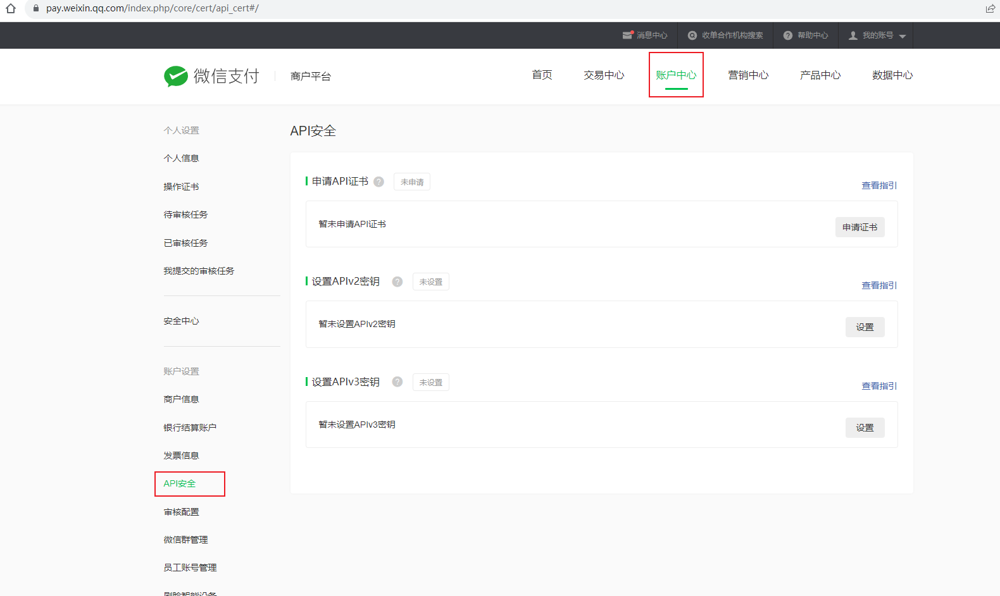

点击申请证书

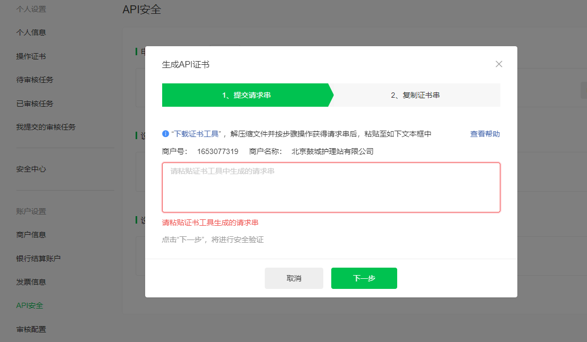

按照提示下载安装(下载证书工具)

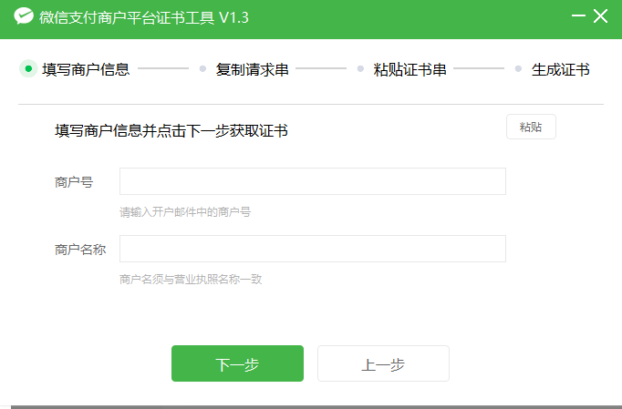

按照提示输入商户号和商户名称

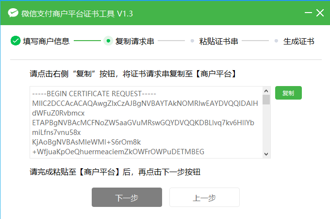

填充到商户平台点击下一步

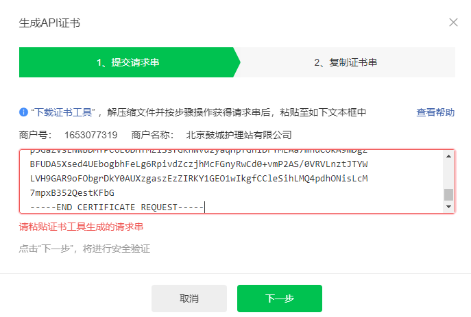

按照提示操作完成会保存证书文件

##### 申请api秘钥

要申请使用对接的api版本是v2或者v3

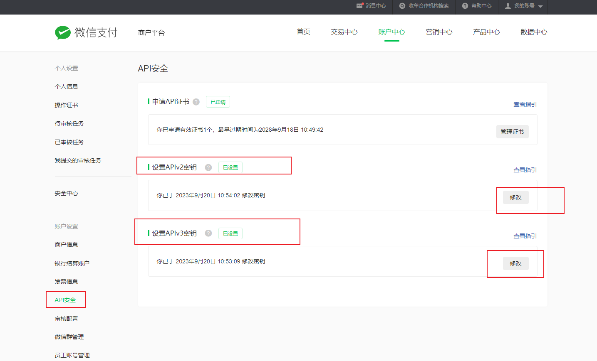

##### 关联appid账号管理

商户关联使用的APP小程序等，提交申请之后，到[平台](https://open.weixin.qq.com)通过申请

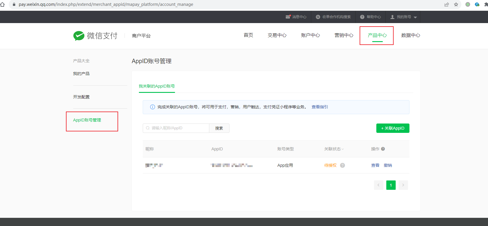

审核申请

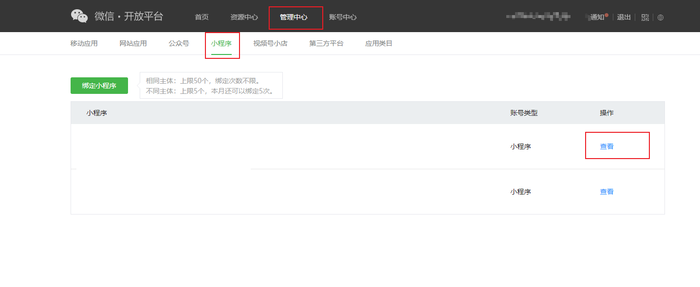

选择指定类型点击查看-选择微信支付点击查看详情-审核待关联的账号

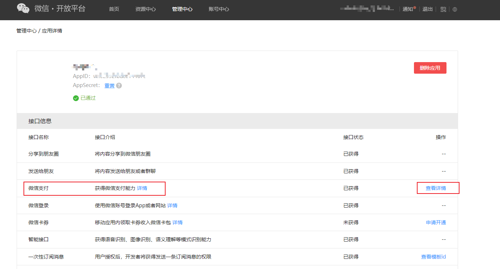

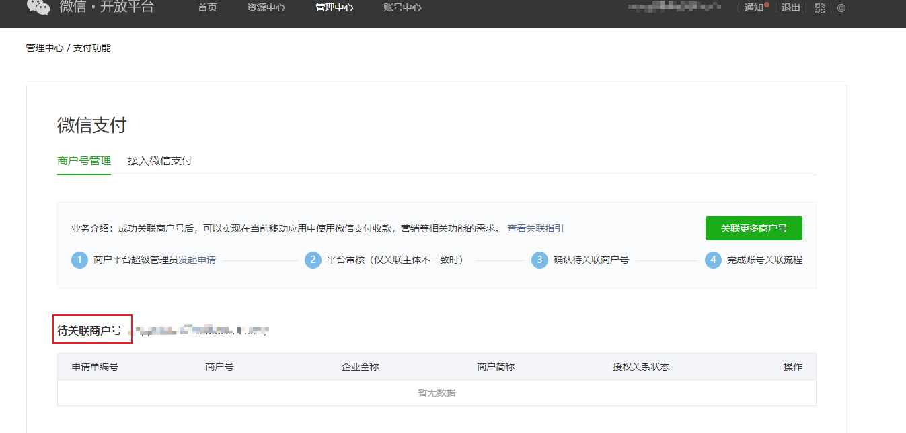

##### 配置商户开发配置

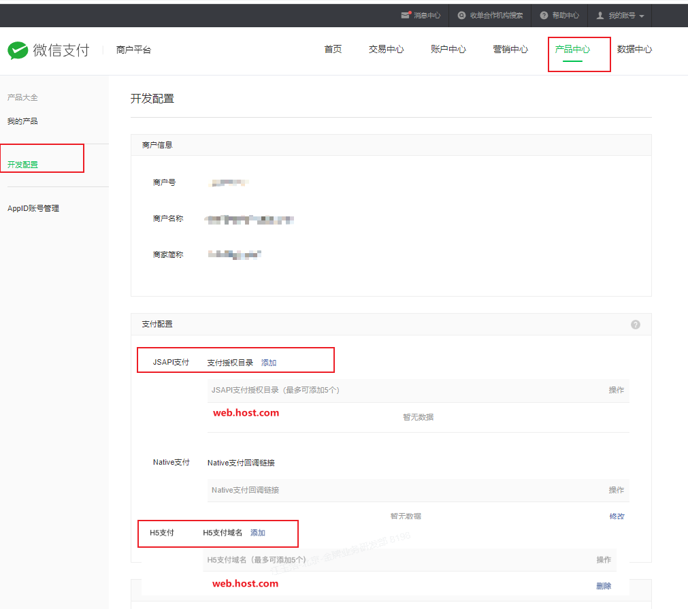

#### 支付宝

##### 目的

- 获取商户Id
- 获取应用Id
- 制作应用密钥对并把公钥配置到支付宝新版本
- 获取支付宝公钥新版本
- 制作应用密钥对并把公钥配置到支付宝老版本
- 获取支付宝公钥老版本

##### 新版本

在开发配置- 接口加签方式（密钥/证书） 按照提示配置应用公钥和查看支付宝公钥

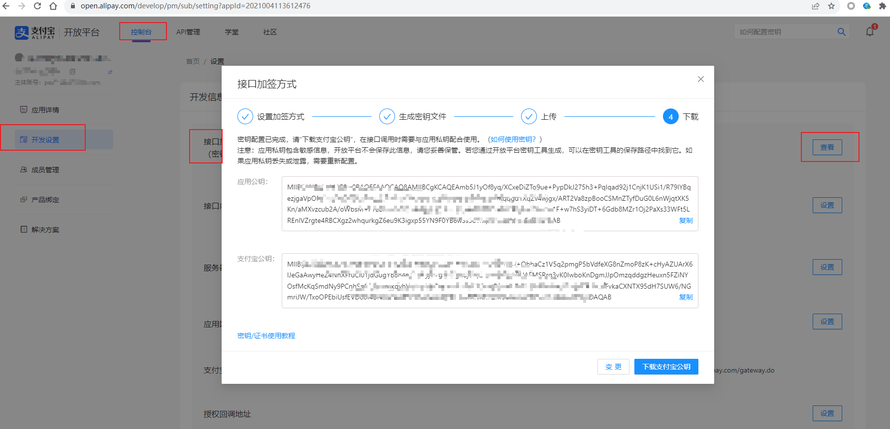

##### 老版本

需要配置开发者公钥，查看支付宝公钥需要配置开发者公钥后可以查看，用户生成一对秘钥，将公钥填充到开发者公钥处

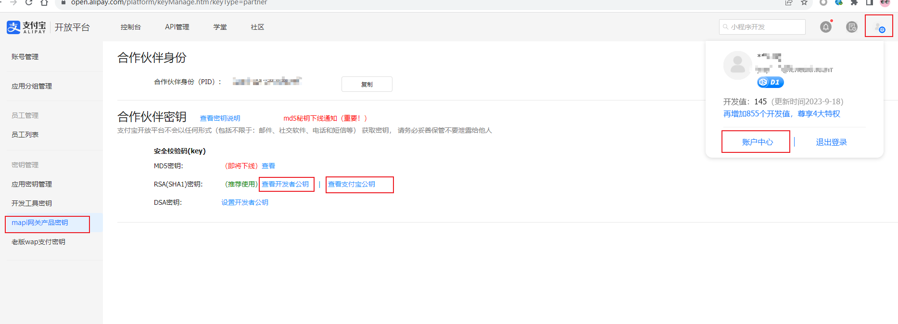

