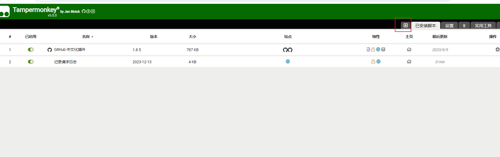

tampermonkey记录日志

- 通过tampermonkey插件记录请求信息
- 并将该信息发送到服务器保存


1. 安装tampermonkey插件

2. 新建tampermonkey脚本

   

3. 编写脚本代码

   interceptUrlList填写需要拦截的地址，在req_data_log中填写记录数据的后台接口

   ```js
   // ==UserScript==
   // @name         记录请求日志
   // @namespace    http://tampermonkey.net/
   // @version      2023-12-13
   // @description  try to take over the world!
   // @author       You
   // @match        *://*/*
   // @grant        GM_webRequest
   // @grant        GM_addValueChangeListener
   // @grant        GM_removeValueChangeListener
   // @grant        GM_xmlhttpRequest
   // @connect      *
   // ==/UserScript==
   
   (function () {
       var originalOpen = XMLHttpRequest.prototype.open;
       // 声明一个字符串列表
       var interceptUrlList = ["https://vdn.apps.cntv.cn/api/getHttpVideoInfo.do", "https://poms.mytijian.cn/orderManager/getOrderList.json", "https://poms.mytijian.cn/platform/order/complaints/orderCustomerComplaintsList.json"];
       var interceptUrlAll = false;
   
       var sentHeaders = {};
       var originalXMLHttpRequest_setRequestHeader = XMLHttpRequest.prototype.setRequestHeader;
   
       XMLHttpRequest.prototype.setRequestHeader = function (header, value) {
           sentHeaders[header.toLowerCase()] = value.toLowerCase();
           originalXMLHttpRequest_setRequestHeader.call(this, header, value);
       }
   
       XMLHttpRequest.prototype.open = function (method, url) {
           var self = this;
           var originalSend = this.send;
   
           const indexSep = url.indexOf('?') == -1 ? url.length : url.indexOf('?');
           const urlPath = url.substring(0, indexSep) // 获取请求地址
           const urlPathParam = url.indexOf('?') == -1 ? "" : url.substring(indexSep + 1, url.length)
   
           this.send = function () {
               console.log("Request sentHeaders: ");
               console.log(sentHeaders);
               var requestBody = arguments[0]; // 获取请求体的内容
               if (requestBody != null && (interceptUrlList.includes(urlPath) || interceptUrlAll)) {
                   const contentType = sentHeaders['content-type']
                   if (contentType.includes('json')) {
                       const requestBodyJson = JSON.parse(requestBody);
                       console.log("Request Text: ");
                       console.log(requestBodyJson);
                   } else {
                       console.log("Request Text: " + requestBody);
                   }
               }
               originalSend.apply(self, arguments);
           };
   
           this.addEventListener("readystatechange", function () {
               //console.log("readyState: " + this.readyState);
               if (this.readyState === 4) {
                   if (interceptUrlList.includes(urlPath) || interceptUrlAll) {
                       console.log("Request URL: " + urlPath);
                       console.log("Request URL Param: " + urlPathParam);
                       // 获取响应头信息
                       const headers = this.getAllResponseHeaders();
                       console.log("Response Headers: \n" + headers);
                       const contentType = this.getResponseHeader('content-type')
                       req_data_log(this.responseText)
                       if (contentType.includes('json')) {
                           const responseJson = JSON.parse(this.responseText);
                           console.log("Response Text: ");
                           console.log(responseJson);
                       } else {
                           console.log("Response Text: " + this.responseText);
                       }
                   }
               }
           });
   
           originalOpen.apply(this, arguments);
       };
       var originalFetch = window.fetch;
   
       window.fetch = function (input, init) {
           console.log("Intercepted fetch request: " + input);  // 获取请求地址
           return originalFetch.apply(this, arguments);
       };
   
   
       var req_data_log = function (dataStr) {
           // 发送 POST 请求
           GM_xmlhttpRequest({
               method: "POST",
               url: "https://api.siyho.cc/demo/tampermonkey/log",
               headers: {
                   "Origin":window.location.hostname,
                   "Content-Type": "text/html"
               },
               data: dataStr,
               onload: function (response) {
                   //console.log("Response:", response.responseText);
               }
           });
       }
   
   
   })();
   ```

   