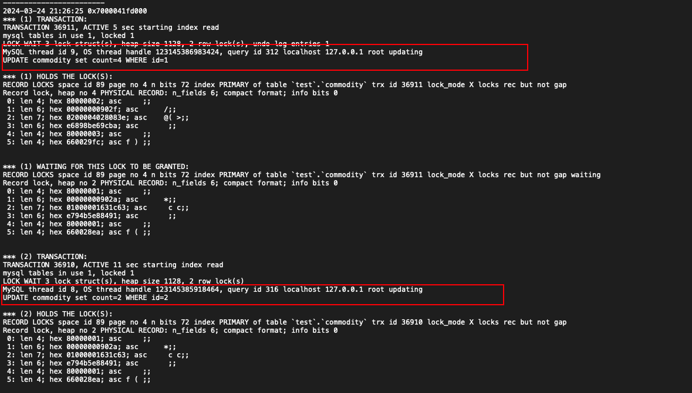

##### 模拟以及解决MySQL死锁

- 什么是死锁

  死锁是指两个或两个以上的进程在执行过程中，由于竞争资源或者由于彼此通信而造成的一种阻塞的现象，若无外力作用，它们都将无法推进下去。此时称系统处于死锁状态或系统产生了死锁，这些永远在互相等待的进程称为死锁进程。

  数据库死锁是指两个资源互相等待，如果需要“修改”一条数据，首先数据库管理系统会在上面加锁，以保证在同一时间只有一个事务能进行修改操作。锁定(Locking)发生在当一个事务获得对某一资源的“锁”时，这时，其他的事务就不能更改这个资源了，这种机制的存在是为了保证数据一致性。

- 查询进程列表

```mysql
SHOW FULL PROCESSLIST;
```

- 查询最近的死锁日志

```mysql
SHOW ENGINE INNODB STATUS;
```

下面描述了进程8的更新语句在更新时遇到进程9的更新语句造成了死锁。

- 释放锁

  ```mysql
  KILL THREAD_ID;
  ```

  



模拟死锁

- 事务1

  ```mysql
  SET AUTOCOMMIT=0;
  BEGIN;
  UPDATE commodity set count=1 WHERE id=1;
  UPDATE commodity set count=2 WHERE id=2;
  COMMIT;
  ```

- 事务2

  ```mysql
  SET AUTOCOMMIT=0;
  BEGIN;
  UPDATE commodity set count=3 WHERE id=2;
  UPDATE commodity set count=4 WHERE id=1;
  COMMIT;
  ```

  

- 执行过程

  - 先执行事务1的SQL1
  - 再执行事务2的SQL1
  - 执行事务1的SQL2。此时这条SQL没有执行成功，一直在等待，如下如所示，“查询时间”一直在增加
  - 然后执行事务2的SQL2，事务2报错，“Deadlock found when trying to get lock; try restarting transaction”，即数据库发现死锁了。


[参考文档](https://www.cnblogs.com/ibigboy/p/16202718.html)