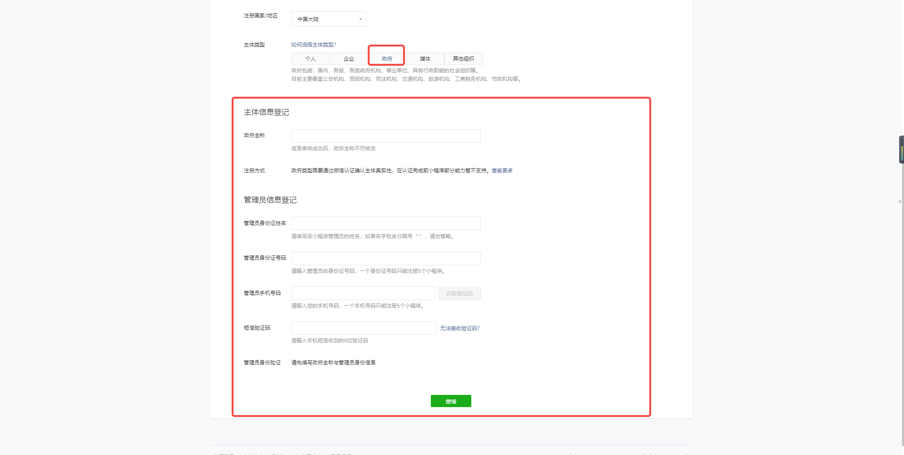
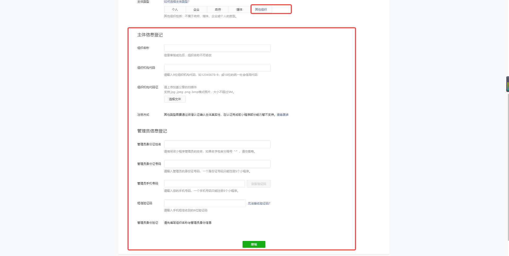

**1、打开https://mp.weixin.qq.com/，点右上角立即注册**

**2、点开之后，选择小程序**

**3、填写信息，**

step1：账号信息（需要提供一个未注册过的邮箱）

step2：邮箱激活

step3：账号激活

a.主体类型为个人的时候，需要的信息如下：

b.主体类型为企业的时候，需要的信息如下：

企业类型为个体工商户时，需注意个体工商户最多只能注册5个帐号

 

注册方式有两种：

第一种：向腾讯公司小额打款验证，需要填写以下截图信息

 

开户银行类型为：若开户银行为中国工商银行，请明确标示，用于验证成功后自动退款。

 

第二种：微信认证

微信注册并认证，需支付300元审核费用。提交认证后会在1-5个工作日完成审核。在认证完成前小程序部分能力暂不支持。[查看详情](http://kf.qq.com/faq/120322fu63YV131224ymQRNB.html)

c.主体类型为政府的时候，需要的信息如下：

d.主体类型为媒体的时候，需要的信息如下：

e.主体类型为其他组织的时候，需要的信息如下：

# **微信支付申请**

### **申请材料：**

1、营业执照：彩色扫描件或数码照片

2、组织机构代码证：彩色扫描件或数码照片，若已三证合一，则无需提供

3、对公银行账户：包含开户行省市信息，开户账号

4、法人身份证：彩色扫描件或数码照片

### **申请流程：**

1. 提交资料

在线提交营业执照、身份证、银行账户等资料，并完成账户验证

AppID请填写：wx98bfd7e0dc1ae7ec

1. 签署协议

微信支付团队会在1-2个工作日内完成审核，审核通过后请在线签约，即可体验各项产品能力

1. 绑定场景

在商户号管理列表中，确认账号关联（AppID绑定）申请[前往](https://mp.weixin.qq.com/pay/index.php/mp_wxopen/biz_info)

### **具体操作：**

1、点申请加入

2、点注册微信支付商户号

 

创建申请单，需要填写以下信息

