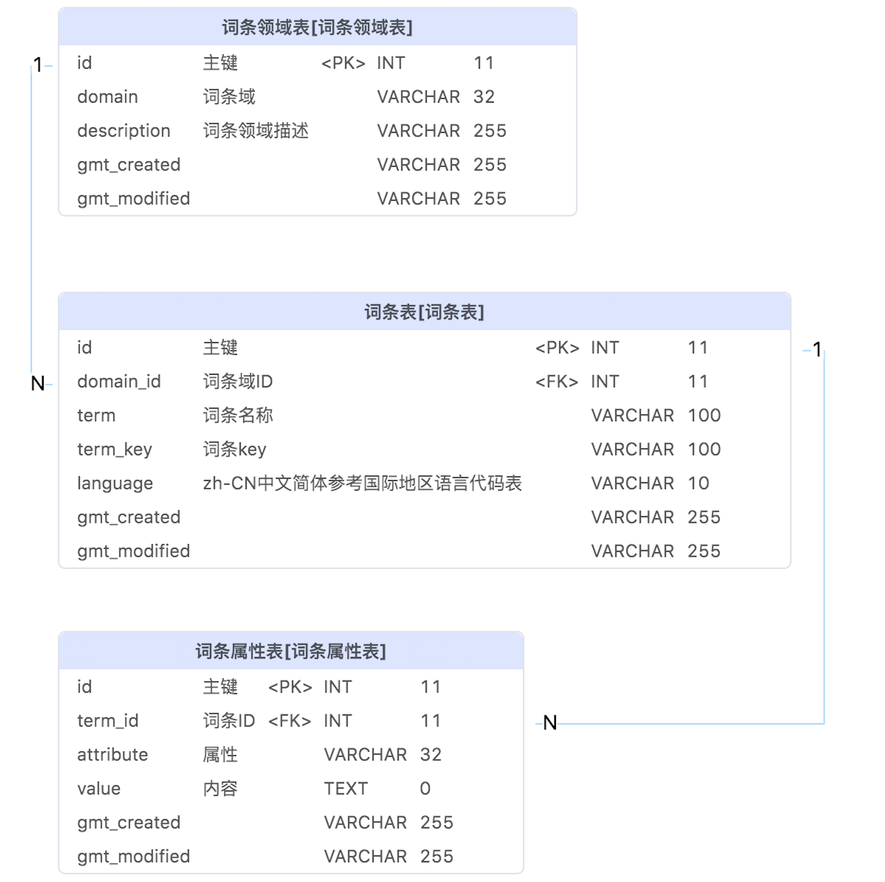

国际化服务组件使用说明书（mytijian-i18n） 

# 一、背景 

- 背景：国际化应用解决的核心问题是后端数据内容根据请求动态返回多语言版本的问题
- 目标群体：后端开发，内容管理者
- 技术应用场景：后端数据多语言
- 整体思路：国际化服务设计的核心思路是不侵入核心业务模块，不改变具体数据模型，建立一个通用的多语言模型，在内容管理（例如ops或者crm）层对具体的数据进行套壳，在业务聚合层（一体化lejian-main-site，公立医院main-site，HR端hr-manage以及互医互药服务）对数据进行动态替换，mytijian-i18n提供一套规范和工具，支持数据的存储和应用
- 源码地址：https://gitee.com/mtjk/mytijian-i18n.git

# 二、名词解释 

- **词条**

词条是对于一条内容的描述，比如爱康国宾北京建国门分院，他本身是一条分院数据，具有分院名称，分院地址，分院简介等内容，这些内容都是要国际化处理的部分。词条本身具有语言类别属性。比如爱康国宾北京建国门分院的中文词条，英文词条，日文词条。词条有复杂词条和简单词条，复杂词条有多内容属性，比如分院、套餐、单项、地址；简单词条只有自己本身，没有其他属性，比如城市、通用标签，北京市的英文词条就是Beijing，没有其他属性。 

- **词条域**

词条域是词条的属性，表示该词条属于什么领域；比如词条爱康国宾北京建国门分院的词条域是分院，XXX-个性化套餐-男(慈铭)的词条域是套餐，北京市的词条域是城市；词条域在系统中使用code来作为标记；词条域一般对应一个数据模型或者一个抽象的数据类型，i18n对词条域提供一套规范，不干涉词条域的定义和使用。 

- **词条KEY**

词条KEY是词条的关键属性，用来识别词条领域下唯一一条词条。词条域+词条KEY = 词条ID。如果词条域对应的是数模模型，使用数据ID作为词条KEY比较合适。简单词条的词条KEY一定是词条本身。同样i18n对词条KEY只提供一套规范，不干涉词条KEY的定义和使用。 

- **词条属性**

​      复杂词条具有多种属性，比如爱康国宾北京建国门分院词条具有分院名称、套餐、单项、地址等属性。 

- **词条语言**

词条的语言类型，使用标准国地区语言代码表。 

# 三、I18N服务数据结构 

 

# 四、JAVA工具包介绍 

多语言服务实际应用中，使用以下4个注解 

- **@ResponseMultilingual**

控制器方法多语言开关注解，当一个控制器方法上被标记了该注解，多语言服务即会处理该方法的返回值，并进行多语言替换。 

示例代码如下： 

```Java
    @GetMapping("/list")
    @LoginRequired
    @ResponseBody
    @ResponseMultilingual
    public List<MealListVo> list(@RequestParam("cardId") Integer cardId,
                                 @RequestParam(name = "brandId",required = false) Integer brandId,
```

- **@ResponseMultilingualTerm**

多语言词条注解，用于标记接口返回VO类是需要多语言处理的多语言词条，注解包含以下属性 

- domain：用于指定该词条使用哪一个词条域，和domainField属性二选一，如果都填入（请勿如此）优先使用domain
- domainField：用于指定从多语言词条类的哪一个属性中获取词条域，可以指定Field也可以指定Method，和domain二选一
- keyField：用于指定从多语言词条类的哪一个属性中获取词条KEY，可以指定Field也可以指定Method，和**@****ResponseMultilingualTermKey**注解二选一，如果都使用（请勿如此），优先使用keyField

示例代码如下： 

```Java
@ResponseMultilingualTerm(domain = "Address",keyField = "id")
public class HospitalAddress extends Address {
}
```

- **@ResponseMultilingualTermKey**

ResponseMultilingualTerm.keyField()的替换方案，直接在属性上标记该属性用于表示是词条KEY 

- **@ResponseMultilingualWord**

简单词条注解，标记在字符串类型的类属性上，表示这是一个简单词条，包含以下属性： 

- domain：用于指定该词条使用哪一个词条域

示例代码如下： 

```Java
public class BrandVo implements Serializable {

    private Integer brandId;
    @ResponseMultilingualWord(domain = "Brand")
    private String brandName;
```

# 五、DUBBO项目快速引用（推荐） 

## 5.1 服务包引用 pom.xml 

版本号 >= 1.1 

```XML
<dependency>
    <groupId>com.mytijian.multilingual</groupId>
    <artifactId>multilingual-component-dubbo</artifactId>
    <!--mytijian-i18n.version >= 1.1-->
    <version>${mytijian-i18n.version}</version>
</dependency>
```

## 5.2 引用Dubbo bean：MultilingualOperateService   spring-dubbo-consumer.xml 

```XML
<dubbo:reference id="multilingualOperateService" interface="com.mytijian.multilingual.service.MultilingualOperateService" version="${dubbo_multilingual_consumer_version}" retries="0"/>
```

## 5.3 最后一步：扫描注入Advice 

```Java
@ComponentScan(basePackages = {"com.mytijian.multilingual.advice"})
public class Application extends SpringBootServletInitializer {
```

# 六、包引用 

## 6.1 服务引用 

### 6.1.1服务包引用 pom.xml 

```XML
<dependency>
    <groupId>com.mytijian.multilingual</groupId>
    <artifactId>multilingual-api</artifactId>
    <version>1.0.0</version>
</dependency>
```

### 6.1.2Advice实现和服务实现 

引入方式需要更简单的方式，方案正在设计中......目前先这样 

多语言的处理依赖spring boot的Advice，直接实现i18n包内的抽象多语言Advice即可AbstractMultilingualResponseBodyAdvice，主要是实现以下两个方法： 

- 复杂词条处理

```Java
protected void multilingualHandle(Object o,MultilingualLanguageEnum language)
```

- 简单词条处理

```Java
protected void multilingualHandle(Object o, Field field, MultilingualLanguageEnum language)
package com.mytijian.web.advice;

import com.mytijian.assembler.MultilingualAssembler;
import com.mytijian.multilingual.advice.AbstractMultilingualResponseBodyAdvice;
import com.mytijian.multilingual.enums.MultilingualLanguageEnum;
import org.springframework.web.bind.annotation.ControllerAdvice;

import javax.annotation.Resource;
import java.lang.reflect.Field;

/**
 * 通用多语言Advice
 * @author JiaChaojie
 * @date 2021/11/4
 * @email chaojie.jia@lejian.com
 */
@ControllerAdvice
public class MultilingualResponseBodyAdvice extends AbstractMultilingualResponseBodyAdvice {

    @Resource
    private MultilingualAssembler multilingual;

    /**
     * 多语言处理 词条vo
     * o 对应实体
     * language 那种语言
     */
    @Override
    protected void multilingualHandle(Object o,MultilingualLanguageEnum language){
        multilingual.multilingualHandle(o,language);
    }

    /**
     * 多语言处理 独立词条属性
     */
    @Override
    protected void multilingualHandle(Object o, Field field, MultilingualLanguageEnum language){
        multilingual.multilingualHandle(o,field,language);
    }
}
```

在服务中实现具体的方法 

```Java
package com.mytijian.assembler;

import com.mytijian.multilingual.enums.MultilingualLanguageEnum;
import com.mytijian.multilingual.model.MultilingualOperate;
import com.mytijian.multilingual.params.MultilingualOperateQuery;
import com.mytijian.multilingual.params.MultilingualOperateQueryBuilder;
import com.mytijian.multilingual.service.MultilingualOperateService;
import org.slf4j.Logger;
import org.slf4j.LoggerFactory;
import org.springframework.stereotype.Component;

import javax.annotation.Resource;
import java.beans.IntrospectionException;
import java.lang.reflect.Field;
import java.lang.reflect.InvocationTargetException;

/**
 * 多语言处理类
 * @author JiaChaojie
 * @date 2021/11/9
 * @email chaojie.jia@lejian.com
 */
@Component
public class MultilingualAssembler {
    @Resource
    private MultilingualOperateService multilingualOperateService;

    private final static Logger log = LoggerFactory.getLogger(MultilingualAssembler.class);

    public void multilingualHandle(Object o, MultilingualLanguageEnum language) {
        MultilingualOperateQuery multilingualOperateQuery = MultilingualOperateQueryBuilder.builder(o, language);
        if(multilingualOperateQuery == null){
            return;
        }
        MultilingualOperate multilingualOperate = multilingualOperateService.getMultilingualOperateByQuery(multilingualOperateQuery);
        if(multilingualOperate.getMultilingualTermDto().getTermKey()==null){
            return;
        }
        try {
            multilingualOperate.loadingObject(o);
        } catch (IllegalAccessException | IntrospectionException | InvocationTargetException e) {
            log.error("多语言处理失败:{}", e.getMessage());
        }
    }
    public void multilingualHandle(Object o, Field field, MultilingualLanguageEnum language) {
        MultilingualOperateQuery multilingualOperateQuery = MultilingualOperateQueryBuilder.builder(o, field, language);
        if(multilingualOperateQuery == null){
            return;
        }
        MultilingualOperate multilingualOperate = multilingualOperateService.getMultilingualOperateByQuery(multilingualOperateQuery);
        if(multilingualOperate.getMultilingualTermDto().getTermKey()==null){
            return;
        }
        try {
            multilingualOperate.loadingObject(o,field);
        } catch (IllegalAccessException | IntrospectionException | InvocationTargetException e) {
            log.error("多语言处理失败:{}", e.getMessage());
        }
    }
}
```

## 6.2 接口应用实例 

- **代码逻辑**：参考lejian-main-site项目 feature/i18n2分支

```Java

```

# 六、开放接口 

## 6.1 服务地址 

生产环境：server_host  https://multilingual-i18n.mytijian.cn/ 

开发环境： 

通用失败返回：http code 不等于 200 

language参数参考：[国际地区码表](https://lejian.feishu.cn/wiki/wikcnc7vd9wXRrNRMm7Hs9t386e)  

## 6.2 单词条翻译 

- 请求接口：

```HTTP
POST {server_host}}/multilingual/open-api/v1.0/translation/term
```

- 请求参数：

```JSON
{
    "language": "EN_US",//语言
    "domain": "test",//词条域
    "termKey": "测试单词", //词条KEY
    "term": {//词条
        "test": "测试单词"
    }
}
```

- 返回值

```JSON
{
    "language": "EN_US", //语言
    "domain": "test", //词条域
    "termKey": "测试单词", //词条KEY
    "term": {//词条
        "test": "TEST"
    }
}
```

## 6.3 词条列表翻译 

- 请求接口：

```HTTP
POST {server_host}}/multilingual/open-api/v1.0/translation/term
```

- 请求参数：

```JSON
[
    {
        "language": "EN_US", //语言
        "domain": "test", //词条域
        "termKey": "测试单词", //词条KEY
        "term": {//词条
            "test": "测试单词"
        }
    }
]
```

- 返回值

```JSON
[
    {
        "language": "EN_US", //语言
        "domain": "test", //词条域
        "termKey": "测试单词", //词条KEY
        "term": {//词条
            "test": "TEST"
        }
    }
]
```

## 6.4 单词翻译 

- 请求接口：

```HTTP
POST {server_host}}/multilingual/open-api/v1.0/translation/word
```

- 请求参数：

```JSON
{
    "language": "EN_US", //语言
    "domain": "test", //词条域
    "word": "测试单词"//单词
}
```

- 返回值

```JSON
{
    "language": "EN_US", //语言
    "domain": "test", //词条域
    "word": "测试单词", //单词
    "translation": "TEST WORD"//翻译
}
```

## 6.5 单词列表翻译 

- 请求接口：

```HTTP
POST {{server_host}}/multilingual/open-api/v1.0/translation/words
```

- 请求参数：

```JSON
[
    {
        "language": "EN_US", //语言
        "domain": "test", //词条域
        "word": "测试单词"//单词
    }
]
```

- 返回值

```JSON
[
    {
        "language": "EN_US", //语言
        "domain": "test", //词条域
        "word": "测试单词", //单词
        "translation": "TEST WORD"//翻译
    }
]
```

# 七、词条管理 

## 7.1  请求方式 

- 请求接口：

```HTTP
POST {{server_host}}/multilingual/excel/project/import
```

- 请求参数

```HTTP
file:多语言导入表格
```

## 7.2  导入模板格式 

[导入模板格式.xlsx](https://lejian.feishu.cn/wiki/wikcnAuKkAFTGuCUPQf8ernBNzi)  


 

- 词条：attribute词条属性，value词条属性值
- 单词：没有attribute和value列

# 附录、多语言词条域定义 

[多语言词条域定义](https://lejian.feishu.cn/sheets/shtcnfNoRYxZMqGM4Tdw2cLpmQf)  

# 附录、国际地区码表 

[国际地区码表](https://lejian.feishu.cn/wiki/wikcnc7vd9wXRrNRMm7Hs9t386e)  

 