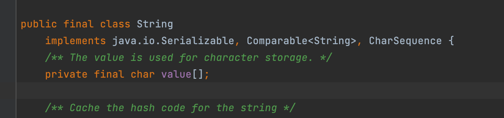
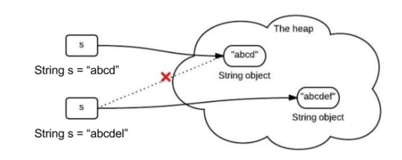
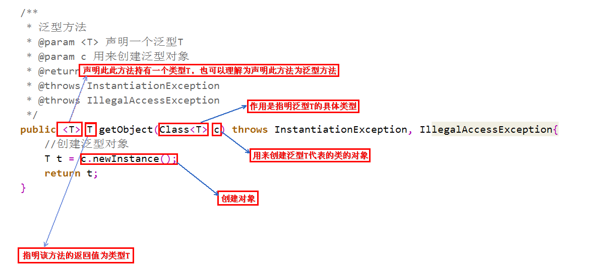
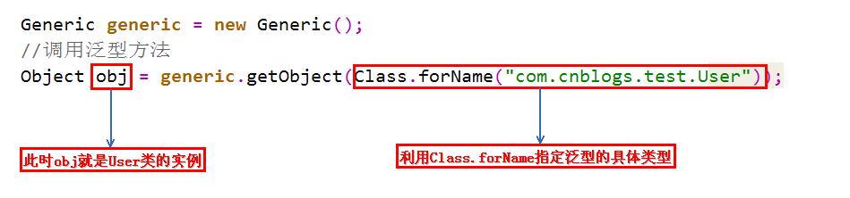
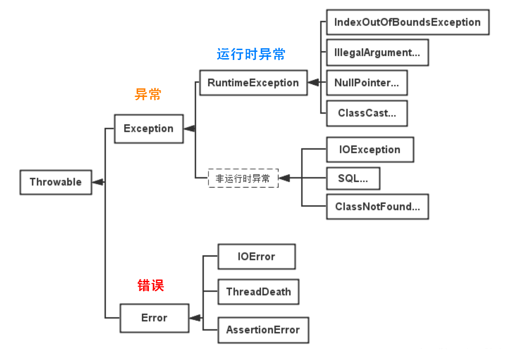
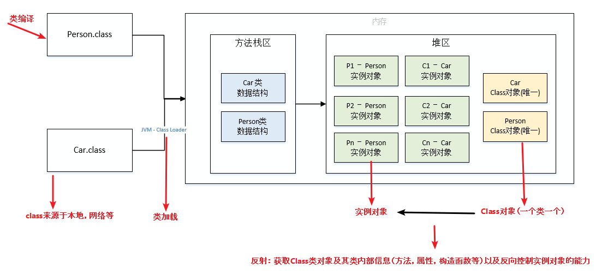
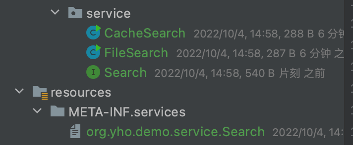

# Java基础

## 1.1 语法基础 

**面向对象特性？** 

- 封装 

利用抽象数据类型将数据和基于数据的操作封装在一起，使其构成一个不可分割的独立实体。数据被保护在抽象数据类型的内部，尽可能地隐藏内部的细节，只保留一些对外接口使之与外部发生联系。用户无需知道对象内部的细节，但可以通过对象对外提供的接口来访问该对象。 

优点: 

- 减少耦合: 可以独立地开发、测试、优化、使用、理解和修改 
- 减轻维护的负担: 可以更容易被程序员理解，并且在调试的时候可以不影响其他模块 
- 有效地调节性能: 可以通过剖析确定哪些模块影响了系统的性能 
- 提高软件的可重用性 
- 降低了构建大型系统的风险: 即使整个系统不可用，但是这些独立的模块却有可能是可用的 

以下 Person 类封装 name、gender、age 等属性，外界只能通过 get() 方法获取一个 Person 对象的 name 属性和 gender 属性，而无法获取 age 属性，但是 age 属性可以供 work() 方法使用。 

注意到 gender 属性使用 int 数据类型进行存储，封装使得用户注意不到这种实现细节。并且在需要修改 gender 属性使用的数据类型时，也可以在不影响客户端代码的情况下进行。

```java
public class Person {
    private String name;
    private int gender;
    private int age;

    public String getName() {
        return name;
    }

    public String getGender() {
        return gender == 0 ? "man" : "woman";
    }

    public void work() {
        if (18 <= age && age <= 50) {
            System.out.println(name + " is working very hard!");
        } else {
            System.out.println(name + " can't work any more!");
        }
    }
}
```


- 继承 

继承实现了  IS-A  关系，例如 Cat 和 Animal 就是一种 IS-A 关系，因此 Cat 可以继承自 Animal，从而获得 Animal 非 private 的属性和方法。 继承应该遵循里氏替换原则，子类对象必须能够替换掉所有父类对象。 

Cat 可以当做 Animal 来使用，也就是说可以使用 Animal 引用 Cat 对象。父类引用指向子类对象称为  向上转型 。

```java
 Animal animal = new Cat();
```

-  多态

 多态分为编译时多态和运行时多态: 

- 编译时多态主要指方法的重载 
- 运行时多态指程序中定义的对象引用所指向的具体类型在运行期间才确定 

运行时多态有三个条件: 

- 继承 
- 覆盖(重写) 
- 向上转型 

下面的代码中，乐器类(Instrument)有两个子类: Wind 和 Percussion，它们都覆盖了父类的 play() 方法，并且在 main() 方法中使用父类 Instrument 来引用 Wind 和 Percussion 对象。在 Instrument 引用调用 play() 方法时，会执行实际引用对象所在类的 play() 方法，而不是 Instrument 类的方法。

```java
public class Instrument {
    public void play() {
        System.out.println("Instrument is playing...");
    }
}

public class Wind extends Instrument {
    public void play() {
        System.out.println("Wind is playing...");
    }
}

public class Percussion extends Instrument {
    public void play() {
        System.out.println("Percussion is playing...");
    }
}

public class Music {
    public static void main(String[] args) {
        List<Instrument> instruments = new ArrayList<>();
        instruments.add(new Wind());
        instruments.add(new Percussion());
        for (Instrument instrument : instruments) {
            instrument.play();
        }
    }
}
```


**a = a + b 与 a += b 的区别** 

+= 隐式的将加操作的结果类型强制转换为持有结果的类型。如果两个整型相加，如 byte、short 或者 int，首先会将它们提升到 int 类型，然后在执行加法操作。

```java
byte a = 127;
byte b = 127;
b = a + b; // error : cannot convert from int to byte
b += a; // ok
```

(因为 a+b 操作会将 a、b 提升为 int 类型，所以将 int 类型赋值给 byte 就会编译出错) ¶ 

**3*0.1 == 0.3 将会返回什么? true 还是 false? false，**

因为有些浮点数不能完全精确的表示出来。

**能在 Switch 中使用 String 吗?** 

从 Java 7 开始，我们可以在 switch case 中使用字符串，但这仅仅是一个语法糖。内部实现在 switch 中使用字符串的 hash code。 

**对equals()和hashCode()的理解?** 

- 为什么在重写 equals 方法的时候需要重写 hashCode 方法? 

因为有强制的规范指定需要同时重写 hashcode 与 equals 是方法，许多容器类，如 HashMap、HashSet 都依赖于 hashcode 与 equals 的规定。 

**有没有可能两个不相等的对象有相同的 hashcode?** 

有可能，两个不相等的对象可能会有相同的 hashcode 值，这就是为什么在 hashmap 中会有冲突。相等 hashcode 值的规定只是说如果两个对象相等，必须有相同的hashcode 值，但是没有关于不相等对象的任何规定。 

**两个相同的对象会有不同的 hash code 吗?** 

不能，根据 hash code 的规定，这是不可能的。 

**final、finalize 和 finally 的不同之处?** 

- final 是一个修饰符，可以修饰变量、方法和类。如果 final 修饰变量，意味着该变量的值在初始化后不能被改变。 
- Java 技术允许使用 finalize() 方法在垃圾收集器将对象从内存中清除出去之前做必要的清理工作。这个方法是由垃圾收集器在确定这个对象没有被引用时对这个对象调用的，但是什么时候调用 finalize 没有保证。 
- finally 是一个关键字，与 try 和 catch 一起用于异常的处理。finally 块一定会被执行，无论在 try 块中是否有发生异常。

 **String、StringBuffer与StringBuilder的区别？**

- 可变和适用范围。String对象是不可变的，而StringBuffer和StringBuilder是可变字符序列。每次对String的操作相当于生成一个新的String对象，而对StringBuffer和StringBuilder的操作是对对象本身的操作，而不会生成新的对象，所以对于频繁改变内容的字符串避免使用String，因为频繁的生成对象将会对系统性能产生影响。
- 线程安全。String由于有final修饰，是immutable的，安全性是简单而纯粹的。StringBuilder和StringBuffer的区别在于StringBuilder不保证同步，也就是说如果需要线程安全需要使用StringBuffer，不需要同步的StringBuilder效率更高。

**String是不可变的?**

​		**原因**

- 语法层面string为final修饰它的值为final修饰的char[]数组，类不能继承修改且value为私有的final修饰
- jvm方面字符串会放置在称为常量池的区域它的特性会使每次修改字符串值都会新创建一个字符串常量

​	**优点**

- 只有字符串不可变 字符串常量池才可以实现可以节约内存空间
- 可以保证线程安全问题





**接口与抽象类的区别？** 

- 一个子类只能继承一个抽象类, 但能实现多个接口 
- 抽象类可以有构造方法, 接口没有构造方法 
- 抽象类可以有普通成员变量, 接口没有普通成员变量 
- 抽象类和接口都可有静态成员变量, 抽象类中静态成员变量访问类型任意，接口只能public static final(默认) 
- 抽象类可以没有抽象方法, 抽象类可以有普通方法；接口在JDK8之前都是抽象方法，在JDK8可以有default方法，在JDK9中允许有私有普通方法 
- 抽象类可以有静态方法；接口在JDK8之前不能有静态方法，在JDK8中可以有静态方法，且只能被接口类直接调用（不能被实现类的对象调用） 
- 抽象类中的方法可以是public、protected; 接口方法在JDK8之前只有public abstract，在JDK8可以有default方法，在JDK9中允许有private方法 

**this() & super()在构造方法中的区别？**

- 调用super()必须写在子类构造方法的第一行, 否则编译不通过 
- super从子类调用父类构造, this在同一类中的构造方法中调用其他构造均需要放在第一行 
- 尽管可以用this调用一个构造器, 却不能调用2个 
- this和super不能出现在同一个构造器中, 否则编译不通过 
- this()、super()都指的对象,不可以在static环境中使用 
- 本质this指向本对象的指针。super是一个关键字

**移位运算符**

- << :左移运算符,x << 1,相当于x乘以2(不溢出的情况下),低位补0 
- \>>带符号右移,x >> 1,相当于x除以2,正数高位补0,负数高位补1 
- \>>> :无符号右移,忽略符号位,空位都以0补齐 

## 1.2泛型

**为什么需要泛型**

- 适用于多种数据类型执行相同的代码

  ```java
  private static int add(int a, int b) {
      System.out.println(a + "+" + b + "=" + (a + b));
      return a + b;
  }
  
  private static float add(float a, float b) {
      System.out.println(a + "+" + b + "=" + (a + b));
      return a + b;
  }
  
  private static double add(double a, double b) {
      System.out.println(a + "+" + b + "=" + (a + b));
      return a + b;
  }
  ```

  如果没有泛型，要实现不同类型的加法，每种类型都需要重载一个add方法；通过泛型，我们可以复用为一个方法：

  ```java
  private static <T extends Number> double add(T a, T b) {
      System.out.println(a + "+" + b + "=" + (a.doubleValue() + b.doubleValue()));
      return a.doubleValue() + b.doubleValue()
  }
  
  ```

- 泛型中的类型在使用时指定，不需要强制类型转换（类型安全，编译器会检查类型）

  看下这个例子：

  ```java
  List list = new ArrayList();
  list.add("xxString");
  list.add(100d);
  list.add(new Person());
  ```

  我们在使用上述list中，list中的元素都是Object类型（无法约束其中的类型），所以在取出集合元素时需要人为的强制类型转化到具体的目标类型，且很容易出现java.lang.ClassCastException异常。 引入泛型，它将提供类型的约束，提供编译前的检查：

  ```java
  List<String> list = new ArrayList<String>();
  // list中只能放String, 不能放其它类型的元素
  ```

**如何定义泛型**

- 定义一个简单的泛型类

  ```java
  class Point<T>{         // 此处可以随便写标识符号，T是type的简称  
      private T var ;     // var的类型由T指定，即：由外部指定  
      public T getVar(){  // 返回值的类型由外部决定  
          return var ;  
      }  
      public void setVar(T var){  // 设置的类型也由外部决定  
          this.var = var ;  
      }  
  }  
  public class GenericsDemo06{  
      public static void main(String args[]){  
          Point<String> p = new Point<String>() ;     // 里面的var类型为String类型  
          p.setVar("it") ;                            // 设置字符串  
          System.out.println(p.getVar().length()) ;   // 取得字符串的长度  
      }  
  }
  ```

- 多元泛型

  ```java
  class Notepad<K,V>{       // 此处指定了两个泛型类型  
      private K key ;     // 此变量的类型由外部决定  
      private V value ;   // 此变量的类型由外部决定  
      public K getKey(){  
          return this.key ;  
      }  
      public V getValue(){  
          return this.value ;  
      }  
      public void setKey(K key){  
          this.key = key ;  
      }  
      public void setValue(V value){  
          this.value = value ;  
      }  
  } 
  public class GenericsDemo09{  
      public static void main(String args[]){  
          Notepad<String,Integer> t = null ;        // 定义两个泛型类型的对象  
          t = new Notepad<String,Integer>() ;       // 里面的key为String，value为Integer  
          t.setKey("汤姆") ;        // 设置第一个内容  
          t.setValue(20) ;            // 设置第二个内容  
          System.out.print("姓名；" + t.getKey()) ;      // 取得信息  
          System.out.print("，年龄；" + t.getValue()) ;       // 取得信息  
    
      }  
  }
  ```

**接口中定义泛型**

- 简单的泛型接口

  ```java
  interface Info<T>{        // 在接口上定义泛型  
      public T getVar() ; // 定义抽象方法，抽象方法的返回值就是泛型类型  
  }  
  class InfoImpl<T> implements Info<T>{   // 定义泛型接口的子类  
      private T var ;             // 定义属性  
      public InfoImpl(T var){     // 通过构造方法设置属性内容  
          this.setVar(var) ;    
      }  
      public void setVar(T var){  
          this.var = var ;  
      }  
      public T getVar(){  
          return this.var ;  
      }  
  } 
  public class GenericsDemo24{  
      public static void main(String arsg[]){  
          Info<String> i = null;        // 声明接口对象  
          i = new InfoImpl<String>("汤姆") ;  // 通过子类实例化对象  
          System.out.println("内容：" + i.getVar()) ;  
      }  
  }  
  ```

**泛型方法**

  泛型方法，是在调用方法的时候指明泛型的具体类型。

- 定义泛型方法的语法格式

  

- 调用泛型方法格式

  

说明一下，定义泛型方法时，必须在返回值前边加一个<T>，来声明这是一个泛型方法，持有一个泛型T，然后才可以用泛型T作为方法的返回值。 Class<T>的作用就是指明泛型的具体类型，而Class<T>类型的变量c，可以用来创建泛型类的对象。 

为什么要用变量c来创建对象呢？既然是泛型方法，就代表着我们不知道具体的类型是什么，也不知道构造方法如何，因此没有办法去new一个对象，但可以利用变量c的newInstance方法去创建对象，也就是利用反射创建对象。 

泛型方法要求的参数是Class<T>类型，而Class.forName()方法的返回值也是Class<T>，因此可以用Class.forName()作为参数。其中，forName()方法中的参数是何种类型，返回的Class<T>就是何种类型。在本例中，forName()方法中传入的是User类的完整路径，因此返回的是Class<User>类型的对象，因此调用泛型方法时，变量c的类型就是Class<User>，因此泛型方法中的泛型T就被指明为User，因此变量obj的类型为User。 

当然，泛型方法不是仅仅可以有一个参数Class<T>，可以根据需要添加其他参数。

**为什么要使用泛型方法呢？**因为泛型类要在实例化的时候就指明类型，如果想换一种类型，不得不重新new一次，可能不够灵活；而泛型方法可以在调用的时候指明类型，更加灵活。 

**泛型的上限和下限？** 

在使用泛型的时候，我们可以为传入的泛型类型实参进行上下边界的限制，如：类型实参只准传入某种类型的父类或某种类型的子类。

- 上限

  ```java
  class Info<T extends Number>{    // 此处泛型只能是数字类型
      private T var ;        // 定义泛型变量
      public void setVar(T var){
          this.var = var ;
      }
      public T getVar(){
          return this.var ;
      }
      public String toString(){    // 直接打印
          return this.var.toString() ;
      }
  }
  public class demo1{
      public static void main(String args[]){
          Info<Integer> i1 = new Info<Integer>() ;        // 声明Integer的泛型对象
      }
  }
  ```

  

- 下限

  ```java
  class Info<T>{
      private T var ;        // 定义泛型变量
      public void setVar(T var){
          this.var = var ;
      }
      public T getVar(){
          return this.var ;
      }
      public String toString(){    // 直接打印
          return this.var.toString() ;
      }
  }
  public class GenericsDemo21{
      public static void main(String args[]){
          Info<String> i1 = new Info<String>() ;        // 声明String的泛型对象
          Info<Object> i2 = new Info<Object>() ;        // 声明Object的泛型对象
          i1.setVar("hello") ;
          i2.setVar(new Object()) ;
          fun(i1) ;
          fun(i2) ;
      }
      public static void fun(Info<? super String> temp){    // 只能接收String或Object类型的泛型，String类的父类只有Object类
          System.out.print(temp + ", ") ;
      }
  }
  ```

  **如何理解Java中的泛型是伪泛型？**

  泛型中类型擦除 Java泛型这个特性是从JDK 1.5才开始加入的，因此为了兼容之前的版本，Java泛型的实现采取了“伪泛型”的策略，即Java在语法上支持泛型之后在编译前检查泛型，但是在编译阶段会进行所谓的“类型擦除”（Type Erasure），将所有的泛型表示（尖括号中的内容）都替换为具体的类型（其对应的原生态类型），就像完全没有泛型一样。

  [类型擦除以及类型擦除带来的问题](https://blog.csdn.net/LonelyRoamer/article/details/7868820)

##  1.3 注解 

**注解的作用？** 

注解是JDK1.5版本开始引入的一个特性，用于对代码进行说明，可以对包、类、接口、字段、方法参数、局部变量等进行注解。它主要的作用有以下四方面： 

- 生成文档，通过代码里标识的元数据生成javadoc文档。 
- 编译检查，通过代码里标识的元数据让编译器在编译期间进行检查验证。 
- 编译时动态处理，编译时通过代码里标识的元数据动态处理，例如动态生成代码。 
- 运行时动态处理，运行时通过代码里标识的元数据动态处理，例如使用反射注入实例。 

**注解的常见分类？** 

- **Java自带的标准注解**，包括@Override、@Deprecated和@SuppressWarnings，分别用于标明重写某个方法、标明某个类或方法过时、标明要忽略的警告，用这些注解标明后编译器就会进行检查。 

- **元注解**，元注解是用于定义注解的注解，包括@Retention、@Target、@Inherited、@Documented

  - @Retention用于标明注解被保留的阶段
  - @Target用于标明注解使用的范围
  - @Inherited用于标明注解可继承
  - @Documented用于标明是否生成javadoc文档

- **自定义注解**，可以根据自己的需求定义注解，并可用元注解对自定义注解进行注解。


## 1.4异常

**异常划分**

- Throwable 是 Java 语言中所有错误与异常的超类。

  - Error 类及其子类：程序中无法处理的错误，表示运行应用程序中出现了严重的错误。

  - Exception 程序本身可以捕获并且可以处理的异常。Exception 这种异常又分为两类：运行时异常和编译时异常。

    

- 运行时异常

  都是RuntimeException类及其子类异常，如NullPointerException(空指针异常)、IndexOutOfBoundsException(下标越界异常)等，这些异常是不检查异常，程序中可以选择捕获处理，也可以不处理。这些异常一般是由程序逻辑错误引起的，程序应该从逻辑角度尽可能避免这类异常的发生。

  运行时异常的特点是Java编译器不会检查它，也就是说，当程序中可能出现这类异常，即使没有用try-catch语句捕获它，也没有用throws子句声明抛出它，也会编译通过。

- 非运行时异常 （编译异常）

  是RuntimeException以外的异常，类型上都属于Exception类及其子类。从程序语法角度讲是必须进行处理的异常，如果不处理，程序就不能编译通过。如IOException、SQLException等以及用户自定义的Exception异常，一般情况下不自定义检查异常。 

**可查的异常（checked exceptions）和不可查的异常（unchecked exceptions）区别？**

- 可查异常（编译器要求必须处置的异常）

  正确的程序在运行中，很容易出现的、情理可容的异常状况。可查异常虽然是异常状况，但在一定程度上它的发生是可以预计的，而且一旦发生这种异常状况，就必须采取某种方式进行处理。 

  除了RuntimeException及其子类以外，其他的Exception类及其子类都属于可查异常。这种异常的特点是Java编译器会检查它，也就是说，当程序中可能出现这类异常，要么用try-catch语句捕获它，要么用throws子句声明抛出它，否则编译不会通过。

- 不可查异常(编译器不要求强制处置的异常)
  包括运行时异常（RuntimeException与其子类）和错误（Error）。

**throw和throws的区别？**

- 异常的申明(throws)

  在Java中，当前执行的语句必属于某个方法，Java解释器调用main方法执行开始执行程序。若方法中存在检查异常，如果不对其捕获，那必须在方法头中显式声明该异常，以便于告知方法调用者此方法有异常，需要进行处理。 在方法中声明一个异常，方法头中使用关键字throws，后面接上要声明的异常。若声明多个异常，则使用逗号分割。如下所示：

  ```java
  public static void method() throws IOException, FileNotFoundException{
      //something statements
  }
  ```

- 异常的抛出(throw)

  如果代码可能会引发某种错误，可以创建一个合适的异常类实例并抛出它，这就是抛出异常。如下所示：

  ```java
  public static double method(int value) {
      if(value == 0) {
          throw new ArithmeticException("参数不能为0"); //抛出一个运行时异常
      }
      return 5.0 / value;
  }
  ```

  

**Java 7 的 try-with-resource**

如果你的资源实现了 AutoCloseable 接口，你可以使用这个语法。大多数的 Java 标准资源都继承了这个接口。当你在 try 子句中打开资源，资源会在 try 代码块执行后或异常处理后自动关闭。

```java
public void automaticallyCloseResource() {
    File file = new File("./tmp.txt");
    try (FileInputStream inputStream = new FileInputStream(file);) {
        // use the inputStream to read a file
    } catch (FileNotFoundException e) {
        log.error(e);
    } catch (IOException e) {
        log.error(e);
    }
}
```

**异常的底层**

提到JVM处理异常的机制，就需要提及Exception Table，以下称为异常表。我们暂且不急于介绍异常表，先看一个简单的 Java 处理异常的小例子。

```java
public static void simpleTryCatch() {
   try {
       testNPE();
   } catch (Exception e) {
       e.printStackTrace();
   }
}
```

使用javap来分析这段代码（需要先使用javac编译）

```java
//javap -c Main
 public static void simpleTryCatch();
    Code:
       0: invokestatic  #3                  // Method testNPE:()V
       3: goto          11
       6: astore_0
       7: aload_0
       8: invokevirtual #5                  // Method java/lang/Exception.printStackTrace:()V
      11: return
    Exception table:
       from    to  target type
           0     3     6   Class java/lang/Exception
```

看到上面的代码，应该会有会心一笑，因为终于看到了Exception table，也就是我们要研究的异常表。 异常表中包含了一个或多个异常处理者(Exception Handler)的信息，这些信息包含如下 

- from 可能发生异常的起始点 
- to 可能发生异常的结束点 
- target 上述from和to之前发生异常后的异常处理者的位置 
- type 异常处理者处理的异常的类信息 

## 1.5反射

**什么是反射**

JAVA反射机制是在运行状态中，对于任意一个类，都能够知道这个类的所有属性和方法；对于任意一个对象，都能够调用它的任意一个方法和属性；这种动态获取的信息以及动态调用对象的方法的功能称为java语言的反射机制。



**反射的使用**

在Java中，Class类与java.lang.reflect类库一起对反射技术进行了全力的支持。在反射包中，我们常用的类主要有Constructor类表示的是Class 对象所表示的类的构造方法，利用它可以在运行时动态创建对象、Field表示Class对象所表示的类的成员变量，通过它可以在运行时动态修改成员变量的属性值(包含private)、Method表示Class对象所表示的类的成员方法，通过它可以动态调用对象的方法(包含private)

Class类对象的获取

```java
    @Test
    public void classTest() throws Exception {
        // 获取Class对象的三种方式
        logger.info("根据类名:  \t" + User.class);
        logger.info("根据对象:  \t" + new User().getClass());
        logger.info("根据全限定类名:\t" + Class.forName("com.test.User"));
        // 常用的方法
        logger.info("获取全限定类名:\t" + userClass.getName());
        logger.info("获取类名:\t" + userClass.getSimpleName());
        logger.info("实例化:\t" + userClass.newInstance());
    }
```

- Constructor类及其用法
- Field类及其用法
- Method类及其用法

**getName、getCanonicalName与getSimpleName的区别**

- getName：类的全限定名，jvm中Class的表示，可以用于动态加载Class对象，例如Class.forName。
- getCanonicalName：返回更容易理解的表示，主要用于输出（toString）或log打印，大多数情况下和getName一样，但是在内部类、数组等类型的表示形式就不同了。
- getSimpleName：只获取类名

## 1.6SPI机制

**什么是SPI机制？**

SPI（Service Provider Interface），是JDK内置的一种 服务提供发现机制，可以用来启用框架扩展和替换组件，主要是被框架的开发人员使用，比如java.sql.Driver接口，其他不同厂商可以针对同一接口做出不同的实现，MySQL和PostgreSQL都有不同的实现提供给用户，而Java的SPI机制可以为某个接口寻找服务实现。Java中SPI机制主要思想是将装配的控制权移到程序之外，在模块化设计中这个机制尤其重要，其核心思想就是 **解耦**。

SPI整体机制图如下：


当服务的提供者提供了一种接口的实现之后，需要在classpath下的META-INF/services/目录里创建一个以服务接口命名的文件，这个文件里的内容就是这个接口的具体的实现类。当其他的程序需要这个服务的时候，就可以通过查找这个jar包（一般都是以jar包做依赖）的META-INF/services/中的配置文件，配置文件中有接口的具体实现类名，可以根据这个类名进行加载实例化，就可以使用该服务了。JDK中查找服务的实现的工具类是：java.util.ServiceLoader。

**SPI机制的应用**

- SPI机制 - JDBC DriverManager 

  在JDBC4.0之前，我们开发有连接数据库的时候，通常会用Class.forName("com.mysql.jdbc.Driver")这句先加载数据库相关的驱动，然后再进行获取连接等的操作。**而JDBC4.0之后不需要用Class.forName("com.mysql.jdbc.Driver")来加载驱动，直接获取连接就可以了，现在这种方式就是使用了Java的SPI扩展机制来实现。** 

- JDBC接口定义 

  首先在java中定义了接口java.sql.Driver，并没有具体的实现，具体的实现都是由不同厂商来提供的。 

- mysql实现 

  在mysql的jar包mysql-connector-java-6.0.6.jar中，可以找到META-INF/services目录，该目录下会有一个名字为java.sql.Driver的文件，文件内容是com.mysql.cj.jdbc.Driver，这里面的内容就是针对Java中定义的接口的实现。 

- postgresql实现 

  同样在postgresql的jar包postgresql-42.0.0.jar中，也可以找到同样的配置文件，文件内容是org.postgresql.Driver，这是postgresql对Java的java.sql.Driver的实现。 

- 使用方法 

  上面说了，现在使用SPI扩展来加载具体的驱动，我们在Java中写连接数据库的代码的时候，不需要再使用Class.forName("com.mysql.jdbc.Driver")来加载驱动了，而是直接使用如下代码：
  
  ```java
  String url = "jdbc:xxxx://xxxx:xxxx/xxxx";
  Connection conn = DriverManager.getConnection(url,username,password);
  .....
  ```
  
  

**SPI简单示例**

我们现在需要使用一个内容搜索接口，搜索的实现可能是基于文件系统的搜索，也可能是基于内存的搜索。

- 目录结构

  

- 定义接口

  ```java
  
  import java.util.Iterator;
  import java.util.ServiceLoader;
  
  public interface Search {
      void searchDoc();
  }
  ```

  

- 定义文件和内存搜索实现

  ```java
  public class FileSearch implements Search {
      @Override
      public void searchDoc() {
          System.out.println("通过文件搜索");
      }
  }
  public class CacheSearch implements Search {
      @Override
      public void searchDoc() {
          System.out.println("通过内存搜索");
      }
  }
  ```

  

- 定义配置

  ```
  1.在resources目录下创建META-INF/services/目录
  2.创建接口全限定名的文件org.yho.demo.service.Search
  3.在创建的文件中写入具体的实现
      org.yho.demo.service.FileSearch
      org.yho.demo.service.CacheSearch
  ```

  

- 测试方法

  ```java
  import java.util.Iterator;
  import java.util.ServiceLoader;
  
      public static void main(String[] args) {
          final ServiceLoader<Search> services = ServiceLoader.load(Search.class);
          final Iterator<Search> iterator = services.iterator();
          while (iterator.hasNext()) {
              final Search search = iterator.next();
              search.searchDoc();
          }
      }
  ```

  可以看到输出结果：

  ​		通过文件搜索
  ​		通过内存搜索

  如果在org.yho.demo.service.Search文件里写上两个实现类，那最后的输出结果就是两行了。 这就是因为ServiceLoader.load(Search.class)在加载某接口时，会去META-INF/services下找接口的全限定名文件，再根据里面的内容加载相应的实现类。 这就是spi的思想，接口的实现由provider实现，provider只用在提交的jar包里的META-INF/services下根据平台定义的接口新建文件，并添加进相应的实现类内容就好。

# 2Java集合

## 2.1 Collection

**集合有哪些类？**

- List
  - ArrayList 基于动态数组实现，支持随机访问。
  - Vector 和 ArrayList 类似，但它是线程安全的。
  - LinkedList 基于双向链表实现，只能顺序访问，但是可以快速地在链表中间插入和删除元素。不仅如此，LinkedList 还可以用作栈、队列和双向队列。

- Set
  - TreeSet 基于红黑树实现，支持有序性操作，例如根据一个范围查找元素的操作。但是查找效率不如 HashSet，HashSet 查找的时间复杂度为 O(1)，TreeSet 则为 O(logN)。
  - HashSet 基于哈希表实现，支持快速查找，但不支持有序性操作。并且失去了元素的插入顺序信息，也就是说使用 Iterator 遍历 HashSet 得到的结果是不确定的。
  - LinkedHashSet 具有 HashSet 的查找效率，且内部使用双向链表维护元素的插入顺序。

- Queue
  - LinkedList 可以用它来实现双向队列。
  
  - PriorityQueue 基于堆结构实现，可以用它来实现优先队列。
  
    - 堆结构严格意义上来说又叫二叉堆，因为它的结构是一颗完全二叉树
  
    - 既实现了一种可排序的队列

**ArrayList的底层**

​     ArrayList实现了List接口，是顺序容器，即元素存放的数据与放进去的顺序相同，允许放入null元素，底层通过数组实现。除该类未实现同步外，其余跟Vector大致相同。每个ArrayList都有一个容量(capacity)，表示底层数组的实际大小，容器内存储元素的个数不能多于当前容量。当向容器中添加元素时，如果容量不足，容器会自动增大底层数组的大小。前面已经提过，Java泛型只是编译器提供的语法糖，所以这里的数组是一个Object数组，以便能够容纳任何类型的对象。


**ArrayList自动扩容**

​	每当向数组中添加元素时，都要去检查添加后元素的个数是否会超出当前数组的长度，如果超出，数组将会进行扩容，以满足添加数据的需求。数组扩容通过ensureCapacity(int minCapacity)方法来实现。在实际添加大量元素前，我也可以使用ensureCapacity来手动增加ArrayList实例的容量，以减少递增式再分配的数量。

​	 数组进行扩容时，会将老数组中的元素重新拷贝一份到新的数组中，每次数组容量的增长大约是其原容量的1.5倍。这种操作的代价是很高的，因此在实际使用时，我们应该尽量避免数组容量的扩张。当我们可预知要保存的元素的多少时，要在构造ArrayList实例时，就指定其容量，以避免数组扩容的发生。或者根据实际需求，通过调用ensureCapacity方法来手动增加ArrayList实例的容量。


**ArrayList的fail-fast与fail-safe机制**

- fail-fast是一种快速失败机制，fail-safe是一种安全失败机制
- fail-fast在集合遍历过程中(迭代器或者增强for循环实质也是迭代器)修改集合数据抛出ConcurrentModificationException异常
- fail-safe基于容器拷贝的遍历方式可以说是读写分离的方式进行遍历避免了ConcurrentModificationException异常
  - 常见的有ConcurrentHashMap以及CopyOnWriteArrayList
  - 但是这种方式遍历数据是第一次开始遍历时拿到的数据遍历期间容器的数据变化是未知的

## 2.2 Map

**常见的Map**

- TreeMap 基于红黑树实现。 
- HashMap 1.7基于哈希表实现，1.8基于数组+链表+红黑树。 
- HashTable 和 HashMap 类似，但它是线程安全的，这意味着同一时刻多个线程可以同时写入 HashTable 并且不会导致数据不一致。它是遗留类，不应该去使用它。现在可以使用 ConcurrentHashMap 来支持线程安全，并且 ConcurrentHashMap 的效率会更高(1.7 ConcurrentHashMap 引入了分段锁, 1.8 引入了红黑树)。 
- LinkedHashMap 使用双向链表来维护元素的顺序，顺序为插入顺序或者最近最少使用(LRU)顺序。

**JDK7的HashMap是如何实现的**

哈希表有两种实现方式，一种开放地址方式(Open addressing)，另一种是冲突链表方式(Separate chaining with linked lists)。**Java7 HashMap采用的是冲突链表方式。**


​	从上图容易看出，如果选择合适的哈希函数，put()和get()方法可以在常数时间内完成。但在对HashMap进行迭代时，需要遍历整个table以及后面跟的冲突链表。因此对于迭代比较频繁的场景，不宜将HashMap的初始大小设的过大。 

​	有两个参数可以影响HashMap的性能: 初始容量(inital capacity)和负载系数(load factor)。初始容量指定了初始table的大小，负载系数用来指定自动扩容的临界值。当entry的数量超过capacity*load_factor时，容器将自动扩容并重新哈希。对于插入元素较多的场景，将初始容量设大可以减少重新哈希的次数。

**JDK8 的HashMap如何实现**

​		根据 Java7 HashMap 的介绍，我们知道，查找的时候，根据 hash 值我们能够快速定位到数组的具体下标，但是之后的话，需要顺着链表一个个比较下去才能找到我们需要的，时间复杂度取决于链表的长度，为 O(n)。

​		为了降低这部分的开销，在 Java8 中，当链表中的元素达到了 8 个时，会将链表转换为红黑树，在这些位置进行查找的时候可以降低时间复杂度为 O(logN)。


**HashMap解决hash冲突**

- 总的来说就是比较key的内存指向以及它们的hash值还有值得equals方法

- 当hashcode一致 但是value不一致 hashmap可以通过node的next指向冲突的数据当冲突超过8次将链表转为红黑树

- 当hashcode一致 但是value也一致的时候会有选择的覆盖key对应的value值的原有数据

  - putVal方法控制value覆盖 onlyIfAbsent如果为true，则不更改现有值

  - 通过put方法会覆盖原有的value值
  - 通过putIfAbsent方法不会覆盖原有的value值

```java
//hash冲突  必然要关联equals方法
final V putVal(int hash, K key, V value, boolean onlyIfAbsent,
                   boolean evict) {
        Node<K,V>[] tab; Node<K,V> p; int n, i;
        if ((tab = table) == null || (n = tab.length) == 0)
            n = (tab = resize()).length;
        if ((p = tab[i = (n - 1) & hash]) == null)
            tab[i] = newNode(hash, key, value, null);
        else {
            Node<K,V> e; K k;
            //何时冲突hashcode一致 key的内存指向一致 key的equals一致 会选择性的发生冲突key值的替换
            //如果hashcode一致 但是value不一致 这种情况hashmap可以解决 列如Aa和BB字符串
            if (p.hash == hash &&
                ((k = p.key) == key || (key != null && key.equals(k))))
                e = p;
            else if (p instanceof TreeNode)
                e = ((TreeNode<K,V>)p).putTreeVal(this, tab, hash, key, value);
            else {
            //处理冲突了
               //如果有冲突，也不是TreeNode，就新建一个链表节点追加，并判断容量。

                for (int binCount = 0; ; ++binCount) {
                    if ((e = p.next) == null) {
                    //新建一个链表节点追加，并判断容量。当添加了8次链表8次冲突之后将链表转换为TreeNode红黑树
                        p.next = newNode(hash, key, value, null);
                        if (binCount >= TREEIFY_THRESHOLD - 1) // -1 for 1st
                            treeifyBin(tab, hash);
                        break;
                    }
                    if (e.hash == hash &&
                        ((k = e.key) == key || (key != null && key.equals(k))))
                        break;
                    p = e;
                }
            }
            if (e != null) { // existing mapping for key
                V oldValue = e.value;
                if (!onlyIfAbsent || oldValue == null)
                    e.value = value;
                afterNodeAccess(e);
                return oldValue;
            }
```


**HashSet是如何实现的**

HashSet是对HashMap的简单包装，对HashSet的函数调用都会转换成合适的HashMap方法

```java
//HashSet是对HashMap的简单包装
public class HashSet<E>
{
	......
	private transient HashMap<E,Object> map;//HashSet里面有一个HashMap
    // Dummy value to associate with an Object in the backing Map
    private static final Object PRESENT = new Object();
    public HashSet() {
        map = new HashMap<>();
    }
    ......
    public boolean add(E e) {//简单的方法转换
        return map.put(e, PRESENT)==null;
    }
    ......
}
```

**什么是WeakHashMap**

我们都知道Java中内存是通过GC自动管理的，GC会在程序运行过程中自动判断哪些对象是可以被回收的，并在合适的时机进行内存释放。GC判断某个对象是否可被回收的依据是，**是否有有效的引用指向该对象**。如果没有有效引用指向该对象(基本意味着不存在访问该对象的方式)，那么该对象就是可回收的。这里的有效引用 并不包括弱引用。也就是说，**虽然弱引用可以用来访问对象，但进行垃圾回收时弱引用并不会被考虑在内，仅有弱引用指向的对象仍然会被GC回收。** 

WeakHashMap 内部是通过弱引用来管理entry的，弱引用的特性对应到 WeakHashMap 上意味着什么呢？ 

面试常见问题WeakHashMap 里的entry可能会被GC自动删除，即使程序员没有调用remove()或者clear()方法。 

**WeakHashMap 的这个特点特别适用于需要缓存的场景。**在缓存场景下，由于内存是有限的，不能缓存所有对象；对象缓存命中可以提高系统效率，但缓存MISS也不会造成错误，因为可以通过计算重新得到。 

# 3 Java并发

# 4 JVM

[**如何排查线上OOM**](source/java/jvm/排查OOM.md)

[**如何排查线上CPU飙高和线程死锁**](source/java/jvm/CPU飙高和线程死锁.md)

