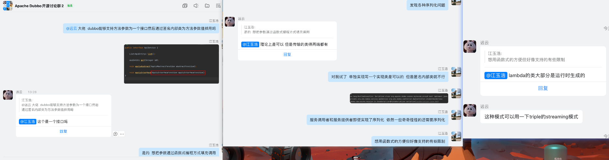

# 接口函数式调用

- 问题描述        

​        当我们发布一个服务(接口)参数为接口，服务消费者调用此接口时若是使用函数式接口或者匿名内部类将爆出各种序列化问题。

- 尝试解决

​      解决此序列化问题我们将参数RunFunction,ApiService,服务消费者实现序列化发现依然爆出序列化问题

- 最终方案

​      经过与官方沟通建议使用triple的streaming模式

```java
public interface ApiService {
    void runFunction(RunFunction runFunction);
}

public interface RunFunction {
    void onSuccess();
    void onError();
}

Caused by: java.lang.IllegalStateException: Serialized class org.apache.dubbo.common.bytecode.proxy0 must implement java.io.Serializable
	at com.alibaba.com.caucho.hessian.io.SerializerFactory.getDefaultSerializer(SerializerFactory.java:417)
	at com.alibaba.com.caucho.hessian.io.SerializerFactory.getSerializer(SerializerFactory.java:391)
	at com.alibaba.com.caucho.hessian.io.Hessian2Output.writeObject(Hessian2Output.java:411)
	at com.alibaba.com.caucho.hessian.io.JavaSerializer$FieldSerializer.serialize(JavaSerializer.java:302)
	... 35 more
```



# triple协议&dubbo3.0

1. 原生和 gRPC 协议互通。打通 gRPC 生态，降低从 gRPC 至 Dubbo 的迁移成本。
2. 增强多语言生态。避免因 CPP/C#/RUST 等语言的 Dubbo SDK 能力不足导致业务难以选型适配的问题。
3. 网关友好。网关无需参与序列化，方便用户从传统的 HTTP 转泛化 Dubbo 调用网关升级至开源或云厂商的 Ingress 方案。
4. 完善的异步和流式支持。带来从底层协议到上层业务的性能提升，易于构建全链路异步以及严格保证消息顺序的流式服务。

**步骤**

- [示例代码](https://gitee.com/deveho/start-boot/tree/feature/dubbo/triple)

- 导包3.0.0以上的包

- dubbo.protocol.name=tri

- import org.apache.dubbo.common.stream.StreamObserver;

  - 该包是必须且唯一的

  - ReflectionMethodDescriptor获取RpcType仅当形参为StreamObserver使用SERVER_STREAM模式

    ```java
    
        private RpcType determineRpcType() {
            if (generic) {
                return RpcType.UNARY;
            }
            if (parameterClasses.length > 2) {
                return RpcType.UNARY;
            }
            if (parameterClasses.length == 1 && isStreamType(parameterClasses[0]) && isStreamType(returnClass)) {
                return RpcType.BI_STREAM;
            }
            if (parameterClasses.length == 2 && !isStreamType(parameterClasses[0]) && isStreamType(
                parameterClasses[1]) && returnClass.getName().equals(void.class.getName())) {
                return RpcType.SERVER_STREAM;
            }
            if (Arrays.stream(parameterClasses).anyMatch(this::isStreamType) || isStreamType(returnClass)) {
                throw new IllegalStateException(
                    "Bad stream method signature. method(" + methodName + ":" + paramDesc + ")");
            }
            // Can not determine client stream because it has same signature with bi_stream
            return RpcType.UNARY;
        }
    
        private boolean isStreamType(Class<?> classType) {
            return StreamObserver.class.isAssignableFrom(classType);
        }
    ```

    

  - 而当为SERVER_STREAM模式的时候不需要检验StreamObserver的序列化会将其做为一个封装对象使用，不然其它的类会存在序列化问题，一下可以看到直接获取了(StreamObserver<Object>) invocation.getArguments()[1]对象没有将其作为参数处理。
    

    ```java
        AsyncRpcResult invokeServerStream(MethodDescriptor methodDescriptor, Invocation invocation,
            ClientCall call) {
            RequestMetadata request = createRequest(methodDescriptor, invocation, null);
            StreamObserver<Object> responseObserver = (StreamObserver<Object>) invocation.getArguments()[1];
            final StreamObserver<Object> requestObserver = streamCall(call, request, responseObserver);
            requestObserver.onNext(invocation.getArguments()[0]);
            requestObserver.onCompleted();
            return new AsyncRpcResult(CompletableFuture.completedFuture(new AppResponse()), invocation);
        }
    ```

  - 如果不是StreamObserver的话会获取所有的形参使用变全部需要实现序列化invocation.getArguments()，然而全部实现序列化是不现实的。(形参、服务提供者、服务消费者、一些框架内部的(验证发现的))

    ```java
        AsyncRpcResult invokeUnary(MethodDescriptor methodDescriptor, Invocation invocation,
            ClientCall call) {
            ExecutorService callbackExecutor = getCallbackExecutor(getUrl(), invocation);
            int timeout = calculateTimeout(invocation, invocation.getMethodName());
            invocation.setAttachment(TIMEOUT_KEY, timeout);
            final AsyncRpcResult result;
            DeadlineFuture future = DeadlineFuture.newFuture(getUrl().getPath(),
                methodDescriptor.getMethodName(), getUrl().getAddress(), timeout, callbackExecutor);
    
            RequestMetadata request = createRequest(methodDescriptor, invocation, timeout);
    
            final Object pureArgument;
    
            if (methodDescriptor instanceof StubMethodDescriptor) {
                pureArgument = invocation.getArguments()[0];
            } else {
                pureArgument = invocation.getArguments();
            }
            result = new AsyncRpcResult(future, invocation);
            FutureContext.getContext().setCompatibleFuture(future);
    
            result.setExecutor(callbackExecutor);
            ClientCall.Listener callListener = new UnaryClientCallListener(future);
    
            final StreamObserver<Object> requestObserver = call.start(request, callListener);
            requestObserver.onNext(pureArgument);
            requestObserver.onCompleted();
            return result;
        }
    ```

# required a single bean, but 3 were found:

​    

dubbo注入bean异常

```
[2023-04-19 16:27:36.036] [operatorName=,operatorId=,traceId=,thread=main,rows=40]  ERROR org.springframework.boot.diagnostics.LoggingFailureAnalysisReporter - 

***************************
APPLICATION FAILED TO START
***************************

Description:

Field fService in com.goldnurse.channel.manage.service.impl.EServiceImpl required a single bean, but 3 were found:
	- FServiceImpl: defined in file [D:\work\code\goldnurse\goldnurse-modules\goldnurse-channel-manage\goldnurse-channel-manage-starter\target\classes\com\goldnurse\channel\manage\service\impl\FServiceImpl.class]
	- @Reference(timeout=30000: a programmatically registered singleton	- version=3.3.3) com.goldnurse.channel.manage.service.FService: a programmatically registered singleton

Action:

Consider marking one of the beans as @Primary, updating the consumer to accept multiple beans, or using @Qualifier to identify the bean that should be consumed

```

## 问题原因

```
条件
1.三个bean发生循环依赖
2.其中的一个bean的@DubboService的版本为X，但是在循环依赖的其中一个bean中使用@DubboReference引入改版本为Y，当X!=Y时候便会发生上述异常(required a single bean, but 3 were found:)
因为当使用DubboReference的时候如果本地没有指定版本会进行创建但是这里还有循环依赖问题造成了该结果。
```


## 问题还原

```
public interface DService {
    void run();
}
public interface EService {
    void run();
}
public interface FService {
    void run();
}
@DubboService(version = "1.1.1")
public class DServiceImpl implements DService {

    @Autowired
    private EService eService;

    @DubboReference(version = "3.3.3", timeout = 30000)
    private FService fService;
    
    @Override
    public void run() {

    }

}
@DubboService(version = "1.1.1")
public class EServiceImpl implements EService {


    @Autowired
    private DService dService;

    @Autowired
    private FService fService;
    @Override
    public void run() {

    }

}
@DubboService(version = "1.1.1")
public class FServiceImpl implements FService {


    @Autowired
    private EService eService;

    @Override
    public void run() {

    }

}

```

# telnet invoke

```
找到客户端端口
telnet 127.0.0.1 20880
ps -l 列出服务
invoke com.team.DubboService.exec(param1,param2,param3)
param为JSON或单个字段
```

# 直连提供者

[文档](https://cn.dubbo.apache.org/zh-cn/overview/mannual/java-sdk/advanced-features-and-usage/service/explicit-target/#%E9%80%9A%E8%BF%87%E6%96%87%E4%BB%B6%E6%98%A0%E5%B0%84)

```
java -Dcom.alibaba.xxx.XxxService=dubbo://localhost:20890
java -Ddubbo.resolve.file=xxx.properties
1.0.15 及以上版本支持，2.0 以上版本自动加载 ${user.home}/dubbo-resolve.properties文件，不需要配置
```

