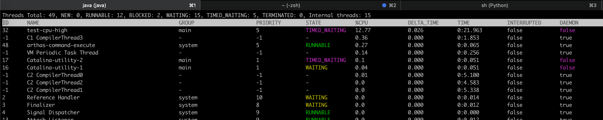
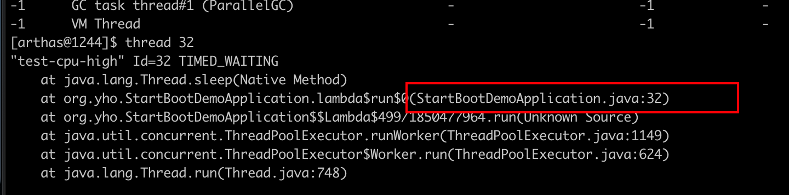
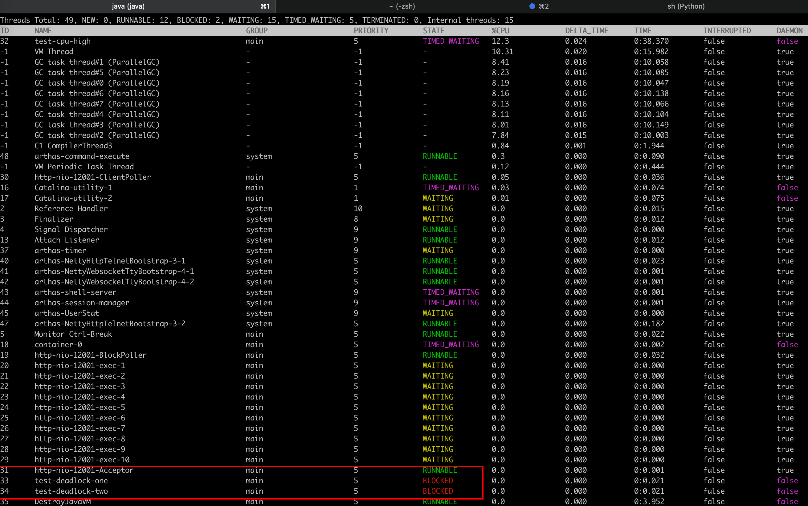
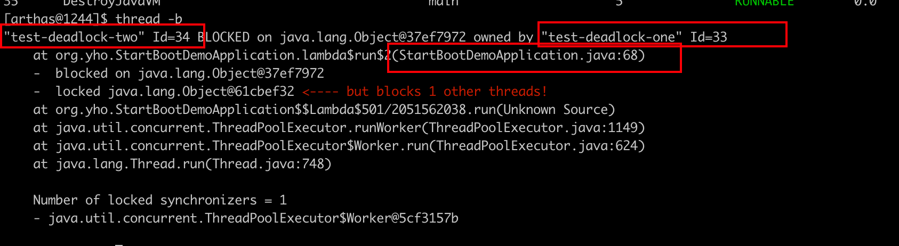

# 示例代码

```java
package org.yho;

import org.springframework.boot.ApplicationArguments;
import org.springframework.boot.ApplicationRunner;
import org.springframework.boot.SpringApplication;
import org.springframework.boot.autoconfigure.SpringBootApplication;
import org.springframework.scheduling.annotation.EnableAsync;
import org.yho.core.common.LogService;
import org.yho.core.common.thread.ThreadPoolUtil;

/**
 * @author yho
 */
@EnableAsync
@SpringBootApplication
public class StartBootDemoApplication implements ApplicationRunner {

    public static void main(String[] args) {
        SpringApplication.run(StartBootDemoApplication.class, args);
    }

    @Override
    public void run(ApplicationArguments args) throws Exception {
        final Object o1 = new Object();
        final Object o2 = new Object();
        ThreadPoolUtil.execute(() -> {
            {
                Thread.currentThread().setName("test-cpu-high");
                while (true) {
                    LogService.debug("模拟CPU高占用");
                    try {
                        Thread.sleep(1);
                    } catch (InterruptedException e) {
                        e.printStackTrace();
                    }
                }
            }
        });

        ThreadPoolUtil.execute(() -> {
            {
                Thread.currentThread().setName("test-deadlock-one");
                synchronized (o1) {
                    try {
                        Thread.sleep(1000);
                    } catch (InterruptedException e) {
                        e.printStackTrace();
                    }
                    System.out.println("以获取o1锁等待获取o2锁");
                    synchronized (o2) {
                        System.out.println("以获取o1锁并获取到o2锁");
                    }
                }
            }
        });

        ThreadPoolUtil.execute(() -> {
            {
                Thread.currentThread().setName("test-deadlock-two");
                synchronized (o2) {
                    try {
                        Thread.sleep(1000);
                    } catch (InterruptedException e) {
                        e.printStackTrace();
                    }
                    System.out.println("以获取o2锁等待获取o1锁");
                    synchronized (o1) {
                        System.out.println("以获取o2锁并获取到o1锁");
                    }
                }
            }
        });
    }


}

```


# 排查CPU飙高

## 1利用arthas

输入thread命令发现CPU占用最高的test-cpu-high线程ID为32



显示指定线程的运行堆栈 thread 32查看堆栈与代码比较可知



## 2使用top&jstack

- 1.使用jps -l定位进程ID

- 2.使用top -Hp pid 定位进程中CPU占用最高的线程

- 3.将第二部得到的PID转16进制  printf '%x\n'  PID

- 4.使用jstack获取对应堆栈信息

  ```
  jstack  process_pid | grep 16_thread_pid -A 10 -B 3
  process_pid 进程PID
  16_thread_pid 线程PID对应16进制
  ```

  

# 查线程死锁

输入thread命令可以看到线程的状态包含死锁的



使用thread -b 查看死锁线程可以看到死锁的线程以及代码信息

