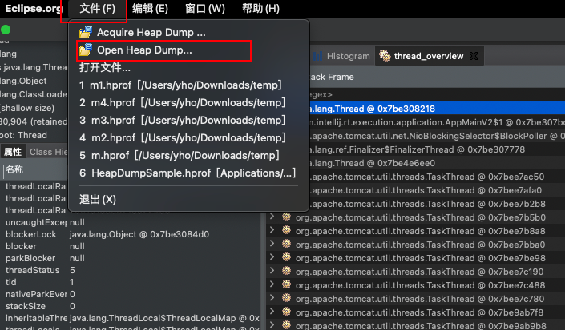
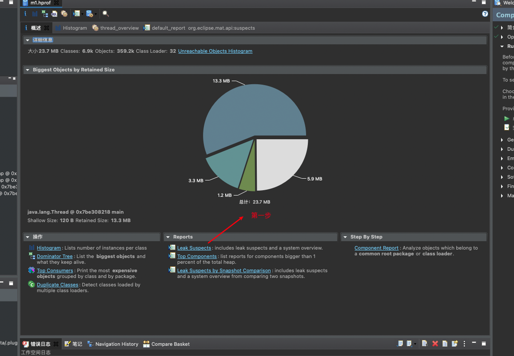
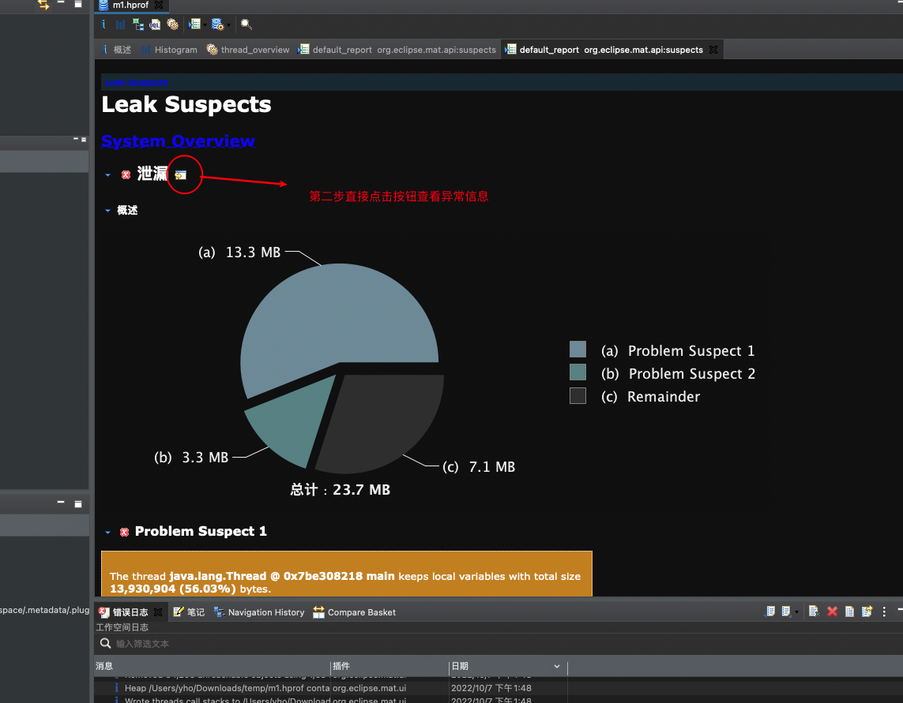
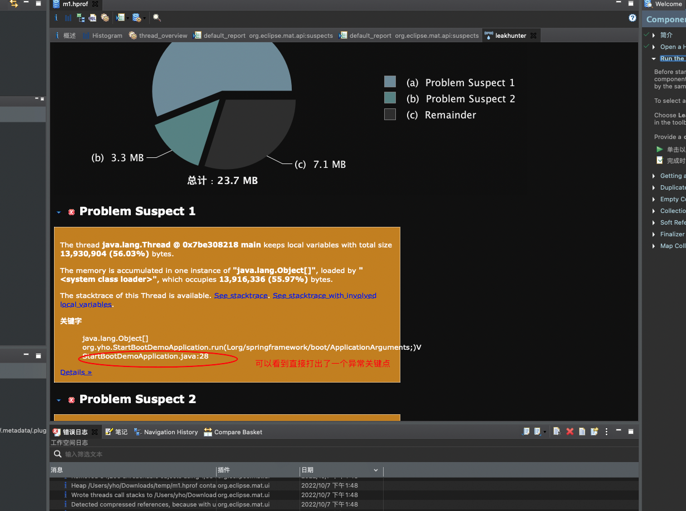
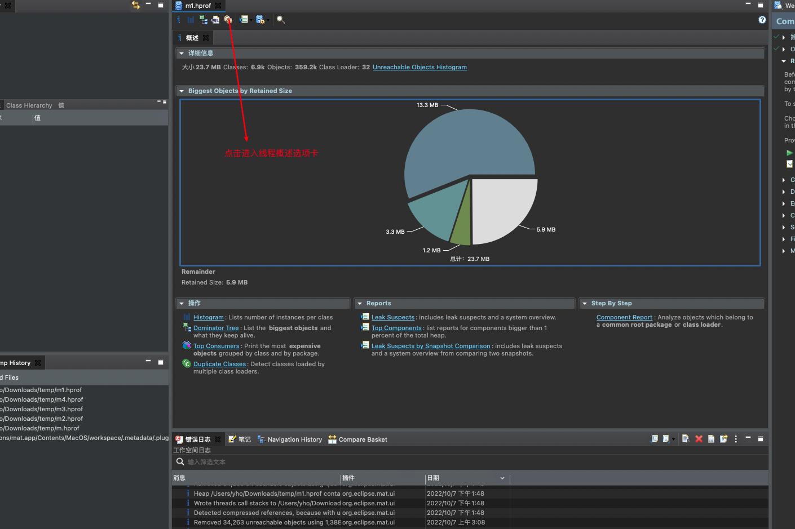
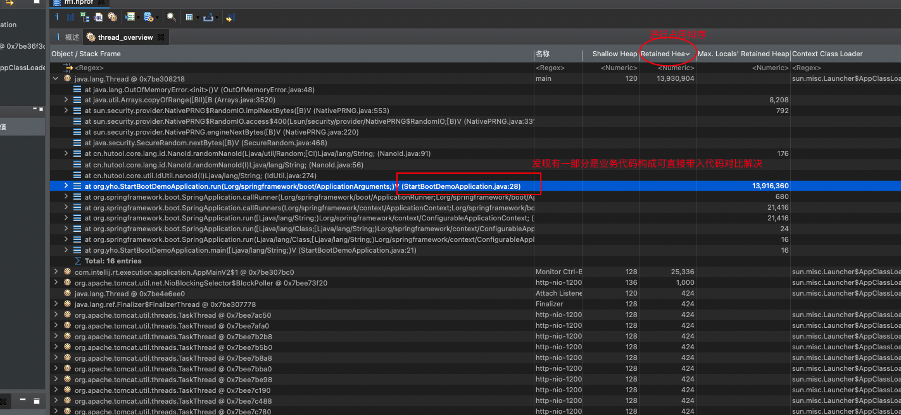
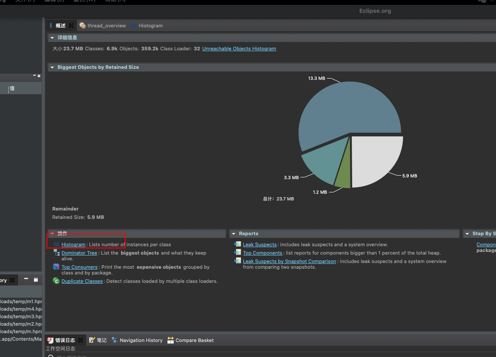
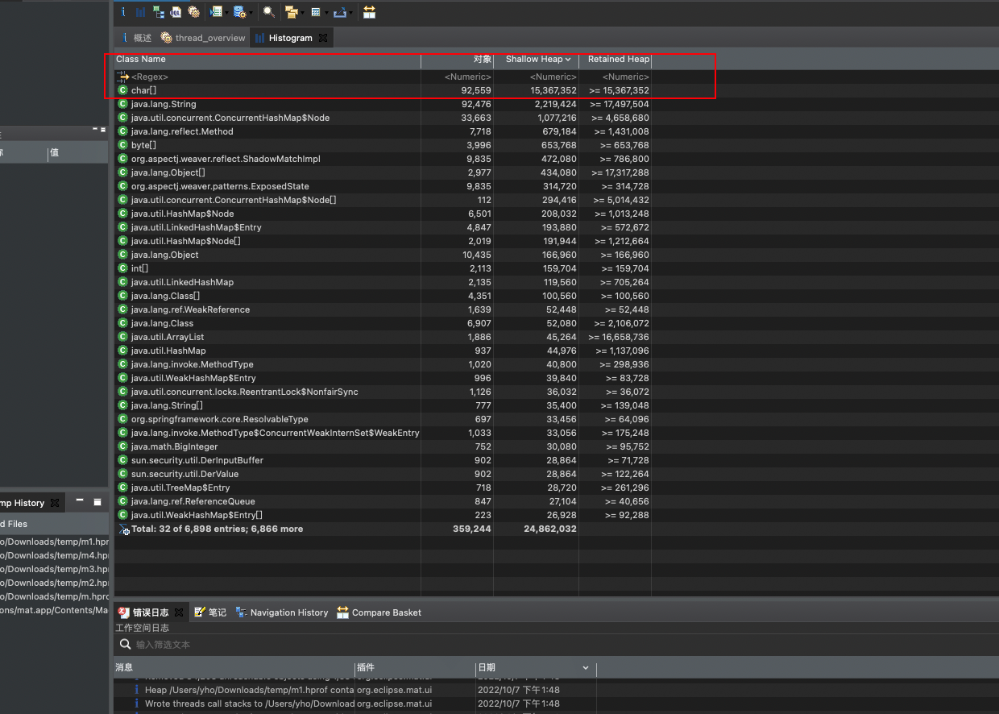

# 排查思路

- 首先我们应该先保留堆栈快照信息

```
第一种方式在运行参数中参加-XX:+HeapDumpOnOutOfMemoryError -XX:HeapDumpPath配置
nohup java -Xmx30m -XX:+HeapDumpOnOutOfMemoryError -XX:HeapDumpPath=/filepath/dump.hprof  -jar start-boot-demo-0.0.1-SNAPSHOT.jar   >/dev/null 2>&1 &
第二种方式
jdk导出堆文件 不想触发 FGC去掉live
jmap -dump:format=b,file=/filepath/dump.hprof PID
jmap -dump:live,format=b,file=/path/to/heap.hprof PID
```

- 准备一份异常代码

  ```java
  package org.yho;
  
  import cn.hutool.core.util.IdUtil;
  import org.springframework.boot.ApplicationArguments;
  import org.springframework.boot.ApplicationRunner;
  import org.springframework.boot.SpringApplication;
  import org.springframework.boot.autoconfigure.SpringBootApplication;
  import org.springframework.scheduling.annotation.EnableAsync;
  
  import java.util.ArrayList;
  import java.util.List;
  
  /**
   * @author yho
   */
  @EnableAsync
  @SpringBootApplication
  public class StartBootDemoApplication implements ApplicationRunner {
  
      public static void main(String[] args) throws InterruptedException {
          SpringApplication.run(StartBootDemoApplication.class, args);
      }
  
      @Override
      public void run(ApplicationArguments args) throws Exception {
          List<String> ids = new ArrayList<>();
          while (true) {
              ids.add(IdUtil.nanoId(100));
          }
      }
  }
  
  ```

  

- 使用mat(Memory Analyzer)导入堆栈文件



- 一般来说可以使用以下几种方式排查是哪里出现了大对象占用内存

  - 直接查看异常时的堆栈信息

    





最终对比28行与代码比较可以解决问题

- 第二种方式查看线程概述

  

  

  我们通过排序找到占用最大的线程后查看树状结果图可发现业务异常代码

# 实际工作

之前线上有一个websocket的接口用于处理用户录音上传动作某日该服务假死，经查看日志发现出现OOM异常并携带业务日志大量输出了为1M大小的byte数组大小的日志(前端实时上传为1M大小的音频文件上传)

由于服务启动没有配置OOM时导出栈堆文件所以使用jmap(jmap -dump:format=b,file=/filepath/dump.hprof PID)导出之后导入MAT查看堆栈信息点击按钮HIstogram发现占用大量内存的是byte数组(下文图为后补实际是大byte数组占用高位)截止到此结合打印的1M大小的byte数组和业务场景基本可以断定用户在实际使用中频繁上传录音文件造成服务内存不足结合当时日志打印的频率既用户上传录音文件上传数据的大小最终作出调整JVM参数调整内存大小解决最终分配大小如下

```
	 -Xms512m -Xmx3000m -XX:NewSize=512m -XX:MaxNewSize=1000m -XX:NewRatio=3 \
```




