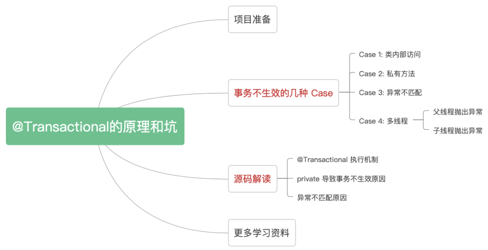

# @Transactional

## 事务失效

```
参考文档 https://mp.weixin.qq.com/s/r388pF8-c6sPVyVGjLBjqg
```




## 事务提交后执行

```java
package org.yho.mybatis.utils;


import lombok.extern.slf4j.Slf4j;
import org.springframework.jdbc.datasource.DataSourceTransactionManager;
import org.springframework.transaction.TransactionStatus;
import org.springframework.transaction.support.DefaultTransactionDefinition;
import org.springframework.transaction.support.TransactionSynchronizationAdapter;
import org.springframework.transaction.support.TransactionSynchronizationManager;
import org.springframework.transaction.support.TransactionTemplate;

import java.util.function.Supplier;

/**
 * 事务处理器
 * created date 2021/11/11 9:50
 *
 * @author JiangYuhao
 */
@Slf4j
public class TransactionHolder<T> {

    /**
     * 执行事务安全的代码
     *
     * @param supplier
     * @return
     */
    public static <T> T executeTransactionTemplate(Supplier<T> supplier) {
        TransactionTemplate transactionTemplate = SpringContextHolder.getBean(TransactionTemplate.class);
        return transactionTemplate.execute((status -> {
            try {
                return supplier.get();
            } catch (Exception e) {
                status.setRollbackOnly();
                throw e;
            }
        }));
    }

    public static <T> T executeTransactionTemplate(Supplier<T> supplier, Runnable callback) {
        TransactionTemplate transactionTemplate = SpringContextHolder.getBean(TransactionTemplate.class);
        return transactionTemplate.execute((status -> {
            try {
                commitCallbackNotify(callback);
                return supplier.get();
            } catch (Exception e) {
                status.setRollbackOnly();
                throw e;
            }
        }));
    }

    /**
     * 执行事务安全的代码
     *
     * @param supplier
     * @return
     */
    public static <T> T execute(Supplier<T> supplier) {
        DataSourceTransactionManager dataSourceTransactionManager = SpringContextHolder.getBean(DataSourceTransactionManager.class);
        TransactionStatus transactionStatus = dataSourceTransactionManager.getTransaction(new DefaultTransactionDefinition());
        try {
            T t = supplier.get();
            dataSourceTransactionManager.commit(transactionStatus);
            return t;
        } catch (Exception e) {
            dataSourceTransactionManager.rollback(transactionStatus);
            throw e;
        }
    }

    public static <T> T execute(Supplier<T> supplier, Runnable callback) {
        DataSourceTransactionManager dataSourceTransactionManager = SpringContextHolder.getBean(DataSourceTransactionManager.class);
        TransactionStatus transactionStatus = dataSourceTransactionManager.getTransaction(new DefaultTransactionDefinition());
        try {
            commitCallbackNotify(callback);
            T t = supplier.get();
            dataSourceTransactionManager.commit(transactionStatus);
            return t;
        } catch (Exception e) {
            dataSourceTransactionManager.rollback(transactionStatus);
            throw e;
        }
    }

    static void commitCallbackNotify(Runnable callback) {
        if (TransactionSynchronizationManager.isActualTransactionActive()) {
            /**
             * https://www.cnblogs.com/kkkfff/p/13778692.html
             * 还可以使用event发布订阅方式
             */
            TransactionSynchronizationManager.registerSynchronization(new TransactionSynchronizationAdapter() {
                @Override
                public void afterCommit() {
                    try {
                        //回调
                        callback.run();
                        //回调
                    } catch (Exception e) {
                        log.error("事务提交后回调失败", e);
                    }
                }
            });
        }
    }
}

```

