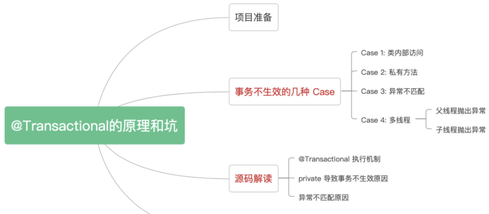
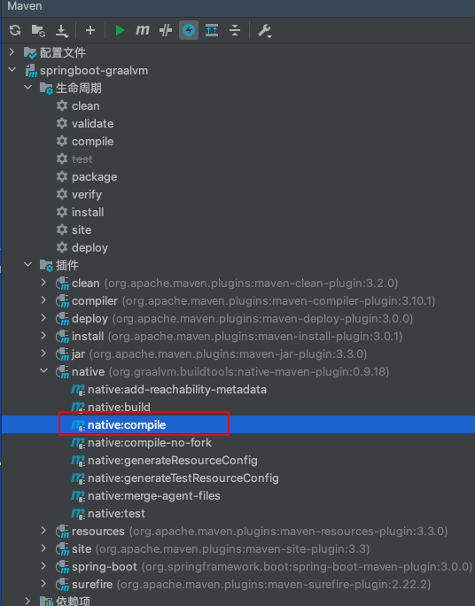

# @Transactional

## 事务特性

- 原子性(Atomicity)：

  事务是数据库的逻辑工作单位，它对数据库的修改要么全部执行，要么全部不执行。

- 一致性(Consistemcy)：

  事务前后，数据库的状态都满足所有的完整性约束。

- 隔离性(Isolation)：

  ​		并发执行的事务是隔离的，一个不影响一个。如果有两个事务，运行在相同的时间内，执行相同的功能，事务的隔离性将确保每一事务在系统中认为只有该事务在使用系统。这种属性有时称为串行化，为了防止事务操作间的混淆，必须串行化或序列化请求，使得在同一时间仅有一个请求用于同一数据。通过设置数据库的隔离级别，可以达到不同的隔离效果。

- 持久性(Durability)：

  在事务完成以后，该事务所对数据库所作的更改便持久的保存在数据库之中，并不会被回滚。


## 事务问题

- 脏读

  当一个事务读取另一个事务尚未提交的修改数据时，产生脏读。

- 不可重复读

  同一查询在同一事务中多次进行，由于其他提交事务所做的修改(update)或删除(delete)，每次返回不同的结果集，此时发生不可重复读。

- 幻读

  同一查询在同一事务中多次进行，由于其他提交事务所做的插入(insert)操作，每次返回不同的结果集，此时发生幻读。


## 传播机制

在声明式事务中通过配置@Transactional主键实现事务，内参数可以配置传播机制

例如：    @Transactional(propagation = Propagation.REQUIRED, rollbackFor = Exception.class)

| 传播机制                  | 说明                                                         |
| ------------------------- | ------------------------------------------------------------ |
| Propagation.REQUIRED      | 支持当前事务，如果当前没有事务，则新建一个事务。             |
| Propagation.SUPPORTS      | 支持当前事务，如果当前没有事务，就以非事务方式执行。         |
| Propagation.MANDATORY     | 支持当前事务，如果当前没有事务，就抛出异常。                 |
| Propagation.REQUIRES_NEW  | 新建事务，如果当前存在事务，把当前事务挂起。                 |
| Propagation.NOT_SUPPORTED | 以非事务方式执行操作，如果当前存在事务，就把当前事务挂起。   |
| Propagation.NEVER         | 以非事务方式执行，如果当前存在事务，则抛出异常。             |
| Propagation.NESTED        | 支持当前事务，如果当前事务存在，则执行一个嵌套事务，如果当前没有事务，就新建一个事务。 |

## 隔离级别

在声明式事务中通过配置@Transactional主键实现事务，内参数可以配置隔离级别

例如：    @Transactional(isolation = Isolation.DEFAULT, rollbackFor = Exception.class)

| 隔离级别                   | 名称     | 说明                                                         |
| -------------------------- | -------- | ------------------------------------------------------------ |
| Isolation.DEFAULT          | 默认     | DEFAULT为数据源（数据库）的默认隔离级别，以目前常用的MySQL为例，默认的隔离级别通常为REPEATABLE_READ。 |
| Isolation.READ_UNCOMMITTED | 读未提交 | 一个事务可以读取另一个未提交事务的数据，可能出现脏读、不可重复读、幻读。 |
| Isolation.READ_COMMITTED   | 读提交   | 读取另一个事务提交的数据，此刻读取到的数据，在未提交之前可能受其它事务影响(update/delete)二次读取到的结果不一致。可以解决脏读问题，但不能解决不可重复读问题和幻读问题。 |
| Isolation.REPEATABLE_READ  | 可重复读 | 一个事务要等待另一个事务更新提交后才能读取数据。重复读可以解决不可重复读问题。但是可能还会有幻读问题。幻读问题对应的是插入insert操作。 |
| Isolation.SERIALIZABLE     | 串行化   | 所有事务按顺序执行                                           |

## 事务失效

```
参考文档 https://mp.weixin.qq.com/s/r388pF8-c6sPVyVGjLBjqg
```




## 解决private失效

以下来自 Spring 官方文档：

> When using proxies, you should apply the @Transactional annotation only to methods with public visibility. If you do annotate protected, private or package-visible methods with the @Transactional annotation, no error is raised, but the annotated method does not exhibit the configured transactional settings. Consider the use of AspectJ (see below) if you need to annotate non-public methods.

```
大概意思就是 @Transactional 只能用于 public 的方法上，否则事务不会失效，如果要用在非 public 方法上，可以开启 AspectJ 代理模式。
```


## 事务提交后执行

```java
package org.yho.mybatis.utils;


import lombok.extern.slf4j.Slf4j;
import org.springframework.jdbc.datasource.DataSourceTransactionManager;
import org.springframework.transaction.TransactionStatus;
import org.springframework.transaction.support.DefaultTransactionDefinition;
import org.springframework.transaction.support.TransactionSynchronizationAdapter;
import org.springframework.transaction.support.TransactionSynchronizationManager;
import org.springframework.transaction.support.TransactionTemplate;

import java.util.function.Supplier;

/**
 * 事务处理器
 * created date 2021/11/11 9:50
 *
 * @author JiangYuhao
 */
@Slf4j
public class TransactionHolder<T> {

    /**
     * 执行事务安全的代码
     *
     * @param supplier
     * @return
     */
    public static <T> T executeTransactionTemplate(Supplier<T> supplier) {
        TransactionTemplate transactionTemplate = SpringContextHolder.getBean(TransactionTemplate.class);
        return transactionTemplate.execute((status -> {
            try {
                return supplier.get();
            } catch (Exception e) {
                status.setRollbackOnly();
                throw e;
            }
        }));
    }

    public static <T> T executeTransactionTemplate(Supplier<T> supplier, Runnable callback) {
        TransactionTemplate transactionTemplate = SpringContextHolder.getBean(TransactionTemplate.class);
        return transactionTemplate.execute((status -> {
            try {
                commitCallbackNotify(callback);
                return supplier.get();
            } catch (Exception e) {
                status.setRollbackOnly();
                throw e;
            }
        }));
    }

    /**
     * 执行事务安全的代码
     *
     * @param supplier
     * @return
     */
    public static <T> T execute(Supplier<T> supplier) {
        DataSourceTransactionManager dataSourceTransactionManager = SpringContextHolder.getBean(DataSourceTransactionManager.class);
        TransactionStatus transactionStatus = dataSourceTransactionManager.getTransaction(new DefaultTransactionDefinition());
        try {
            T t = supplier.get();
            dataSourceTransactionManager.commit(transactionStatus);
            return t;
        } catch (Exception e) {
            dataSourceTransactionManager.rollback(transactionStatus);
            throw e;
        }
    }

    public static <T> T execute(Supplier<T> supplier, Runnable callback) {
        DataSourceTransactionManager dataSourceTransactionManager = SpringContextHolder.getBean(DataSourceTransactionManager.class);
        TransactionStatus transactionStatus = dataSourceTransactionManager.getTransaction(new DefaultTransactionDefinition());
        try {
            commitCallbackNotify(callback);
            T t = supplier.get();
            dataSourceTransactionManager.commit(transactionStatus);
            return t;
        } catch (Exception e) {
            dataSourceTransactionManager.rollback(transactionStatus);
            throw e;
        }
    }

    static void commitCallbackNotify(Runnable callback) {
        if (TransactionSynchronizationManager.isActualTransactionActive()) {
            /**
             * https://www.cnblogs.com/kkkfff/p/13778692.html
             * 还可以使用event发布订阅方式
             */
            TransactionSynchronizationManager.registerSynchronization(new TransactionSynchronizationAdapter() {
                @Override
                public void afterCommit() {
                    try {
                        //回调
                        callback.run();
                        //回调
                    } catch (Exception e) {
                        log.error("事务提交后回调失败", e);
                    }
                }
            });
        }
    }
}

```

# 可执行文件

- GraalVM
- springboot3.0
- [参考文档](https://blog.csdn.net/weixin_60223449/article/details/128120918)
- 配置插件
- [示例代码](https://gitee.com/deveho/springboot-graalvm.git)

```xml
    <build>
        <plugins>
            <plugin>
                <groupId>org.graalvm.buildtools</groupId>
                <artifactId>native-maven-plugin</artifactId>
                <extensions>true</extensions>
                <executions>
                    <execution>
                        <id>build-native</id>
                        <goals>
                            <goal>compile-no-fork</goal>
                        </goals>
                        <phase>package</phase>
                    </execution>
                    <execution>
                        <id>test-native</id>
                        <goals>
                            <goal>test</goal>
                        </goals>
                        <phase>test</phase>
                    </execution>
                </executions>
                <configuration>
                    <!-- 此处是入口类,必须与实际代码一致,否则无法打包成功-->
                    <mainClass>org.yho.graalvm.GraalVMApplication</mainClass>
                    <!--  生成的可执行文件名-->
                    <imageName>run</imageName>
                    <buildArgs>
                        <buildArg>--verbose</buildArg>
                    </buildArgs>
                </configuration>
            </plugin>
            <plugin>
                <groupId>org.springframework.boot</groupId>
                <artifactId>spring-boot-maven-plugin</artifactId>
                <configuration>
                    <excludes>
                        <exclude>
                            <groupId>org.projectlombok</groupId>
                            <artifactId>lombok</artifactId>
                        </exclude>
                    </excludes>
                </configuration>
            </plugin>
        </plugins>
    </build>
```

 - 执行打包命令

   - 可通过idea中maven插件执行

   - 直接通过命令

   - 运行可执行文件即可启动程序

     ```java
      mvn -Pnative -DskipTests clean package
      ./target/run
     ```

     

     

# 循环依赖

```java
package org.yho.study.web.daily.circular.dependency;

import org.yho.core.common.ReflectionUtils;

/**
 * 演示解答spring的循环依赖问题
 * Spring 提供了除了构造函数注入和原型注入外的，setter循环依赖注入解决方案。
 * spring通过三级缓存延迟生成初始化完成的Bean解决循环依赖
 * 一级缓存：为“Spring 的单例属性”而生 ，就是个单例池，用来存放已经初始化完成的单例 Bean；
 * 二级缓存：为“解决 AOP”而生 ，存放的是半成品的 AOP 的单例 Bean；
 * 三级缓存：为“打破循环”而生 ，存放的是生成半成品单例 Bean 的工厂方法。
 *
 *
 * 原型注入：每次获取都是一个新的bean
 * @Component
 * @Scope(value = BeanDefinition.SCOPE_PROTOTYPE)
 */
public class CircularDependencyFactory {
    public static void main(String[] args) throws Exception {
        CircularDependencyA a = new CircularDependencyA();
        CircularDependencyB b = new CircularDependencyB();

        //此方式类似于在在字段上注解@Resource
        ReflectionUtils.setFieldValue(a, "circularDependencyB", b);
        ReflectionUtils.setFieldValue(b, "circularDependencyA", a);

        //此方式类似于在在set方法上注解@Resource
        ReflectionUtils.invokeMethod(a, ReflectionUtils.getMethod(a, "setCircularDependencyB", b.getClass()), b);
        ReflectionUtils.invokeMethod(b, ReflectionUtils.getMethod(b, "setCircularDependencyA", a.getClass()), a);

        a.action();
        b.action();

        //通过以上可以发现，通过创建空对象(字段值为null)在给字段赋值的方式可以解决循环依赖问题
        //如果通过构造方法的话，需要在创建对象的时候准备好字段的对象值，
        //准备好的在于，构造对象要求传入对象的话，对于构造方法中对于对象的操作是未知的，所以必须准备好在传入
        //而多个对象循环引用，还要求传入一个准备好的对象这种情况是无法解决的，故spring不解决构造方的循环引用问题

        //而构造方法不要求传入准备好的对象，也可以先传入一个空对象，暂时创建对象，而后给其赋值
        //先传入一个空对象类似于使用@Lazy注解，生成一个代理对象，调用的时候获取原生对象

        //spring还可以手动处理，实现两个接口ApplicationContextAware, InitializingBean，获取上下文对象，并手动设置对象

        CircularDependencyA a1 = new CircularDependencyA(new CircularDependencyB(null));
        CircularDependencyB b1 = new CircularDependencyB(new CircularDependencyA(null));
        ReflectionUtils.setFieldValue(a1, "circularDependencyB", b1);
        ReflectionUtils.setFieldValue(b1, "circularDependencyA", a1);
        a1.action();
        b1.action();

        CircularDependencyA a2 = ReflectionUtils.newInstance(ReflectionUtils.getConstructor(a1, CircularDependencyB.class), b1);
        CircularDependencyB b2 = ReflectionUtils.newInstance(ReflectionUtils.getConstructor(b1, CircularDependencyA.class), a1);
        a2.action();
        b2.action();

    }
}
```

```java
package org.yho.study.web.daily.circular.dependency;

import org.springframework.beans.BeansException;
import org.springframework.beans.factory.InitializingBean;
import org.springframework.context.ApplicationContext;
import org.springframework.context.ApplicationContextAware;

public class CircularDependencyA implements ApplicationContextAware, InitializingBean {
    private CircularDependencyB circularDependencyB;

    private ApplicationContext context;

    public CircularDependencyA() {
    }

    public CircularDependencyA(CircularDependencyB circularDependencyB) {
        this.circularDependencyB = circularDependencyB;
    }

    public void setCircularDependencyB(CircularDependencyB circularDependencyB) {
        this.circularDependencyB = circularDependencyB;
    }

    public void action() {
        System.err.println("执行A对象动作");
    }

    @Override
    public void setApplicationContext(ApplicationContext applicationContext) throws BeansException {
        context = applicationContext;
    }

    @Override
    public void afterPropertiesSet() throws Exception {
        circularDependencyB = context.getBean(CircularDependencyB.class);
    }

}
```

```java
package org.yho.study.web.daily.circular.dependency;

public class CircularDependencyB {

    private CircularDependencyA circularDependencyA;

    public CircularDependencyB() {
    }

    public CircularDependencyB(CircularDependencyA circularDependencyA) {
        this.circularDependencyA = circularDependencyA;
    }

    public void setCircularDependencyA(CircularDependencyA circularDependencyA) {
        this.circularDependencyA = circularDependencyA;
    }

    public void action() {
        System.err.println("执行B对象动作");
        circularDependencyA.action();
    }
}
```

# 项目启动前加载自定义配置

通过改功能可以在项目启动前统一配置本地项目的自定义话配置而不用改动代码，例如本地测试时候需要自定义端口号dubbo的版本feign的调用地址等可以通过改功能实现，该功能的读取索引为项目的spring.application.name值，需要配置好spring.application.name.properties配置。

- 创建`META-INF/spring.factories`文件：在自动配置模块的resources目录下创建`META-INF/spring.factories`文件，并添加以下内容： 

  ```
  org.springframework.boot.env.EnvironmentPostProcessor=com.team.config.ConfigurationReader
  ```

- 会在配置目录下读取bootstrap.properties的公共配置在读取spring.application.name的项目配置

- 编写自动读取类

  ```java
  package com.team.config;
  
  import org.springframework.beans.factory.config.YamlPropertiesFactoryBean;
  import org.springframework.boot.SpringApplication;
  import org.springframework.boot.env.EnvironmentPostProcessor;
  import org.springframework.core.env.ConfigurableEnvironment;
  import org.springframework.core.env.MapPropertySource;
  import org.springframework.core.io.ClassPathResource;
  import org.springframework.core.io.support.PropertiesLoaderUtils;
  
  import java.io.File;
  import java.io.FileInputStream;
  import java.io.IOException;
  import java.io.InputStream;
  import java.util.HashMap;
  import java.util.Map;
  import java.util.Properties;
  
  /**
   * @author yho
   * @create 2023-06-16 16:17
   * @Description
   */
  public class ConfigurationReader implements EnvironmentPostProcessor {
      private static final String BASE_PATH = "D:\\me\\worklog\\configlist";
  
      @Override
      public void postProcessEnvironment(ConfigurableEnvironment environment, SpringApplication application) {
          // 读取配置信息，并将其添加到环境中,自定义方法，读取配置信息
          environment.getPropertySources().
                  addFirst(
                          new MapPropertySource("yourConfig",
                                  readYourConfig(environment, application)));
      }
  
      private Map<String, Object> readYourConfig(ConfigurableEnvironment environment, SpringApplication application) {
          try {
              String springApplicationName = environment.getProperty("spring.application.name");
              if (springApplicationName == null || springApplicationName == "") {
                  YamlPropertiesFactoryBean factory = new YamlPropertiesFactoryBean();
                  factory.setResources(new ClassPathResource("application.yml"));
                  factory.afterPropertiesSet();
                  Properties properties = factory.getObject();
                  springApplicationName = properties.getProperty("spring.application.name");
                  if (springApplicationName == null || springApplicationName == "") {
                      properties = PropertiesLoaderUtils.loadProperties(new ClassPathResource("application.properties"));
                      springApplicationName = properties.getProperty("spring.application.name");
                      if (springApplicationName == null || springApplicationName == "") {
                          throw new RuntimeException("not bootstrap config spring.application.name");
                      }
                  }
              }
              // 读取配置信息的具体逻辑，可以从文件、数据库或其他地方获取配置信息
              // 返回一个包含配置属性的Map
              return getSpringApplicationName(springApplicationName);
          } catch (IOException e) {
              e.printStackTrace();
              return new HashMap<>();
          }
      }
  
      private Map<String, Object> getSpringApplicationName(String springApplicationName) throws IOException {
          InputStream is = new FileInputStream(BASE_PATH + File.separator + "public.properties");
          Properties properties = new Properties();
          properties.load(is);
          Map<String, Object> result = new HashMap<>();
          for (String key : properties.stringPropertyNames()) {
              result.put(key, properties.getProperty(key));
          }
          String port = properties.getProperty(springApplicationName);
          result.put("server.port", port);
  
          is = new FileInputStream(BASE_PATH + File.separator + springApplicationName + ".properties");
          properties = new Properties();
          properties.load(is);
          for (String key : properties.stringPropertyNames()) {
              result.put(key, properties.getProperty(key));
          }
          return result;
  //        List<Map<String, Object>> list = new ArrayList<Map<String, Object>>() {{
  //            add(new HashMap<String, Object>() {{
  //                put("spring.application.name", "application-name-starter");
  //                put("server.port", 10001);
  //            }});
  //        }};
//        Optional<Map<String, Object>> first = list.stream().
  //                filter((entity) -> entity.get("spring.application.name").equals(springApplicationName)).
  //                collect(Collectors.toList()).stream().findFirst();
  //        return first.get();
      }
  }
  ```
  
  

