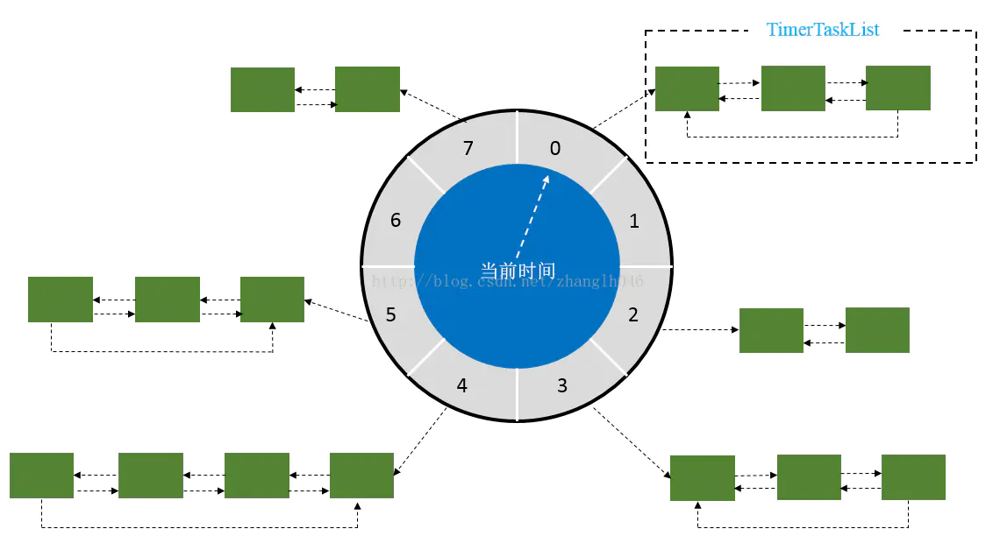
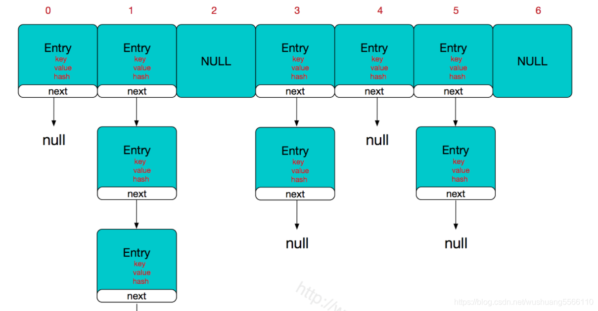
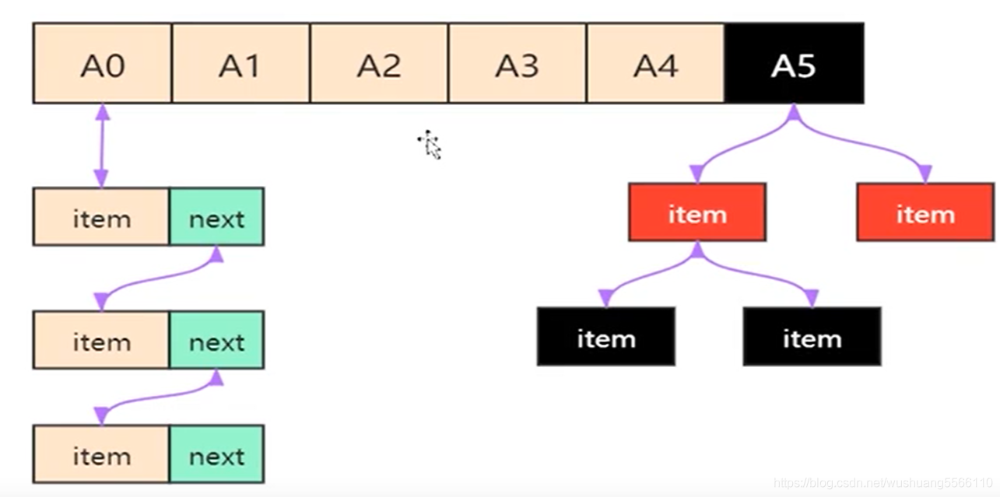
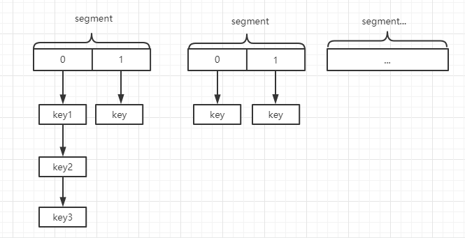
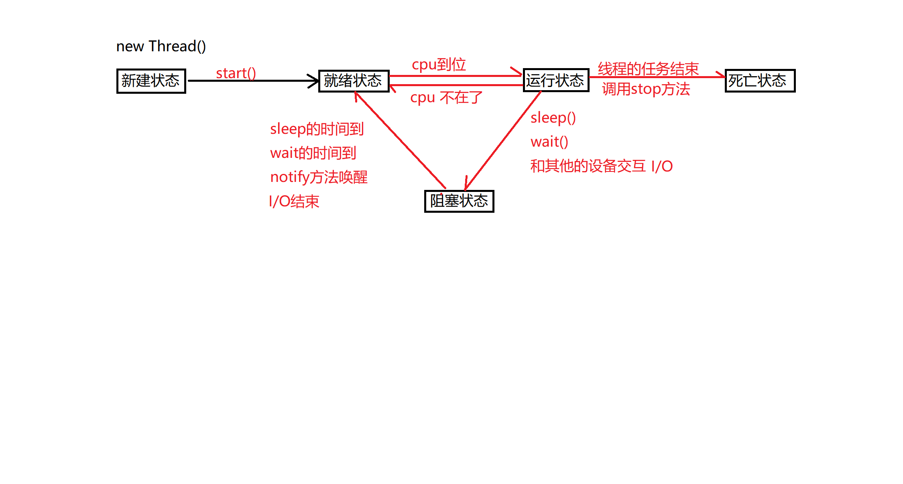
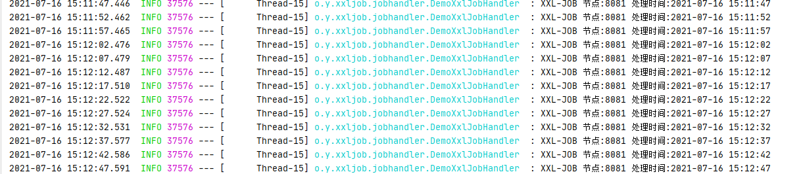
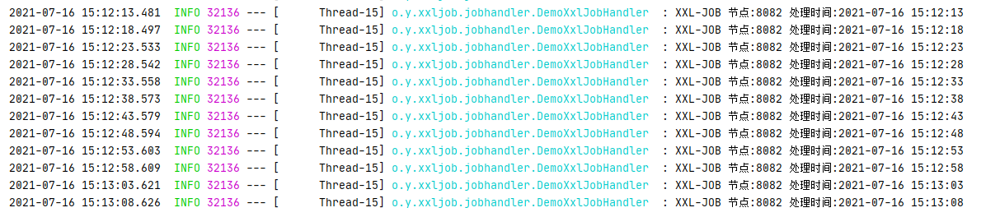
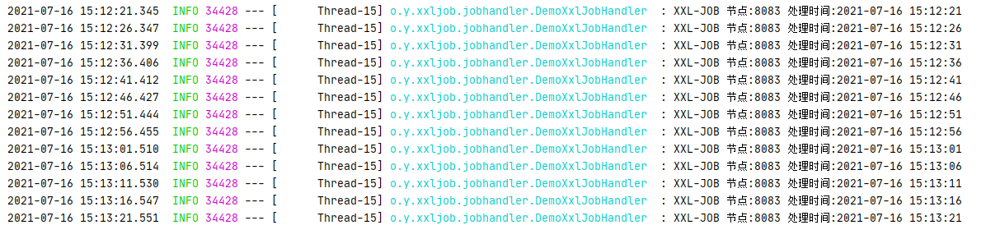

# 1.问题点

线程，线程池，设计模式，数据库,jvm、垃圾回收、数据库一些索引，优化，存储过程，引擎、redis、hashmap  集合、jdk8的新特性、springcloud、jvm比较深

# 2.mysql

## 2.1 mysql底层数据结构是什么？做过哪些数据库优化？

```
https://blog.csdn.net/nrsc272420199/article/details/104511925
b+树，索引优化和字段多分表等优化方案，
之所以不是二叉树和红黑树(平衡二叉树)是因为面对大数据量时树的高度将会不断变高即使红黑树做了高度查找的优化，高的数据结构再查找数据时将会多次进行磁盘IO，带来性能损耗。cpu每次从磁盘上至少读取1页（64位系统为4K）的数据，但是由于每个节点在磁盘中的位置是随机的，所以有很大概率cpu每次仅仅只能从磁盘读取到一个索引值。而b+数非叶子节点可以存储多个索引

InnoDB的主键索引叶子节点包含了该索引对应的整行数据，非主键索引只包含了索引的主键值还需要去查找物理地址和数据


存储引擎
MyISAM 表级锁、不支持事务和全文索引
innodb ：行级锁、事务安全（ACID兼容）、支持外键、不支持FULLTEXT类型的索引(5.6.4以后版本开始支持FULLTEXT类型的索引)。InnoDB存储引擎提供了具有提交、回滚和崩溃恢复能力的事务安全存储引擎。InnoDB是为处理巨大量时拥有最大性能而设计的。它的CPU效率可能是任何其他基于磁盘的关系数据库引擎所不能匹敌的。
行级锁也不是绝对的 当不能确定扫描范围时候 会锁整表

锁表当多个程序对表进行修改操作时 一个进程没有提交 另一个资源正忙异常时候 就会锁表

优化方案
分库分表了 读写表读写库
like 不要使用前置的 %AAA 字段会丢失索引
不要再列上进行运算 会导致索引失效 全表扫描  YEAR(adddate)
建议用join替换子查询 因为子查询会创建临时表 但是对于大数据还是分开查询自行匹配
字段最好不要为null 会存在索引丢失(具体场景待考察)
```

## 2.1 mysql 底层b+树存储在磁盘上，那索引同时存储在磁盘时为什么索引会速度快呢？磁盘读取很慢

```
这个太底层不知道怎么回答，我尝试回答innodb的文件存储结构（很显然面试官不想要这个答案），那就不清楚了
这个我猜是CPU读取数据的问题 索引提高了读取磁盘数据效率的问题 减少了随机存储在磁盘中数据多次磁盘IO
```

## 2.3 mvcc 多版本并发控制 原理

```
mvcc  中文名称多版本并发控制
一般这个在数据库系统中 MVCC在MySQL InnoDB中的实现主要是为了提高数据库并发性能，用更好的方式去处理读-写冲突，做到即使有读写冲突时，也能做到不加锁，非阻塞并发读
当前读 读取最新数据 保证其他并发事务不能修改当前记录，会对读取的记录进行加锁。
快照读 不加锁的非阻塞读不一定是最新的数据
MVCC多版本并发控制指的是 “维持一个数据的多个版本，使得读写操作没有冲突” 这么一个概念。仅仅是一个理想概念

实现原理依靠三个概念 3个隐式字段 undolog readview 实现
https://www.jianshu.com/p/8845ddca3b23

流程生成一个readview(快照度) 由undolog记录日志 隐式字段记录事务属性 
```

## 2.4 存储引擎

## 2.5 InnoDB 索引方式 聚合索引 索引原理 实现方式

```
InnoDB 存储引擎采用“聚集索引”的数据存储方式实现B-Tree索引
聚集，就是指数据行和相邻的键值紧凑地存储在一起 因为innodb只能聚集一个叶子节点16K的数据 因此相邻键值记录可能相距甚远
按照表中唯一主键构造一颗B+树，同时叶子节点存放整行的完整数据
```

## 2.6 锁的分类

```
按照对数据的操作类型 分为读锁和写锁
锁的粒度 分为行锁(innodb默认) 表锁(myism默认) 库锁
对数据的态度 悲观锁 乐观锁(比较交换)

innodb更新行的话如果使用了索引会进行行锁，如果无法命中索引锁表
```

## 2.7 myisam锁表还能读

```
锁表分为读锁和写锁

读锁 
在当前会话中只能对当前加锁的表进行读操作 其它表不能进行去写操作 当前锁表也不能写
其它的会话可以对相对于锁表的其他表进行读写操作，被锁的表可以进行读操作，写操作需要等待锁释放

写锁
不能进行任何读写操作 需要等待释放

```

## 2.8 哪些索引

- 聚簇索引

  ```
  索引与数据存放在一起，找到索引的同时也找到了数据；聚簇索引具有唯一性，一张表只有一个聚簇索引。
  聚簇索引默认是主键，如果表中没有定义主键，InnoDB 会选择一个非空唯一索引代替。如果没有，InnoDB 会使用隐藏的_rowid 列来作为聚簇索引。
  ```
- 非聚簇索引

  ```
  索引与数据分开存放，索引结构的叶子节点指向了数据的对应行。
  ```
- 普通索引(NORMAL)
- 唯一索引(UNIQUE)
- 主键索引(PRIMARY KEY)
- 外键索引
- 组合索引

  ```
  多个字段上创建的索引只有在查询条件中使用了创建索引时的第一个字段索引才会被使用。使用组合索引时遵循最左前缀集合
  ```
- 全文索引

  ```
  查找文本中的关键字(FULLTEXT)
  ```
- 空间索引(SPATIAL)

  ```
  空间索引是对空间数据类型的字段建立的索引，MYSQL使用SPATIAL关键字进行扩展，使其能够在空间数据类型的语法上创建空间索引。
  ```

## 2.9数据类型

char 定长字符串 无论存储多少数据都按照指定的长度存储

varchar 可变字符串在最大范围内按照实际字符长度决定长度

tinyint int tinyint

Float 浮点  创建表的时候默认保留小数后两位，可以省略长度

Double 浮点 创建表的时候默认保留小数后两位，可以省略长度

decimal  数字型，128bit，不存在精度损失，常用于银行帐目计算。

decimal(M,D)  M>=D

a指定指定小数点左边和右边可以存储的十进制数字的最大个数，最大精度38。

time 时间值 date 日期值 datetime 时间日期组合

```
char和varchar区别
char定长存入的长度不足也会空格补齐，检索时候空格字符将被去掉
varchar可变的只要在规定字长之内，有多少存多少

int类型的长度都是显示宽度
```

## 2.10回表

[mysql覆盖索引与回表 - 简书 (jianshu.com)](https://www.jianshu.com/p/8991cbca3854)

通过非主键查询到记录所在行后又通过主键查询获取数据(之所以要回表是因为查询的数据没有在一个索引树上需要再通过主键去查找)普通索引的叶子节点存储的是主键，需要通过主键索引回表查询数据，而通过联合索引可以将要查找的数据放到一个索引树不用再回表

## 2.11 EXPLAIN执行计划

```
expain出来的信息有10列，分别是id、select_type、table、type、possible_keys、key、key_len、ref、rows、Extra

概要描述：
id:选择标识符
select_type:表示查询的类型。
table:输出结果集的表
partitions:匹配的分区
type:表示表的连接类型
possible_keys:表示查询时，可能使用的索引
key:表示实际使用的索引
key_len:索引字段的长度
ref:列与索引的比较
rows:扫描出的行数(估算的行数)
filtered:按表条件过滤的行百分比
Extra:执行情况的描述和说明

下面对这些字段出现的可能进行解释：

一、 id

SELECT识别符。这是SELECT的查询序列号

我的理解是SQL执行的顺序的标识，SQL从大到小的执行

1. id相同时，执行顺序由上至下

2. 如果是子查询，id的序号会递增，id值越大优先级越高，越先被执行

3. id如果相同，可以认为是一组，从上往下顺序执行；在所有组中，id值越大，优先级越高，越先执行

-- 查看在研发部并且名字以Jef开头的员工，经典查询
explain select e.no, e.name from emp e left join dept d on e.dept_no = d.no where e.name like 'Jef%' and d.name = '研发部';


 

二、select_type

      示查询中每个select子句的类型

(1) SIMPLE(简单SELECT，不使用UNION或子查询等)

(2) PRIMARY(子查询中最外层查询，查询中若包含任何复杂的子部分，最外层的select被标记为PRIMARY)

(3) UNION(UNION中的第二个或后面的SELECT语句)

(4) DEPENDENT UNION(UNION中的第二个或后面的SELECT语句，取决于外面的查询)

(5) UNION RESULT(UNION的结果，union语句中第二个select开始后面所有select)

(6) SUBQUERY(子查询中的第一个SELECT，结果不依赖于外部查询)

(7) DEPENDENT SUBQUERY(子查询中的第一个SELECT，依赖于外部查询)

(8) DERIVED(派生表的SELECT, FROM子句的子查询)

(9) UNCACHEABLE SUBQUERY(一个子查询的结果不能被缓存，必须重新评估外链接的第一行)

 

三、table

显示这一步所访问数据库中表名称（显示这一行的数据是关于哪张表的），有时不是真实的表名字，可能是简称，例如上面的e，d，也可能是第几步执行的结果的简称

 

四、type

对表访问方式，表示MySQL在表中找到所需行的方式，又称“访问类型”。

常用的类型有： ALL、index、range、 ref、eq_ref、const、system、NULL（从左到右，性能从差到好）

ALL：Full Table Scan， MySQL将遍历全表以找到匹配的行

index: Full Index Scan，index与ALL区别为index类型只遍历索引树

range:只检索给定范围的行，使用一个索引来选择行

ref: 表示上述表的连接匹配条件，即哪些列或常量被用于查找索引列上的值

eq_ref: 类似ref，区别就在使用的索引是唯一索引，对于每个索引键值，表中只有一条记录匹配，简单来说，就是多表连接中使用primary key或者 unique key作为关联条件

const、system: 当MySQL对查询某部分进行优化，并转换为一个常量时，使用这些类型访问。如将主键置于where列表中，MySQL就能将该查询转换为一个常量，system是const类型的特例，当查询的表只有一行的情况下，使用system

NULL: MySQL在优化过程中分解语句，执行时甚至不用访问表或索引，例如从一个索引列里选取最小值可以通过单独索引查找完成。

 

五、possible_keys

指出MySQL能使用哪个索引在表中找到记录，查询涉及到的字段上若存在索引，则该索引将被列出，但不一定被查询使用（该查询可以利用的索引，如果没有任何索引显示 null）

该列完全独立于EXPLAIN输出所示的表的次序。这意味着在possible_keys中的某些键实际上不能按生成的表次序使用。
如果该列是NULL，则没有相关的索引。在这种情况下，可以通过检查WHERE子句看是否它引用某些列或适合索引的列来提高你的查询性能。如果是这样，创造一个适当的索引并且再次用EXPLAIN检查查询

 

六、Key

key列显示MySQL实际决定使用的键（索引），必然包含在possible_keys中

如果没有选择索引，键是NULL。要想强制MySQL使用或忽视possible_keys列中的索引，在查询中使用FORCE INDEX、USE INDEX或者IGNORE INDEX。

 

七、key_len

表示索引中使用的字节数，可通过该列计算查询中使用的索引的长度（key_len显示的值为索引字段的最大可能长度，并非实际使用长度，即key_len是根据表定义计算而得，不是通过表内检索出的）

不损失精确性的情况下，长度越短越好 

 

八、ref

列与索引的比较，表示上述表的连接匹配条件，即哪些列或常量被用于查找索引列上的值

 

九、rows

 估算出结果集行数，表示MySQL根据表统计信息及索引选用情况，估算的找到所需的记录所需要读取的行数

 

十、Extra

该列包含MySQL解决查询的详细信息,有以下几种情况：

Using where:不用读取表中所有信息，仅通过索引就可以获取所需数据，这发生在对表的全部的请求列都是同一个索引的部分的时候，表示mysql服务器将在存储引擎检索行后再进行过滤

Using temporary：表示MySQL需要使用临时表来存储结果集，常见于排序和分组查询，常见 group by ; order by

Using filesort：当Query中包含 order by 操作，而且无法利用索引完成的排序操作称为“文件排序”

-- 测试Extra的filesort
explain select * from emp order by name;
Using join buffer：改值强调了在获取连接条件时没有使用索引，并且需要连接缓冲区来存储中间结果。如果出现了这个值，那应该注意，根据查询的具体情况可能需要添加索引来改进能。

Impossible where：这个值强调了where语句会导致没有符合条件的行（通过收集统计信息不可能存在结果）。

Select tables optimized away：这个值意味着仅通过使用索引，优化器可能仅从聚合函数结果中返回一行

No tables used：Query语句中使用from dual 或不含任何from子句

-- explain select now() from dual;
 

总结：
• EXPLAIN不会告诉你关于触发器、存储过程的信息或用户自定义函数对查询的影响情况
• EXPLAIN不考虑各种Cache
• EXPLAIN不能显示MySQL在执行查询时所作的优化工作
• 部分统计信息是估算的，并非精确值
• EXPALIN只能解释SELECT操作，其他操作要重写为SELECT后查看执行计划。

通过收集统计信息不可能存在结果


```

## 2.12 事务隔离级别

脏读：一个事务在处理过程中读取了另外一个事务未提交的数据

幻读：一个事务查询的前后结果，受到另一个事务的插入影响

不可重复读：一个事务查询的前后结果，受到另一个事务的修改影响

- Read uncommitted  读未提交

  一个事务可以读取另一个未提交事务的数据，可能出现脏读、不可重复读、幻读。
- Read committed 读提交

  读取另一个事务提交的数据，此刻读取到的数据，在未提交之前可能受其它事务影响(update/delete)二次读取到的结果不一致。可以解决脏读问题，但不能解决不可重复读问题和幻读问题。 Sql Server , Oracle默认
- Repeatable read 可重复度

  一个事务读取数据(不能在修改)要等待另一个事务更新提交后才能读取数据。重复读可以解决不可重复读问题。但是可能还会有幻读问题。幻读问题对应的是插入insert操作。MySQL默认
- Serializable 串行化

## 2.13 MySQL悲观锁

高并发场景下对数据的准确行有很高的要求，可以使用for update

for update 仅适用于InnoDB，并且必须开启事务，在begin与commit之间才生效。

InnoDB默认是行级别的锁，当有明确指定的主键时候，是行级锁。否则是表级别。

```MySQL
-- 在Navicat开启两个窗口测试，后执行的将会等待第一个提交可执行

SET @@autocommit=0;
SELECT @@autocommit;

SELECT * FROM commodity WHERE id=1 FOR UPDATE;
UPDATE commodity SET `count`=`count`-1 WHERE id=1;

COMMIT;
```

## 2.14 mysql乐观锁

[参考](https://blog.csdn.net/weixin_45433031/article/details/120838045)

更新前查询version字段，更新时候通过比较version字段是否相等进行更新

- version字段
- CAS 比较并交换
- 适用于读场景多竞争条件不激烈的场景，当写操作非常频繁时，更新失败的几率就越大，上层逻辑进行重试的次数也会增多，从而降低了系统的性能。

```
update task set value = newValue,version = version+1 where version = loadVersion;
```

## 2.15 cpu飙升

[参考文章](https://www.h5w3.com/176644.html)

- 场景：场景业务存在慢查询，同时大量用户用户造成数据库访问查询压力，当访问量下降时，CPU自行下降。
- 现象：服务不可访问，数据库CPU100%
- 问题：造成数据库CPU100%的本质原因是什么？
- 观点一：慢查导致线程阻塞，而当线程数超过CPU线程数，CPU会进行频繁切换上下文，导致CPU飙升，线程阻塞本质不会让CPU飙升，CPU飙升的原因还是因为在干一些事情，CPU的多线程机制，本质上是在一堆线程之间做线程切换，因为阻塞，所以 CPU会频繁切换上线文去抢，访问的权限，所以导致飙升。
- 观点二：cpu本身也是基于时间片在多个线程中分配，10个线程和100个线程，对于cpu的切换是没有太大区别的，也就是说切换时间不变，切换不会更频繁。CPU执行代码，是需要把数据加载到CPU缓存中去的，切换1次线程，CPU就要从外部重新加载一次数据而目还要把上一次执行的线程的所有数据的快照保存起来(上下文)，和CPU缓存相比，CPU访问内存和磁盘的速度特别慢，所以一般来说，不愿意频繁切换线程执行。
- 观点三：多方面原因，一方面慢查询一直阻塞，另一方面过多的线程查询还有CPU本身的线程切换，本身过多的线程会更加消耗CPU资源，另外还有慢查询一直阻塞，更加消耗了切换上下文的资源占用。外部系统还有不断的请求查询进入，短时间内无法更换的调配资源，造成CPU飙升。
- 驳斥二观点：CPU切换不会造成CPU升高
  从CPU 时间片是什么问题中描述时间片会公平地分配CPU资源也就是说过多的线程会更加消耗资源用于下文切换。
- ChatGPT

  - 问题：线程太多，cpu切换线程会浪费很多时间？

    ```
    是的，如果有太多的线程，系统将需要频繁地切换线程，这将浪费大量的时间和系统资源。切换线程的成本包括将当前线程的上下文（例如寄存器和堆栈状态）保存到内存，然后从内存加载下一个线程的上下文。这些切换可以导致系统效率低下，因此需要适当地管理线程数量。
    ```

    为了避免线程过多导致的问题，可以通过以下方法来减少线程数量：

    - 使用线程池：线程池可以在内部管理线程，以避免线程数量过多的问题。
    - 合并线程：将多个线程合并为一个线程，可以减少线程数量。
    - 优化线程代码：通过改进线程代码，减少线程的创建和销毁，从而减少线程数量。
      通过正确地管理线程，可以提高系统的性能和效率。
  - 问题：CPU 时间片是什么
    CPU时间片是指操作系统为每个进程分配的使用CPU的时间长度。在多任务环境中，操作系统通常会在多个进程之间切换，以公平地分配CPU资源。为了实现这一点，操作系统把CPU的使用权限分配给每个进程一段短暂的时间，这段时间称为时间片。

  ```
  在每个时间片结束时，操作系统会把CPU的使用权限分配给下一个进程，然后将该进程的执行状态保存，以便在下次分配时间片时继续执行该进程。这种方法允许每个进程有机会使用CPU，因此可以提高系统的效率和响应速度。
  ```

  ```
  时间片长度可以通过操作系统设置来调整，一般情况下，时间片长度越短，系统的响应速度越快，但也会消耗更多的系统资源（例如内存和CPU周期）。因此，调整时间片长度需要权衡多种因素，以达到最佳的平衡。
  ```

  - 问题：时间片长度受那些方面的影响

    - 系统配置：操作系统的配置可以直接影响时间片长度。例如，更高配置的系统可以设置更长的时间片，以提高系统效率。
    - 进程优先级：操作系统通常会根据进程的优先级分配时间片。例如，高优先级的进程可以获得更多的时间片，以便更快地执行
    - 负载：当系统负载较高时，时间片可能会变短，以便更快地响应。
    - 配置：系统硬件配置，例如处理器核心数量，内存容量，磁盘容量，网络带宽等，也可能影响时间片长度。
    - 调度策略：操作系统的调度策略也可能影响时间片长度。例如，某些调度策略可能更多地考虑进程的优先级，而另一些调度策略可能更多地考虑系统负载。
      因此，时间片长度受多个因素的影响，需要根据实际情况进行调整，以达到最佳的平衡。

## 2.16 count(*),count(id),count(1)的区别

在 MySQL 中，`count(*)`、`count(id)` 和 `count(1)` 三者都是用来计算表中记录数量的聚合函数，它们之间的区别如下：

1. `count(*)`：计算表中所有记录的数量，包括 NULL 值。count(*)是 SQL92 定义的标
   准统计行数的语法，跟数据库无关。阿里开发规范也建议使用。
2. `count(id)`：计算表中指定字段 `id` 不为 NULL 的记录数量。
3. `count(1)`：计算表中所有记录的数量，包括 NULL 值。这里的 `1` 是指随便选取的一个常量值，也可以使用其他常量值代替。

在实际开发中，通常会优先选择 `count(*)`，因为它可以利用索引快速计算出表的总行数，而且不需要判断 NULL 值，因此执行效率相对更高。

对于 `count(id)` 和 `count(1)`，它们需要对每行记录进行判断，因此执行效率相对较低。在一些特定情况下，如统计表中某个字段的非空值数量，可以使用 `count(字段名)` 代替 `count(*)`，以提高执行效率。

需要注意的是，在使用 `count(id)` 或 `count(字段名)` 时，如果对应字段上存在索引，则可以利用索引加速查询，从而提高执行效率。而对于 `count(1)`，则没有任何额外的优化空间。

## 2.17三大范式

**1、第一范式**

　　**第一范式（Normal From,1NF）的目标是确保每列的原子性。**

　　**如果每列（或属性）的都是不可再分的最小数据单元（或最小的原子单元）则满足第一范式**

如：地址列 可以拆分为国家 ，省，市，县（区），镇，村（街道办事处）等几个 部分

**2、第二范式**

　　**第二范式（2NF）在第一范式的基础上更近一步，目标是确保表中的每列都和主键相关。**

　　**如果一个关系满足第一范式，并且除了主键以外，其他主键都全部依赖该主键则满足第二范式**

如：订单详细表中有（订单详细编码，订单详细名，订单编号，订单名，订单类型，商品编码，商品名，商品单价，商品数量等）

　　其中可以看出

　　订单详细名 → 订单详细编码

　　订单名，订单类型 → 订单编号

　　商品名，商品单价，商品数量 → 商品编码

　　**其中 → 符号代表依赖，**由于上述只有部分列依赖于主键，违背了第二 范式 可以对其进行拆分成 订单详细表，订单表，商品表三个表，通过主外键进行相互关联

**3、第三范式**

　　**第三范(3NF)是在第二范式的基础上更近一步，第三范式的目标是确保每列都和主键列直接相关，而不是间接相关**

　　**如果一个关系满足第二范式，并且除了主键以外的其他列都只能依赖主键列，列与列之间不存在相互依赖关系，则满足第三范式**

在现实的话如：商品表中有（商品编号，商品名，商品类型，商品规格，商品单价）

　　其中虽然 商品名，商品类型，商品规格，商品单价 都依赖 主键商品编号，但是 商品规格，商品单价 依赖于商品类型

　　由于不同类型的商品的 规格 和 单价不同

　　因此还可以将其分为商品表和商品类型表，这样才满足第三范式

## 2.18优化深度分页

​      MySQL 并不是跳过 offset 行，而是取 offset+N 行，然后返回放弃前 offset 行，返回 N 行，那当offset 特别大的时候，效率就非常的低下，要么控制返回的总页数，要么对超过特定阈值的页数进行 SQL改写。

- 利用主键索引

  ```
   SELECT t1.* FROM 表 1 as t1, (select id from 表 1 where 条件 LIMIT 100000,20 ) as t2 where t1.id=t2.id
  ```

- 利用游标查询

  ```
  --- 记录每次取出的最大id， 然后where id > 最大id,最大id由前端分页pageNum和pageIndex计算出来。但是这样的方式前端需要放弃跳页功能。因为跳页后将无---- 法得知当前页的最大ID，也就无法准确获取下一个页的ID范围，利用ID作为范围区间说明给出的数据是以ID为顺序的，更准确为是以时间为倒序的并且ID是递增的。
  select * from table_name Where id > 最大id limit 10000, 10;
  ```

  

# 3.看门狗

长话短说实际是一个锁的续期操作

```
加入配置config.setLockWatchdogTimeout(3000L);
看门狗是基于定时任务实现的，而这个定时任务是基于netty的时间轮实现的
```



大致就是启动一个线程去推动指针转动 去匹配槽位上的任务。

# 4.eureka和zookeeper

eureka 保证 AP  可用性和分区容错性 不保证节点一致性
zookeeper 保证 CP 一致性和容错性  不保证 可用性
当发生网络故障时 eureka有一只自我保护机制，如果在15分钟内超过85%的节点都没有心跳，
那就回认为发生了网络故障不会移除长时间没有心跳的服务，此时仍然能够接受新的注册与查询服务，但不会同步到其它节点
当网络故障恢复后会将新的注册信息同步到其它节点。
相比于zookeeper会使整个服务瘫痪

zookeeper重新选举过程30-120秒 选举过程中 服务不可用

eureka中若是某台服务器宕机，不会有类似于zookeeper的leader选举机制，客户端请求后会切换到可用节点，当宕机的服务恢复后，eureka在将其纳入服务器集群中
这其中eureka做的无非更新同步了一些服务注册信息而已

ZooKeeper是分布式协调服务，它的职责是保证数据（注：配置数据，状态数据）在其管辖下的所有服务之间保持同步、一致
在ZooKeeper中，如果在同一个网络分区（partition）的节点数（nodes）数达不到ZooKeeper选取Leader节点的“法定人数”时，它们就会从ZooKeeper中断开，当然同时也就不能提供Service发现服务了。
zookeeper本意是保证节点的数据一致也就是CP强一致性，这样一来，就不可能得到一个既数据一致（CP）而且还保证可用性的（AP）服务

假死：由于心跳超时（网络原因导致的）认为master死了，但其实master还存活着。
脑裂：由于假死会发起新的master选举，选举出一个新的master，但旧的master网络又通了，导致出现了两个master ，有的客户端连接到老的master 有的客户端链接到新的master。

## 4.1延伸点CAP

Consistency（一致性）、 Availability（可用性）、Partition tolerance（分区容错性），三者不可得兼。
指的是在一个分布式系统中，Consistency（一致性）、 Availability（可用性）、Partition tolerance（分区容错性），三者不可同时获得，最多只能两个。
一致性（C）：在分布式系统中的所有数据备份，在同一时刻是否同样的值。（所有节点在同一时间的数据完全一致，越多节点，数据同步越耗时）（响应时间不能过长）
可用性（A）：负载过大后，集群整体是否还能响应客户端的读写请求。（服务一直可用，而且是正常响应时间）（机器不能过多）
分区容错性（P）：分区容忍性，就是高可用性，一个节点崩了，并不影响其它的节点（100个节点，挂了几个，不影响服务，越多机器越好）（机器不能过少）
CAP理论就是说在分布式存储系统中，最多只能实现上面的两点。而由于当前的网络硬件肯定会出现延迟丢包等问题，所以分区容忍性是我们必须需要实现的。所以我们只能在一致性和可用性之间进行权衡

# 5.缓存穿透缓存击穿缓存雪崩

```
https://blog.csdn.net/qq_33479841/article/details/107778359
（1）缓存穿透：穿透，顾名思义，就是redis和数据库都没有，所以就是被穿透了啊；
（2）缓存击穿：击穿就是单点集中式访问，所有就被击穿了，这种肯定是某个key失效导致的啊；
（3）缓存雪崩：雪崩是大规模式的，普遍式和灾难式的，因此肯定是大规模失效状态，此处可记为大规模redis的key被干掉了，也就是大规模失效了。
穿透 redis mysql都没有 击穿了  在某一时间内大量访问  都没有 设置默认值null
击穿 某一key过期大量请求击穿了数据库  为热点数据延长失效时间，增加本地缓存
雪崩大量key过期   随机时间，限流处理
```

# 6.Spring Boot Starter怎么实现的？如何自定义Starter？

```
是什么？
通过maven完成自包含(一些jar配置)并通过注解完成自动配置可以被spring上下文发现并实例化的一个可插拔组件服务
分为内部支持的和一些第三方的
1.内部支持的通过@ConditionalOnClass注解判断是否引入了pom的start
2.第三方引入的主要META-INF/spring.factories的文件配置需要导入的自动配置类
在导入的自动配置类中会完成组件的实例化
问题什么时候扫描的spring.factories文件
启动springboot项目需要在主启动类加入@SpringBootApplication注解该注解包含了@EnableAutoConfiguration注解
springboot在启动过程中会扫描META-INF/spring.factories文件中EnableAutoConfiguration的值，将这些作为自动配置类导入到容器当中，自动配置类就生效，帮我们进行自动配置的工作。
参考文档https://blog.csdn.net/weixin_44848573/article/details/106591284
示例https://gitee.com/wlyxtx/spring-boot-customize.git
```

META-INF/spring.factories

```
# Auto Configure
org.springframework.boot.autoconfigure.EnableAutoConfiguration=\
org.yho.customize.autoconfigure.HelloServiceAutoConfiguration
```

```
package org.yho.customize.autoconfigure;

import org.springframework.beans.factory.annotation.Autowired;
import org.springframework.boot.autoconfigure.condition.ConditionalOnWebApplication;
import org.springframework.boot.context.properties.EnableConfigurationProperties;
import org.springframework.context.annotation.Bean;
import org.springframework.context.annotation.Configuration;
import org.yho.customize.properties.HelloProperties;
import org.yho.customize.service.HelloService;

@Configuration
@ConditionalOnWebApplication //web应该生效
@EnableConfigurationProperties(HelloProperties.class)
public class HelloServiceAutoConfiguration {

    @Autowired
    HelloProperties helloProperties;

    @Bean
    public HelloService helloService() {
        HelloService service = new HelloService();
        service.setHelloProperties(helloProperties);
        return service;
    }
}
```

# 7.Eureka，Nacos的区别？

1.eureka是SpringCloud的一个组件单独的springboot服务,nacos是一个独立的中间件包括服务注册发现配置中心

2.eureka支持AP、nacos支持AP、CP根据服务注册选择临时和永久来决定走AP模式还是CP模式

```
nacos和eureka都是注册中心，都具有各自的负载均衡策略，eureka分为Eureka Server（Eureka服务）和Eureka Client（Eureka客户端），所有Eureka Server 通过Replicate进行数据同步。无论Eureka Client向哪个Eureka Server中注册信息，最终所有Eureka Server中都会存储注册的信息，这些信息都缓存到Eureka Server的本地。
Eureka Client向Eureka Server注册信息的时候我们称它为服务提供者，当获取注册的信息时称为服务消费者，所以很多Eureka Client既是服务提供者，又是服务消费者。
服务提供者在启动后，每隔30秒向Eureka Server发送一次心跳，以证明自己的可用。当Eureka Server超过90秒没有收到提供者的心跳后，会认为这个提供者已经宕机，销毁实例。Nacos有自己的配置中心，Eureka需要配合config实现配置中心，且不提供管理界面，nacos是动态刷新的，它采用Netty保持长连接实时推送，eureka需要配合MQ实现配置动态刷新
阿里的nacos : 性能最好
他同时支持AP和CP模式，他根据服务注册选择临时和永久来决定走AP模式还是CP模式
eureka: 可以做注册中心,完全AP,支持注册中心之间的节点复制,同时支持服务端同时注册多个注册中心节点,所以不存节点信息不一致的情况
```

# 8.Dubbo的注册中心如何实现？

首先dubbo是一个RPC调用框架服务的注册与发现通过dubbo实现最终的注册中心可以选择zookeeper或者Redis

# 9.Zuul和Gateway的区别？

[参考文档](https://www.cnblogs.com/lgg20/p/12507845.html)

```
1、底层都是servlet
2、两者均是web网关，处理的是http请求
在内部实现上由于zuul性能不是很理想，gateway对比zuul多依赖了spring-webflux 内部实现了限流、负载均衡等，扩展性也更强
gateway相比zuul支持异步
```

# 10.Feign的底层原理？

[参考文档](https://www.jianshu.com/p/e0218c142d03)

```
1.基于动态代理生成实现类
2.根据传入的bean对象和注解信息构建httprequest对象
3.将传入的请求对象转换为消息体
4.在请求转换过程中feign抽象出了拦截器接口可以定义传递过程中压缩
5.发送请求
```

# 11.谈谈Java锁升级和降级的理解？

[参考文档1](https://blog.csdn.net/u010530712/article/details/87690970)

[参考文档2](https://blog.csdn.net/tongdanping/article/details/79647337)

```
锁的升级、降级：就是JVM优化synchronized运行的机制，当jvm检测到不同的竞争状况时，会自动的切换到合适的锁实现

锁的4中状态：无锁状态、偏向锁状态、轻量级锁状态、重量级锁状态（级别从低到高）

锁可以升级不可以降级，但是偏向锁状态可以被重置为无锁状态。

偏向锁不会主动释放锁，因此以后线程1再次获取锁的时候，需要比较当前线程的threadID和Java对象头中的threadID是否一致，如果一致（还是线程1获取锁对象），则无需使用CAS来加锁、解锁

轻量级锁适用于竞争锁对象的线程不多，而且线程持有锁的时间也不长的情景通过自旋等待锁释放

重量级锁如果自旋的时间太长也不行，因为自旋是要消耗CPU的，因此自旋的次数是有限制的，比如10次或者100次，如果自旋次数到了线程1还没有释放锁，或者线程1还在执行，线程2还在自旋等待，这时又有一个线程3过来竞争这个锁对象，那么这个时候轻量级锁就会膨胀为重量级锁。重量级锁把除了拥有锁的线程都阻塞，防止CPU空转。

锁自旋当前线程不断的盯着持有锁的线程是否已经释放锁这个过程称之为自旋(自我等待的过程)
```

# 12.CAS的基本原理？

CAS俗称乐观锁，流程比较并交换。

```
利用非阻塞算法(一个线程的失败或者挂起不应该影响其他线程的失败或挂起的算法。) 每次不加锁假设没有冲突去完成某项工作，如果冲突就重试，直到成功。
完成的某项工作中涉及三个变量，内存值V、旧的预期值A、要修改的值B，当且仅当预期值A和内存值V相同时，将内存值V修改为B，否则不断尝试。
```

```java
package org.yho.customize.client.web;

import java.util.concurrent.atomic.AtomicBoolean;

/**
 * @Description 乐观锁实例模型
 * https://www.jianshu.com/p/ae25eb3cfb5d
 * 无论怎么运行，Thread-1、Thread-0都会执行if=true条件，而且还不会产生线程脏读脏写，这是如何做到的了，这就用到了我们的compareAndSet(boolean expect,boolean update)方法
 * 我们看到当Thread-1在进行操作的时候，Thread一直在进行重试机制
 */
public class AtomicBooleanTest implements Runnable {

    private static AtomicBoolean flag = new AtomicBoolean(true);

    public static void main(String[] args) {
        AtomicBooleanTest ast = new AtomicBooleanTest();
        Thread thread1 = new Thread(ast,"窗口一");
        Thread thread = new Thread(ast,"窗口二");
        thread1.start();
        thread.start();
    }

    @Override
    public void run() {
      //比较参数一预期值参数二要修改的值如果内存值等于参数一预期值将内存值更改为预期修改值false，第二个线程等待5秒钟内存值改为true执行
        if (flag.compareAndSet(true, false)) {
            System.out.println(Thread.currentThread().getName() + "在处理中。。。");
            try {
                Thread.sleep(5000);
            } catch (InterruptedException e) {
                e.printStackTrace();
            }
            flag.set(true);
            System.out.println(Thread.currentThread().getName() + "在处理结束");
        } else {
            System.out.println( Thread.currentThread().getName() + "在尝试获取处理资格");
            try {
                Thread.sleep(500);
            } catch (InterruptedException e) {
                e.printStackTrace();
            }
            run();
        }

    }
}
```

# 13.CAS中的ABA问题解决方案？

```
ABA  多个线程旧的预期值和要修改的发生交换在交换的问题 数值已经经过修改但又改了回来
如果一个值原来是A，变成B，又变成A，那么CAS进行检查时会认为这个值没有变化，但是实际上却变化了。
1：AtomicMarkableReference 利用一个boolean类型的标记来记录，只能记录它改变过，不能记录改变的次数
2：AtomicStampedReference 利用一个int类型的标记来记录，它能够记录改变的次数。
```

```java
package org.yho.customize.client.web;

import java.util.concurrent.atomic.AtomicReference;

public class AtomicMarkableReferenceTest1 {
    private final static String A = "A";
    private final static String B = "B";
    private final static AtomicReference<String> ar = new AtomicReference<>(A);

    public static void main(String[] args) {
        new Thread(() -> {
            try {
                Thread.sleep(Math.abs((int) (Math.random() * 100)));
            } catch (InterruptedException e) {
                e.printStackTrace();
            }
            if (ar.compareAndSet(A, B)) {
                System.out.println("我是线程1,我成功将A改成了B");
            }
        }).start();
        new Thread(() -> {
            if (ar.compareAndSet(A, B)) {
                System.out.println("我是线程2,我成功将A改成了B");
            }
        }).start();
        new Thread(() -> {
            if (ar.compareAndSet(B, A)) {
                ar.set(B);
                ar.set(A);
                System.out.println("我是线程3,我成功将B改成了A");
            }
        }).start();
    }
}
```

```java
package org.yho.customize.client.web;

import java.util.concurrent.atomic.AtomicMarkableReference;

public class AtomicMarkableReferenceTest2 {
    private final static String A = "A";
    private final static String B = "B";
    private final static AtomicMarkableReference<String> ar = new AtomicMarkableReference<>(A, false);

    public static void main(String[] args) {
        new Thread(() -> {
            try {
                Thread.sleep(Math.abs((int) (Math.random() * 100)));
            } catch (InterruptedException e) {
                e.printStackTrace();
            }
            if (ar.compareAndSet(A, B, false, true)) {
                System.out.println("我是线程1,我成功将A改成了B，标记的当前值：" + ar.isMarked());
            }
        }).start();
        new Thread(() -> {
            if (ar.compareAndSet(A, B, false, true)) {
                System.out.println("我是线程2,我成功将A改成了B，标记的当前值：" + ar.isMarked());
            }
        }).start();
        new Thread(() -> {
            if (ar.compareAndSet(B, A, ar.isMarked(), true)) {
                System.out.println("我是线程3,我成功将B改成了A，标记的当前值：" + ar.isMarked());
            }
        }).start();
    }
}
```

# 14.volatile作用和特点？

- 内存一致性
- 防止指令重排
- 内存屏障
- volatile关键字的注意事项(不具备原子性)

[参考文档](https://www.jianshu.com/p/7b901261fc2d)

- 什么是指令重排

  ```
  计算机在执行程序时，为了提高性能，编译器和处理器常常会做指令排重
  单线程环境里面确保程序最终执行结果和代码顺序执行结果一致。
  处理器在进行指令重排序时必须考虑指令之间的数据依赖性
  多线程环境中线程交替执行，由于编译器指令重排的存在，两个线程使用的变量能否保证一致性是无法确认的，结果无法预测。

  最重要的是要保证数据依赖性进行指令重排
  例如：
  a=1 
  b=2 
  各个指令代码不具备依赖关联性 可以进行重排  但在多线程中无法保证多个线程中的执行顺序
  ```
- 内存屏障

```
内存屏障实质上是jvm的指令
该JVM指令可以保证特定操作执行的顺序性，也可以保证某些变量的内存可见性（利用该特性实现volatile内存可见性）
```

- 示例

```java
package org.yho.customize.client.web;

import java.text.Format;
import java.text.SimpleDateFormat;
import java.util.Date;

/**
 * volatile内存一致性
 */
public class ThreadVerify {

      /**
     * 不加volatile线程中将无法及时获取内存修改的值会一直执行
     * public volatile static  Boolean stop = false;
     */
    public static Boolean stop = false;

    public static void main(String args[]) throws InterruptedException {
        Thread testThread = new Thread() {
            @Override
            public void run() {
                int i = 1;
                long start = System.currentTimeMillis();
                while (!stop) {
                    /**
                     * 调用System.out.println会强制同步主存中的数据
                     * 是由java虚拟机的机制导致的，虚拟机为了效率，在处理线程类的属性时会创建一个临时属性，比如你一个线程类有一个子属性int a,在线程高速运行的时候，线程外部对这个a的修改并不能及时传达至内部，因为是非原子操作，同样线程内部对这个a 的修改也不能及时传达至外部，因为在线程外部调用这个属性a和线程内部调用这个属性a其实不是一个内存地址，只是看起来是同一个变量罢了，这个类似一种线程内部的缓存机制,可以确定的是当这个线程运行结束时，这个属性的值才会统一，至于在线程运行期间这个属性的值是不是能同步是不确定的，解决的办法可以采用sleep,你那个System.out.println也算是一种解决办法，我理解的当输出一个属性的时候是会读相关属性的真实内存地址上的数据同时做一次同步，除了这两个看起来不雅的办法，还可以用原子操作来解决可以参考下 AtomicInteger  这个类的api,这个类是一个原子操作的类，可以确保你多线程运行过程中内部和外部数据的统一，但是也略微降低了程序效率
                     */
                    i = i + 1;
                }
                System.out.println(getCurrentTime());
                System.out.println("Thread stop i=" + i + " timeConsuming=" + (System.currentTimeMillis() - start));
            }
        };
        testThread.start();
        System.out.println(getCurrentTime());
        Thread.sleep(1000);
        System.out.println(getCurrentTime());
        stop = true;
        System.out.println("now, in main thread stop is: " + stop);
        testThread.join();//阻塞调用此方法的线程(main)当前线程，直到调用join的线程执行完毕，当前线程继续执行
        System.out.println("main thread stop");
    }

    public static String getCurrentTime() {
        String time = null;
        try {
            Format format = new SimpleDateFormat("yyyy-MM-dd HH:mm:ss.SSS");
            time = format.format(new Date());
        } catch (Exception e) {
            e.printStackTrace();
        }
        return time;
    }
}
```

# 15.volatile不保证原子性的后果是什么？

[结合文章](https://www.jianshu.com/p/d4b2c3d1f142)

```
原子的粒度是由多大？只保证基本数据类型的赋值和读取操作。
volatile可以保证原子性 但是计算方式不能保证原子性
Java中只有对基本类型变量的赋值和读取是原子操作，如i = 1的赋值操作，但是像j = i或者i++这样的操作都不是原子操作，因为他们都进行了多次原子操作，比如先读取i的值，再将i的值赋值给j，两个原子操作加起来就不是原子操作了。
所有对于所有的计算方式  都是先去获取再去计算 那么一个计算操作被拆分为多步 所以volatile不能保证原子性 存在数据不一致的问题
```

# 16.java引用类型

```
1、引用类型：强、软、弱、虚
    强：默认引用类型就是强引用,只要强引用存在，垃圾回收器将永远不会回收被引用的对象，哪怕内存不足时，JVM也会直接抛出OutOfMemoryError，不会去回收。如果想中断强引用与对象之间的联系，可以显示的将强引用赋值为null，这样一来，JVM就可以适时的回收对象了
	软：在内存足够的时候，软引用对象不会被回收，只有在内存不足时，系统则会回收软引用对象，如果回收了软引用对象之后仍然没有足够的内存，才会抛出内存溢出异常。
	弱：无论内存是否足够，只要 JVM 开始进行垃圾回收，那些被弱引用关联的对象都会被回收。
	虚：顾名思义形同虚拟的引用不会影响垃圾回收操作，目的在于设置虚引用可以再垃圾回收时做一些系统通知性质的操作，但是虚引用要搭配引用队列
引用队列：当一个引用（软引用、弱引用）关联到了一个引用队列后，当这个引用所引用的对象要被垃圾回收时，就会将它加入到所关联的引用队列中，所以判断一个引用对象是否已经被回收的一个现象就是，这个对象的引用是否被加入到了它所关联的引用队列

要想实现gc()的回收 必须去掉对象的栈引用 不然会是一个强引用无法回收 或者该对象的引用随着方法对象的销毁而销毁掉了 如果方法创建完成对象 引用销毁掉了 但在接收方法时又添加了引用那么将无法回收(接了适用于复杂对象)包装类除非加在创建引用的构造方法上否则无法回收
```

```java
    {
        /**
         * 声明软引用
         */
        SoftReference<String> a = new SoftReference<>(new String("弱引用"));

        /**
         * 声明弱引用
         */
        WeakReference<String> b = new WeakReference(new String("软引用"));

        System.out.println(a.get());
        System.out.println(b.get());
        System.gc();
        System.out.println(a.get());
        System.out.println(b.get());
    }  


		/**
     * 虚引用回收
     */
public void quote() {
        String str = new String("abc");
        /**
         * 声明一个引用队列
         */
        ReferenceQueue queue = new ReferenceQueue();
        /**
         * 声明一个虚拟引用
         */
        PhantomReference pr = new PhantomReference(str, queue);
        //切断引用
        str = null;
        System.gc();//回收
        while (true) {
            Boolean flag = pr.isEnqueued();
            if (flag) {
                System.out.println("已被回收，队列存在状态：" + flag);
                break;
            } else {
                System.out.println("未被回收，队列存在状态：" + flag);
            }
        }
    }

    /**
     * 模拟回收
     *
     * @param args
     */
    public static void main(String[] args) {
        SoftReference<String> a = new SoftReference<>(new String("弱引用"));
        WeakReference<String> b = new WeakReference(new String("软引用"));
        WeakReference<BankCardParam> c = new WeakReference(createObj());
        System.out.println(a.get());
        System.out.println(b.get());
        System.out.println(c.get());
        System.gc();
        System.out.println("------------------------");
        System.out.println(a.get());
        System.out.println(b.get());
        System.out.println(c.get());

    }

    public static BankCardParam createObj() {
        BankCardParam bankCardParam = new BankCardParam();
        bankCardParam.setCode("123");
        bankCardParam.setUseEnv("软引用");
        return bankCardParam;
    }
```

# 17 HashMap

- [HashMap(JDK1.8)源码+底层数据结构分析](HashMap(JDK1.8)源码+底层数据结构分析.md)

## 17.1 结构扩容

[HashMap底层实现原理解析](https://blog.csdn.net/qq_43370771/article/details/111353046)

[HashMap底层实现原理](https://blog.csdn.net/chinese_zhang/article/details/105203418?utm_medium=distribute.pc_relevant.none-task-blog-baidujs_baidulandingword-0&spm=1001.2101.3001.4242)

[hashmap的数据结构](https://blog.csdn.net/wushuang5566110/article/details/111912954)


| JDK版本 | 实现方式             | 节点数>=8     | 节点数<=6     |
| :-------- | :--------------------- | :-------------- | :-------------- |
| 1.8以前 | 数组+单向链表        | 数组+单向链表 | 数组+单向链表 |
| 1.8以后 | 数组+单向链表+红黑树 | 数组+红黑树   | 数组+单向链表 |

JDK8之后，如果哈希表单向链表中元素超过8个，那么单向链表这种数据结构会变成红黑树数据结构。当红黑树上的节点数量小于6个，会重新把红黑树变成单向链表数据结构。

Hashtable 初始容量是11 ，扩容 方式为2N+1;

HashMap 初始容量是16,扩容方式为2N;

加载因子是哈希表在其容量自动扩容之前可以达到多满的一种度量。 0.75描述的是当数量达到容量的0.75时要扩容为2N

```
默认实例化后每个元素里面都是null，在put时候会根据key的hash计算一个index值，如 put（“张飞”，666），这个时候通过hash计算出index的坐标位置：hash（“张飞”） = 1，但是数组的长度是有限的，在有限的长度里面使用hash本身存在概率性问题，也就是容易重复。比如我门哈希的张飞也有可能是这样，hash（“飞张”）=1 也index也等于1，这样坐标为1的数据就会出现一个链表，链表则是主要为了解决哈希冲突而存在的。
```





## 17.2 currentHashMap原理

```
这里问我如何保证线程安全的我就简单介绍使用sync去解决代码块保证写是线程安全的，另外追问为什么保证线程安全？
HashMap 线程不安全
HashTable synchronized保证线程安全
CurrentHashMap 
	1.7使用数组+Segment+分段锁
	1.8使用CAS乐观锁(比较并交换)
```

在 JDK1.7 版本中，ConcurrentHashMap 由数组 + Segment + 分段锁实现，其内部氛围一个个段（Segment）数组，Segment`` 通过继承 ReentrantLock 来进行加锁，通过每次锁住一个 segment 来降低锁的粒度而且保证了每个 segment 内的操作的线程安全性，从而实现全局线程安全。下图就是 JDK1.7 版本中 ConcurrentHashMap 的结构示意图：



## 17.3 HashMap死循环

[参考文章](https://blog.51cto.com/vipstone/5409185)

```
HashMap在扩容时候存在线程安全死循环
hashmap用数组+链表。数组是固定长度，链表太长就需要扩充数组长度进行rehash减少链表长度。如果两个线程同时触发扩容，在移动节点时会导致一个链表中的2个节点相互引用，从而生成环链表 jdk1.7使用头插法 1.8使用尾插法不会造成环链死循环
头插法在扩容转移过程中
线程1正常扩容执行完成  A->B->C 由于尾插法顺序相反扩容转移变为  C->B->A
线程2时间片执行到A后线程1扩容执行完成后转移变为C->B->A而线程2为A->B->C   此时AB相互引用陷入死循环

头插法是直接将头结点的下一个节点交给新节点，然后头结点指向新节点。但是链表顺序与输入顺序相反。
尾插法是直接让单链表的最后一个节点的指向新节点，然后让新节点指向NULL。链表顺序与输入顺序一致。
```

## 17.4 map和并发map

```
	死锁发生在1.7版本
	当单线程操作时候，不会发生死锁，计算hash是使用&运算hash&(hash-1)，然后计算时基本使用移位运算（位干扰）
	当多线程扩容时候，
	T1在进行扩容时候，此时下标3 链表上1 节点位A 2节点为B,扩容后，A和B链表顺序颠倒即 原A->B变为B->A
	T2也要进行扩容并在扩容计算entry时阻塞了，此时t2阻塞结束拿到的map为t1扩容后但是先前指向e->A next->B，然后根据当前情况进行扩容
	即e->B 然后放到新数组中，然后e=next next->A，
	此时next->B，仔细发现A.next=B,e=A,e.next=B且B.next=A，一个环形循环产生为死循环。
	其他的map的原理不用多说大家应该都看过源码。
```

## 17.6 hash冲突

```
//hash冲突  必然要关联equals方法
final V putVal(int hash, K key, V value, boolean onlyIfAbsent,
                   boolean evict) {
        Node<K,V>[] tab; Node<K,V> p; int n, i;
        if ((tab = table) == null || (n = tab.length) == 0)
            n = (tab = resize()).length;
        if ((p = tab[i = (n - 1) & hash]) == null)
            tab[i] = newNode(hash, key, value, null);
        else {
            Node<K,V> e; K k;
            //何时冲突hashcode一致 key的内存指向一致 key的equals一致 这是作为一个对象 重写hashcode和equals造成的一致hashmap无法解决
            //如果hashcode一致 但是value不一致 这种情况hashmap可以解决 列如Aa和BB字符串
            if (p.hash == hash &&
                ((k = p.key) == key || (key != null && key.equals(k))))
                e = p;
            else if (p instanceof TreeNode)
                e = ((TreeNode<K,V>)p).putTreeVal(this, tab, hash, key, value);
            else {
            //处理冲突了
               //如果有冲突，也不是TreeNode，就新建一个链表节点追加，并判断容量。

                for (int binCount = 0; ; ++binCount) {
                    if ((e = p.next) == null) {
                    //新建一个链表节点追加，并判断容量。当添加了8次链表8次冲突之后将链表转换为TreeNode红黑树
                        p.next = newNode(hash, key, value, null);
                        if (binCount >= TREEIFY_THRESHOLD - 1) // -1 for 1st
                            treeifyBin(tab, hash);
                        break;
                    }
                    if (e.hash == hash &&
                        ((k = e.key) == key || (key != null && key.equals(k))))
                        break;
                    p = e;
                }
            }
```

# 18.threadlocal

```
threadlocal是线程内部的一个存储类可以为了指定的线程存储数据，数据存储以后只有指定的线程可以获取数据。ThreadLocal的主要用途是为了保持线程自身对象和避免参数传递，主要适用场景是按线程多实例（每个线程对应一个实例）的对象的访问，并且这个对象很多地方都要用到
threadlocal拥有者大量的应用
1.spring框架中每一个请求都是一个线程而请求对象存储于threadlocal中可以通过
HttpServletRequest req = ((ServletRequestAttributes)RequestContextHolder.getRequestAttributes()).getRequest();
获取
2.自身系统保存的用户信息共享于当前线程中避免来回传值
3.为什么pagehelp  紧跟一个mapper方法就会被分页呢 因为pagehelp使用了静态的threadlocal分页参数是和线程绑定的

	（1）各个线程的数据互不干扰，线程数据隔离，值保存在当前的thread中即获取Thread.currentThread
	(2)ThreadLoalMap
		在插入过程中，根据ThreadLocal对象的hash值，定位到table中的位置i，过程如下：
		1、如果当前位置是空的，那么正好，就初始化一个Entry对象放在位置i上；
		2、不巧，位置i已经有Entry对象了，如果这个Entry对象的key正好是即将设置的key，那么重新设置Entry中的value；
		3、很不巧，位置i的Entry对象，和即将设置的key没关系，那么只能找下一个空位置；
	(3)内存泄露
	key被保存到了WeakReference对象中。
	这就导致了一个问题，ThreadLocal在没有外部强引用时，
	发生GC时会被回收，如果创建ThreadLocal的线程一直持续运行，
	那么这个Entry对象中的value就有可能一直得不到回收，发生内存泄露。
	ThreadLocal 内存泄漏的根源是：
由于ThreadLocalMap 的生命周期跟 Thread 一样长，如果没有手动删除（remove()方法）对应 key 就会导致内存泄漏．
	(4)解决内存泄漏
	如果使用ThreadLocal的set方法之后，没有显示的调用remove方法，就有可能发生内存泄露，所以养成良好的编程习惯十分重要，使用完ThreadLocal之后，记得调用remove方法。
	(5)解决其他问题
	当多线程下使用simpledateformat时候，由于线程不安全会导致问题
	多线程场景下time被别的线程修改，导致线程不安全，那么使用ThreadLocal就会避免问题，原因线程数据隔离
```

# 19bio nio aio理解概念，

```
	同步异步：两个任务之间是否需要等待对方任务执行的结果通知。
	阻塞非租塞：两个任务之间是否只去阻塞着执行对方的任务。
	类似于下载任务
	同步 小明下载需要等待下载完成 阻塞下载期间不能执行其他任务
	异步 小明下载需要不等待下载完成 不阻塞下载期间能执行其他任务
	同步异步阻塞非租塞参考https://zhuanlan.zhihu.com/p/88403724
	BIO 同步阻塞I/O模式，数据的读取写入必须阻塞在一个线程内等待其完成。

	nio:同步非阻塞的I/O模型,数据的读取写入非阻塞在一个线程内等待其完成。
	nio的意义在于构建了新的IO模型避开了线程之间切换流读写的问题，主要得益于增加了选择器和通道，原本流的切换和读写由选择器选择交给多个通道去读写。
		(1)说明：
		是一种同步非阻塞的I/O模型，也是I/O多路复用的基础，已经被越来越多地应用到大型应用服务器，成为解决高并发与大量连接、I/O处理问题的有效方式
		(2)组成部分：
		Channels、Buffers、Selectors
		Channels：
		FileChannel、DatagramChannel、SocketChannel、ServerSocketChannel
		Buffers:
		ByteBuffer、CharBuffer、DoubleBuffer、FloatBuffer、IntBuffer、LongBuffer、ShortBuffer
		Selectors:
		Selector会不断的轮询注册在上面的所有channel，如果某个channel为读写等事件做好准备，那么就处于就绪状态，通过Selector可以不断轮询发现出就绪的channel，进行后续的IO操作。
	aio异步非阻塞的IO模型 异步实现于事件回调机制的 实际上是nio的加强版nio2
```

# 20.树的遍历算法


```
具体使用方法，这个实现的缺点，怎么改进
前序遍历、中序遍历、后序遍历、层序

二叉树的遍历

二叉树常用的遍历方式有：前序遍历、中序遍历、后序遍历、层序遍历四种遍历方式，不同的遍历算法，其思想略有不同，我们来看一下这四种遍历方法主要的算法思想：

1、先序遍历二叉树顺序：根节点 –> 左子树 –> 右子树，即先访问根节点，然后是左子树，最后是右子树。
上图中二叉树的前序遍历结果为：0 -> 1 -> 3 -> 4 -> 2 -> 5 -> 6
2、中序遍历二叉树顺序：左子树 –> 根节点 –> 右子树，即先访问左子树，然后是根节点，最后是右子树。
上图中二叉树的中序遍历结果为：3 -> 1 -> 4 -> 0 -> 5 -> 2 -> 6
3、后续遍历二叉树顺序：左子树 –> 右子树 –> 根节点，即先访问左子树，然后是右子树，最后是根节点。
上图中二叉树的后序遍历结果为：3 -> 4 -> 1 -> 5 -> 6 -> 2 -> 0
4、层序遍历二叉树顺序：从最顶层的节点开始，从左往右依次遍历，之后转到第二层，继续从左往右遍历，持续循环，直到所有节点都遍历完成
上图中二叉树的层序遍历结果为：0 -> 1 -> 2 -> 3 -> 4 -> 5 -> 6
```

# 21.springcloud服务治理

```
服务治理是微服务架构中核心模块，它主要用来实现各个微服务实例的自动化注册、发现、续约和销毁。

基于二次封装的Netflix eureka实现

服务注册
注册中心以周期心跳检测的方式去监测服务是否可用，若不可用需要从服务清单中剔除，以达到排除故障服务的效果。
服务发现
调用者通过注册中心获取服务列表清单通过指定负载均衡策略调用
续约 
注册中心Eureka Server每隔60秒中检查所有注册的服务是否存活，如果超过默认时长90秒没有收到服务的续约请求，就将服务从注册中心删除掉。
服务自我保护
注册中心会统计最近15分钟之内的有效心跳数与总数的比例，当比例小于85%时，会将当前服务保护起来，类似服务半关闭半开放状态，允许一个客户端调用此服务，根据调用结果决定是否真正关闭此服务，这些由客户端容错机制决定，比如请求重试，断路器等。
```

# 25 lock

synchronized是一个关键字是一个内置的特性他不需要手动释放锁当线程执行完成自动释放

lock是一个API 常用分布式锁RedissonLock

# 26 redis

## 26.1 redis使用场景

```
缓存方案
用户信息存储共享session
分布式锁

Redis支持五种数据类型：
string（字符串）
hash（哈希）
list（列表）
set（集合）
zset(sorted set：有序集合)

string
string 是二进制安全的，就是说可以包含任何数据，比如图片或者序列化的对象
string最大能存储512MB

Redis hash 是一个string类型的field和value的映射表，hash特别适合用于存储对象
Redis 中每个 hash 可以存储 232 - 1 键值对（40多亿）

Redis 的 Set 是 String 类型的无序集合。集合成员是唯一的，这就意味着集合中不能出现重复的数据。
Redis 中集合是通过哈希表实现的，所以添加，删除，查找的复杂度都是 O(1)。
集合中最大的成员数为 232 - 1 (4294967295, 每个集合可存储40多亿个成员)。

```

## 26.2 Redis灾备

RDB  快照文件 大规模的数据迁移可以保存为快照文件 宕机数据完整性低

AOF  日志命令 保存每次修改指令 性能差 完整性高

```
1.复制redis的安装目录下的/usr/local/java/redis-3.2.3/datas目录下dump.rdb文件。

2.粘贴到要复制的redis的安装目录下的/usr/local/java/redis-3.2.3/datas目录下即可。

3.bin目录下重启redis服务：./redis-server /usr/local/java/redis-3.2.3/etc/redis.conf
```

## 26.3 [Redis集群方案](https://www.cnblogs.com/51life/p/10233340.html)

三种集群模式实际上是自身的不断升级优化。

主从模式 主节点向从节点同步数据，但是宕机需要手动重启

哨兵模式 自动化的系统监控和故障恢复功能,每个节点存储相同数据浪费内存

集群模式 已自身的算法将数据存储在不同的槽中

## 26.4 redis在不改变代码情况下如何扩容？

```
增加redis服务器
twemproxy 使用代理
https://blog.csdn.net/levy_cui/article/details/70876621
```

## 26.5 redis list底层数据结构

```
链表
这里我说了使用ziplist和双端队列也解释了ziplist、linedList是什么但是怎么转换我忘了没讲

```

## 26.6 redis缓存更新

- 延迟双删
  - 延迟双删策略是一种先删除缓存，再更新数据库，然后再删除缓存的策略。具体来说，当需要更新数据时，先删除 Redis 中的缓存数据，然后更新数据库中的数据，最后再删除 Redis 中的缓存数据。
  - 因为先删除缓存在更新数据库缓存命中率高从而减少了数据库的压力和网络延迟，更新数据库完成后再次删除缓存又保证了缓存数据的一致性。
- canal监听binlog后通过mq消息投递
- [文章](https://cloud.tencent.com/developer/news/634004)

## 26.7 redisson的各种锁类型

1. 可重入锁（Reentrant Lock）：Redisson的可重入锁与传统的Java `ReentrantLock` 类似，允许线程多次获取同一把锁。它通过维护一个持有计数来追踪线程获取锁的次数，并需要相同数量的解锁操作来完全释放锁。
2. 自旋锁（Spin Lock）：Redisson的自旋锁是一种简单的锁实现，它使用自旋来等待锁的释放。当一个线程尝试获取锁时，如果锁已被其他线程占用，它会不断尝试获取锁，而不是进入阻塞状态。
3. 公平锁（Fair Lock）：Redisson的公平锁确保锁的获取按照线程的请求顺序进行，即先到先得的原则。当锁释放后，等待时间最长的线程将获得锁。
4. 多重锁（MultiLock）：Redisson的多重锁允许同时获取多个锁，并在所有锁都被成功获取时才继续执行后续操作。它可用于同时保护多个资源，确保在获取所有资源的情况下进行操作。
5. 红锁（RedLock）：Redisson的红锁是一种分布式锁解决方案，用于在多个Redis实例之间实现强一致性的分布式锁。它要求在多个Redis节点上同时获取锁，并使用大多数原则来判断锁的获取是否成功。
6. 读写锁（ReadWriteLock）：Redisson的读写锁允许多个线程同时读取数据，但只允许一个线程写入数据。读锁可以被多个线程同时获取，而写锁只能被单个线程独占获取。


## 26.8为什么Redis作为分布式锁性能比zookeeper高

Redis作为分布式锁的性能比ZooKeeper高主要有以下几个原因：

1. 内存存储：Redis是基于内存的数据库，数据存储在内存中，而ZooKeeper则是将数据存储在磁盘上。由于内存的读写速度远高于磁盘，Redis能够更快地进行锁的读写操作，从而提升性能。
2. 单线程模型：Redis采用单线程模型，通过事件驱动机制处理客户端的请求。这样可以避免线程切换和锁竞争的开销，提高了并发性能。而ZooKeeper采用多线程模型，每个请求都会在不同的线程中处理，可能会导致线程切换和锁竞争的开销。
3. 简单的数据结构：Redis的数据结构相对简单，如字符串、哈希表、有序集合等，而ZooKeeper则实现了更复杂的数据结构，如树形结构和Watcher机制等。简单的数据结构使得Redis在处理分布式锁时更加高效。
4. 数据复制和持久化：Redis支持主从复制和持久化机制，可以通过数据复制提高读性能，而ZooKeeper的复制机制相对复杂，需要维护多个节点之间的数据一致性，对于写入操作的性能会有一定的影响。

需要注意的是，Redis作为分布式锁的高性能是在满足一定条件下的情况下。例如，当锁的竞争较激烈或需要频繁进行锁的获取和释放时，Redis的性能优势可能更加明显。但在一些特定场景下，ZooKeeper可能更适合作为分布式锁的选择，例如需要强一致性和可靠性的场景。选择合适的分布式锁方案需要根据具体业务需求和性能要求进行评估和选择。


# 27.mvc

```
Handler(处理器)就是请求执行的的那个方法

1.发起一个请求后到前端控制器DispatcherServlet

2.前端控制器请求HandlerMapping控制器映射器根据xml或者注解查找Handler，并返回给前端控制器Handler

3.前端控制器调用控制器适配器HandlerAdapter去执行Handler

4.Handler执行完毕控制器适配器返回给ModelAndView

5.控制器适配器向前端控制器返回ModelAndView

6.前端控制器请求视图解析器ViewResolver进行视图解析，根据视图名称解析成真正的视图（jsp）

7.视图解析器向前端控制器返回view

8.前端控制器进行视图渲染，将模型数据填充到request域

9.前端控制器向用户响应结果
```

# 28.二叉树

[参考文档](https://www.cnblogs.com/gaochundong/p/binary_search_tree.html)

## 28.1 二叉树

是一种特殊的数类型，其每个节点最多只能有两个子节点。


## 28.2 二叉查找树

二叉搜索树是一种节点值之间具有一定数量级次序的二叉树，对于树中每个节点：

- 若其左子树存在，则其左子树中每个节点的值都不大于该节点值；
- 若其右子树存在，则其右子树中每个节点的值都不小于该节点值。


## 28.3 红黑树

R-B Tree，全称是Red-Black Tree，又称为“红黑树”，它一种特殊的二叉查找树。红黑树的每个节点上都有存储位表示节点的颜色，可以是红(Red)或黑(Black)。

**红黑树的特性**:
**（1）每个节点或者是黑色，或者是红色。**
**（2）根节点是黑色。**
**（3）每个叶子节点（NIL）是黑色。 [注意：这里叶子节点，是指为空(NIL或NULL)的叶子节点！]**
**（4）如果一个节点是红色的，则它的子节点必须是黑色的。**
**（5）从一个节点到该节点的子孙节点的所有路径上包含相同数目的黑节点。**

**注意**：
(01) 特性(3)中的叶子节点，是只为空(NIL或null)的节点。
(02) 特性(5)，确保没有一条路径会比其他路径长出俩倍。因而，红黑树是相对是接近平衡的二叉树。


**红黑树的自旋**:

红黑树的基本操作是**添加**、**删除**。在对红黑树进行添加或删除之后，都会用到旋转方法。为什么呢？道理很简单，添加或删除红黑树中的节点之后，红黑树就发生了变化，可能不满足红黑树的5条性质，也就不再是一颗红黑树了，而是一颗普通的树。而通过旋转，可以使这颗树重新成为红黑树。简单点说，旋转的目的是让树保持红黑树的特性。
旋转包括两种：**左旋** 和 **右旋**。

# 29集合


## 33.1ConcurrentModificationException

```
并发修改异常，这是一种fail-fast机制
java 认为在迭代过程中，容器应当保持不变。因此，java 容器中通常保留了一个域称为 modCount，每次你对容器修改，这个值就会加1。
当使用迭代器的时候会使用expectedModCount记录集合遍历之前的modCount，迭代器迭代时候如果使用了原集合的add或者remove方法，当检查集合在迭代遍历的过程中有没有被修改，如果被修改了，就会在运行时抛出ConcurrentModificationException这个RuntimeException，以提醒开发者集合已经被修改。
但如果使用迭代器的add或者remove方法，expectedModCount被重新赋值，是的modCount总是等于expectedModCount，所以不会抛出ConcurrentModificationException异常。
```

## 33.2fail-fast机制

```
Fail-fast机制指的是当多个线程对同一个集合进行操作时，如果有一个线程对集合进行了修改（添加、删除元素等），那么其他线程在遍历集合时就可能会出现ConcurrentModificationException异常。这个异常会提醒开发者在多线程环境下，需要注意集合的安全性。

Java中的一些集合类，比如ArrayList、HashMap等都是非线程安全的，也就是说，多个线程对这些集合进行操作时，可能会出现并发访问的问题，而导致程序出现异常或数据不一致的情况。

为了避免这种情况，Java中提供了一种Fail-fast机制，它的原理是当多个线程对同一个集合进行操作时，如果有一个线程对集合进行了修改，那么其他线程在遍历集合时就可能会出现ConcurrentModificationException异常，以保证多线程对集合的安全访问。

需要注意的是，虽然Fail-fast机制可以避免并发问题，但并不是线程安全的，因此在多线程环境下使用集合时，仍然需要采取适当的同步措施来保证线程安全。
```

## 33.3无序表现

```java
    /**
     * 无序的表现
     * 输入：17,42,5,48,3
     * HashSet输出：       [48, 17, 3, 5, 42]
     * LinkedHashSet输出： [17, 42, 5, 48, 3]
     * TreeSet输出：       [3, 5, 17, 42, 48]
     *
     * @param args
     */
    public static void main(String[] args) {
        HashSet<Integer> hashSet = new HashSet<>();

        int i1 = RandomUtil.randomInt(0, 100);
        int i2 = RandomUtil.randomInt(0, 100);
        int i3 = RandomUtil.randomInt(0, 100);
        int i4 = RandomUtil.randomInt(0, 100);
        int i5 = RandomUtil.randomInt(0, 100);
        System.out.print(i1 + "," + i2 + "," + i3 + "," + i4 + "," + i5 + "\n");
        hashSet.add(i1);
        hashSet.add(i2);
        hashSet.add(i3);
        hashSet.add(i4);
        hashSet.add(i5);

        LinkedHashSet<Integer> linkedHashSet = new LinkedHashSet<>();
        linkedHashSet.add(i1);
        linkedHashSet.add(i2);
        linkedHashSet.add(i3);
        linkedHashSet.add(i4);
        linkedHashSet.add(i5);

        TreeSet<Integer> treeSet = new TreeSet<>(new Comparator<Integer>() {
            @Override
            public int compare(Integer o1, Integer o2) {
                return o1 - o2;
            }
        });
        treeSet.add(i1);
        treeSet.add(i2);
        treeSet.add(i3);
        treeSet.add(i4);
        treeSet.add(i5);

        System.out.println(hashSet);
        System.out.println(linkedHashSet);
        System.out.println(treeSet);
    }
```

# 30 jdk8新特性

[参考文档](https://blog.csdn.net/wpf719971425/article/details/78634578)

## 30.1 接口新增默认方法与静态方法

```java
    default void log1(){
	//不需要再为该方法提供实现,但可以重新实现覆盖
    }
    static void log2(){
   //无法在实现类中覆盖,和其它静态一样无法由实例化对象访问
    }
```

## 30.2 函数式接口


## 30.3重复注解

Java 5引入了注解机制  然而，使用注解的一个限制是相同的注解在同一位置只能声明一次，不能声明多次。Java 8打破了这条规则，引入了重复注解机制，这样相同的注解可以在同一地方声明多次。重复注解机制本身必须用@Repeatable注解.

## 30.4并行API

在Java7之前，并行处理数据基本是通过多线程来解决

a.将数据分成部分

b.给每个子部分分配一个子线程

c.等待所有的子线程全部结束

d.合并子线程

这样的并行数据处理不稳定、易出错，在Java8中Stream接口应用分支/合并框架

将一个数据内容分成多个数据块，并用不同的线程分别处理每个数据块流

Stream有串行和并行两种，串行Stream上的操作是在一个线程中依次完成

而并行Stream则是在多个线程上同时执行

```
通常编写并行代码很难而且容易出错,

但使用 Stream API 无需编写一行多线程的代码

就可以很方便地写出高性能的并发程序

a.调用Stream的parallel()方法

b.调用Collection的parallelStream()方法

c.parallel() 与 sequential() 可在并行流与顺序流之间切换

package org.xxxx.demo01;
 
import java.util.ArrayList;
import java.util.List;
 
public class Demo01 {
	public static void main(String[] args) {
		List<Long> list = new ArrayList<>();

		// 封装到集合
		for (long i = 1; i <= 100; i++) {
			list.add(i);
		}

		// 计算
		// reduce：参1，和的初始值
		Long sum = list.stream().parallel().reduce(0L, (r, l) -> r + l);

		System.out.println(sum);
	}
 
}
```

# 31 设计模式

[Spring 中经典的 9 种设计模式)](https://mp.weixin.qq.com/s/JsGJQs1Zn6i3qCUQXTjmXw)

```
工厂模式，单例模式，装饰者模式，生产者和消费者模式，适配器模式，观察者模式，发布订阅模式，策略模式、模版方法

工厂模式 实例化对象的一个接口 在spring中ApplicationContext.getClass()是一个工厂方法 

单例模式 例如工厂实例化的对象在内存中只会存在一个

装饰者模式 动态的为对象提供一些组件化的额外的功能
装饰者模式和代理模式区别 一个自身增强 一个找别人增强
spring中的装饰者模式可以通过增强request在过滤器中创建增强request对象，并将其request.setAttribute中再通过后置处理程序，用以记录每一次请求的请求和返回参数
1、装饰器模式强调的是增强自身，在被装饰之后你能够在被增强的类上使用增强后的功能。增强后你还是你，只不过能力更强了而已；代理模式强调要让别人帮你去做一些本身与你业务没有太多关系的职责（记录日志、设置缓存）。代理模式是为了实现对象的控制，因为被代理的对象往往难以直接获得或者是其内部不想暴露出来。
2、装饰模式是以对客户端透明的方式扩展对象的功能，是继承方案的一个替代方案；代理模式则是给一个对象提供一个代理对象，并由代理对象来控制对原有对象的引用；
3、装饰模式是为装饰的对象增强功能；而代理模式对代理的对象施加控制，但不对对象本身的功能进行增强；

生产者消费者模式
例如在大型的电商网站中 服务解耦之后 就通过消息队列和应用或者说服务之间的架构关系  称之为生产者消费者模型

适配器模式
一种扩展对现有和新加接口的适配 例如对接其它系统字段不匹配的问题 可以使用一个中间类 继承之前和新加的类 一个类扩展实现两个类的功能

观察者模式
一个对象一个功能，对多个对象存在一对多的关系 当一个对象信息被修改是 会自动通知其他对象作出操作，具体在代码中当被观察者收到通知时同时调用观察者执行操作
一、发布订阅模式存在经纪人Broker
二、往更深层次讲：
观察者和被观察者，是松耦合的关系
发布者和订阅者，则完全不存在耦合
三、从使用层面上讲：
观察者模式，多用于单个应用内部
发布订阅模式，则更多的是一种跨应用的模式(cross-application pattern)，比如我们常用的消息中间件

策略模式
根据不同的场景作出不同的策略选择 可以使用一个枚举，配合获取需要的对象

模版方法 
抽离出来的公共方法 继承加final
```

```java
/**
 * @author yho
 * @CreateTime 2021/7/4 下午10:45:34
 * @Description 工厂模式
 */
public interface Athlete {
    void start();

    static <T> T get(Class<T> t) {
        T t1 = null;
        try {
            t1 = t.newInstance();
        } catch (InstantiationException e) {
            e.printStackTrace();
        } catch (IllegalAccessException e) {
            e.printStackTrace();
        }
        return t1;
    }

    public static void main(String[] args) {
        FootballAthlete footballAthlete = Athlete.get(FootballAthlete.class);
        BasketballAthlete basketballAthlete = Athlete.get(BasketballAthlete.class);
        footballAthlete.start();
        basketballAthlete.start();
    }
}

class FootballAthlete implements Athlete {
    @Override
    public void start() {
        System.out.println("踢足球");
    }
}

class BasketballAthlete implements Athlete {
    @Override
    public void start() {
        System.out.println("打篮球");
    }
}
```

```java
/**
 * @author yho
 * @CreateTime 2021/7/4 下午10:45:34
 * @Description 装饰者模式
 */
public interface GuoDi {
    public float cost();//锅底当然要有价钱啦

    public String name();//名字也得有哦

    public static void main(String[] args) {
        GuoDi guodi = new DaLongYan();//点个大龙燚火锅原味锅底
        MaLaNiuRou y = new MaLaNiuRou(guodi);//来个麻辣牛肉
        MaoDu x = new MaoDu(y);//在麻辣牛肉的基础上再来个大刀毛肚
        System.out.println("一共点了" + x.name() + ",共消费" + x.cost());
    }
}

class YuanYang implements GuoDi {
    @Override
    public float cost() {
        return 48.0f;
    }

    @Override
    public String name() {
        return "鸳鸯锅底";
    }
}

class DaLongYan implements GuoDi {
    @Override
    public float cost() {
        return 59.0f;
    }

    @Override
    public String name() {
        return "大龙燚火锅原味锅底";
    }
}

abstract class PeiCai implements GuoDi {
    private GuoDi guodi;

    public PeiCai(GuoDi guodi) {
        super();
        this.guodi = guodi;
    }

    @Override
    public float cost() {
        return guodi.cost();
    }

    @Override
    public String name() {
        return guodi.name();
    }
}


class MaLaNiuRou extends PeiCai {
    public MaLaNiuRou(GuoDi guodi) {
        super(guodi);
    }

    @Override
    public float cost() {
        return super.cost() + 46f;
    }

    @Override
    public String name() {
        return super.name() + "+麻辣牛肉";
    }
}

class MaoDu extends PeiCai {

    public MaoDu(GuoDi guodi) {
        super(guodi);
    }

    @Override
    public float cost() {
        return super.cost() + 30f;
    }

    @Override
    public String name() {
        return super.name() + "+大刀毛肚";
    }
}
```

# 32 JVM相关

## 32.1 内存模型

[详细解读](https://www.pdai.tech/md/java/jvm/java-jvm-struct.html#)

1. 程序计数器（Program Counter Register）：每个线程都有一个程序计数器，用于记录线程执行的位置和指令。当线程执行 Java 方法时，计数器记录的是正在执行的虚拟机字节码指令的地址。当线程执行 Native 方法时，计数器值为空（Undefined）。
2. Java 虚拟机栈（Java Virtual Machine Stacks）：每个线程都有一个栈，用于存储方法调用的参数、局部变量以及中间计算结果。栈的深度是由虚拟机预先定义的，可以根据实际情况动态扩展或缩小。
3. 本地方法栈（Native Method Stack）：与 Java 虚拟机栈类似，但是用于执行 Native 方法。
4. Java 堆（Java Heap）：用于存储对象实例。Java 堆是 JVM 管理的最大一块内存区域，也是 GC 管理的主要区域。
5. 方法区（Method Area）：用于存储已经被虚拟机加载的类信息、常量、静态变量、即时编译器编译后的代码等数据。方法区也被称为永久代（Permanent Generation），但是在 JDK 8 中，永久代已经被移除，取而代之的是元空间（Metaspace）。
6. 运行时常量池（Runtime Constant Pool）：用于存储编译期生成的各种字面量和符号引用，以及运行期间生成的动态生成的常量。
7. 直接内存（Direct Memory）：不是 JVM 运行时数据区的一部分，但是可以通过 JNI（Java Native Interface）来访问 Native 内存区域，这部分内存也需要被回收，通常使用 ByteBuffer 类来操作直接内存。


栈内存 存放函数的主体 函数参数 函数返回地址、局部变量、变量名等

堆内存 存储对象实例以及数组

方法区 存储已被虚拟机加载的类信息、常量、静态bianl、编译器编译后的代码等数据

静态区 方法区中的一块内存区域 存储static修饰的常量

常量池 存储基本数据类型int long等final修饰的和string字符串

1.7及以后将类的元数据, 字符串池, 类的静态变量从方法区移到了堆中，因为通常使用PermSize和MaxPermSize设置永久代的大小然而这部分的大小却不容易预知，而堆内存除非自行指定不然他是根据系统内存大小计算的

## 32.2 新生代、老年代、永久代

新生代 刚new出来的对象会到新生代 如果对象比较大 会直接到达老年代 当经过几轮GC后 还存活下来的会被安排到老年代

新生代  年轻一代被分为三个部分——伊甸园（**Eden Memory**）和两个幸存区（**Survivor Memory**，被称为from/to或s0/s1），默认比例是`8:1:1`

新创建会被放到A中GC之后会将一部分由B1放到B2,B2满了之后在执行相同操作,经过几轮之后将其放到老年代,之所以有两个Suvivor Space是为了避免GC后过快的将对象放到老年代。

永久代JDK8称之为元空间，元空间是存在于本地内存中，永久代存在于JVM中

## 32.3 类加载器

是将指定全限定名称的class文件加载到内存中转为class对象

类加载过程双亲委派模型 当收到一个类加载请求时，他首先不会自己去加载，而是先去委派父级去查找当父级没有找到时自身才去加载

为什么使用这样的模型

双亲委派模型是为了确定类加载的唯一性，使其带有了优先级的层次关系。保证了任何类收到的都是对于Object的加载请求。如果说不加载父级加载器那么用户可以自行创建一个object对象可以同一个全引用路径造成安全问题。


## 32.4 Minor GC、Major GC、Full GC

JVM 在进行 GC 时，并非每次都对堆内存（新生代、老年代；方法区）区域一起回收的，大部分时候回收的都是指新生代。

针对 HotSpot VM 的实现，它里面的 GC 按照回收区域又分为两大类：部分收集（Partial GC），整堆收集（Full GC）

- 部分收集：不是完整收集整个 Java 堆的垃圾收集。其中又分为：
  - 新生代收集（Minor GC/Young GC）：只是新生代的垃圾收集
  - 老年代收集（Major GC/Old GC）：只是老年代的垃圾收集
    - 目前，只有 CMS GC 会有单独收集老年代的行为
    - 很多时候 Major GC 会和 Full GC 混合使用，需要具体分辨是老年代回收还是整堆回收
  - 混合收集（Mixed GC）：收集整个新生代以及部分老年代的垃圾收集
    - 目前只有 G1 GC 会有这种行为
- 整堆收集（Full GC）：收集整个 Java 堆和方法区的垃圾

---

## 32.5垃圾回收方式

```
Java默认的垃圾回收算法是基于分代的标记-清除算法（Generational Mark-Sweep Algorithm）。这种算法将堆内存划分为年轻代和老年代，年轻代又分为Eden(伊甸园)区和Survivor(幸存者)区（From和To），根据对象的生命周期和特征使用不同的算法处理不同区域的垃圾回收。
```

```
在年轻代中，使用复制算法（Copying Algorithm），将存活的对象复制到Survivor区，当Survivor区满了之后再触发一次GC，将存活的对象复制到另一个Survivor区，同时清空原来的Survivor区。
```

```
在老年代中，使用标记-清除算法（Mark-Sweep Algorithm），首先进行标记，将存活的对象进行标记，然后清除不标记的对象。
```

```
默认的垃圾回收算法虽然效率较低，但是适用于大多数应用场景，而且具有较好的稳定性和可靠性。如果需要提高垃圾回收效率，可以根据具体情况选择其他的垃圾回收算法和调优参数。
```

1. 标记-清除算法（Mark-Sweep）：分为标记和清除两个阶段，先标记出所有需要回收的对象，然后统一回收。该算法存在的问题是会产生大量不连续的内存碎片。
2. 复制算法（Copying）：将内存分为两个区域，每次只使用其中一个区域。当这个区域的对象都被标记并复制到另一个区域时，就将该区域中所有对象全部清除。该算法解决了标记-清除算法的内存碎片问题，但是内存利用率较低。
3. 标记-整理算法（Mark-Compact）：在标记阶段和标记-清除算法类似，但在清除阶段会将存活的对象向一端移动，然后直接清除边界外的所有对象。该算法解决了标记-清除算法的内存碎片问题，也解决了复制算法的内存利用率问题，但是移动存活对象的操作较耗时。
4. 分代收集算法（Generational）：根据对象的生命周期将内存分为几个区域，通常分为年轻代和老年代。年轻代中的对象生命周期较短，因此采用复制算法进行垃圾回收，老年代中的对象生命周期较长，因此采用标记-整理算法进行垃圾回收。该算法兼顾了复制算法和标记-整理算法的优缺点，提高了垃圾回收的效率。
5. 分区算法（Region）：将内存分为多个大小相等的区域，每个区域都独立使用某个算法进行垃圾回收。该算法可以根据不同应用的特点，选择适合的垃圾回收算法和内存分配策略，提高了灵活性和效率。

## 32.6  标记-清除算法中产生大量不连续的内存碎片是什么意思

```
在标记-清除算法中，当垃圾对象被标记后，清除器会将它们所占用的内存空间标记为空闲空间。如果需要分配新的内存时，分配器会搜索空闲空间，找到一块足够大的内存分配给新的对象。但是，由于标记-清除算法无法保证清除后空间是连续的，因此可能出现很多不连续的小块空间，这些小块空间加起来的大小足以满足内存需求，但是无法满足连续内存的需求，也就是产生了内存碎片。当内存碎片越来越多，就会降低垃圾回收效率，甚至可能导致 OutOfMemoryError 错误。
```

## 32.7  JDK17的GC性能为什么大幅度提升

```
JDK 17 中默认的垃圾回收器是 ZGC（Z Garbage Collector），它是一种可扩展、低延迟的垃圾回收器。相比之前的垃圾回收器，ZGC 在以下几个方面实现了性能提升：
```

1. 垃圾回收时暂停时间更短：ZGC 实现了一种基于读屏障的内存访问技术，允许回收器在并发执行时扫描存活对象而不必暂停整个应用程序。这样就可以实现较短的垃圾回收暂停时间，即使在非常大的堆和多核系统上也能保持较低的延迟。
2. 扩展性更好：ZGC 采用了一种可扩展的堆管理方式，它允许堆的大小在数千兆到数千亿兆之间进行调整，从而支持更广泛的应用程序需求。
3. 更好的可预测性：ZGC 还引入了一些新的调优选项，使得应用程序可以更好地控制垃圾回收暂停时间，从而提高了可预测性和可靠性。

总之，ZGC 通过并发执行和基于读屏障的内存访问技术，大大降低了垃圾回收暂停时间，从而提高了应用程序的性能和可靠性。

## 32.8 CMS G1 ZGC三大垃圾收集器比较

```
CMS、G1 和 ZGC 是 Java 虚拟机中的三种主要垃圾收集器。它们在某些方面有相似之处，但在其他方面则有所不同。
```

1. CMS（Concurrent Mark Sweep）收集器 CMS 是一种并发垃圾回收器，它的主要目标是尽可能减少应用程序的停顿时间。它在运行时会在后台进行垃圾回收，以减少应用程序的停顿时间。它采用“标记-清除”算法，不会造成长时间的停顿，但是可能会产生内存碎片。
2. G1（Garbage First）收集器 G1 也是一种并发垃圾回收器，它主要是为了解决 CMS 在产生内存碎片方面存在的问题而设计的。G1 在堆内存中划分为多个小块，以更好地控制回收的区域，以避免内存碎片。它采用“标记-整理”算法，能够同时进行标记和清理，并且能够优化对象的分配和回收。
3. ZGC（Z Garbage Collector）收集器 ZGC 是 JDK 11 引入的一种新型垃圾收集器。它是一种全局并发垃圾收集器，专为大内存的应用程序和多处理器环境设计。ZGC 最大的特点是将垃圾回收时间限制在10ms以内，最大停顿时间不超过1秒。它采用了“读屏障”和“写屏障”技术，以确保并发执行的正确性。

综合来看，三种垃圾收集器都有各自的优点和适用场景。CMS 适合响应时间比较紧的系统，G1 适用于多核 CPU 和大内存的系统，ZGC 则是适用于需要大内存且响应时间敏感的系统。

## 32.9 ZGC的读写屏障

```
读写屏障会在对象读写操作的字节码中插入特殊的指令，这些指令是垃圾收集器实现的关键部分，具体指令的实现和指令集架构有关，不同的垃圾收集器实现可能会有不同的指令实现方式。在 ZGC 中，读写屏障采用的是 C2 编译器生成的汇编指令，在写操作时会插入
```

`load barrier` 指令，在读操作时会插入 `store barrier` 指令。这些指令会在对象读写操作时检查当前线程是否在安全点（SafePoint），如果不在，则触发垃圾收集器进行安全点操作，保证内存一致性。这样就能够保证在垃圾收集器执行期间，所有的线程都停留在安全点上，等待垃圾收集完成后再继续执行 。

```
ZGC的读写屏障是一种垃圾回收器使用的技术，用于处理在并发垃圾收集期间，对象的读写操作。
```

```
在ZGC中，由于垃圾回收器和应用线程是并发执行的，因此在某个时刻，可能有一些对象被垃圾回收器标记为垃圾，但是应用线程还在使用它们。这就需要使用读写屏障来解决这个问题。
```

```
读写屏障在对象的读写操作中插入一些特殊的指令，这些指令在并发垃圾收集期间被执行时，可以确保垃圾回收器能够正确地追踪所有的对象引用，即使这些引用在应用程序的不同线程中进行。
```

```
对于写操作，写屏障会在写操作完成之前，将该操作添加到一个队列中，并通知垃圾回收器进行相应的处理。对于读操作，读屏障会在读操作完成之后，将该操作添加到一个队列中，并通知垃圾回收器进行相应的处理。
```

通过使用读写屏障，ZGC可以实现高效的并发垃圾回收，同时保证应用程序的正确性和性能。

## 32.10 优化思路

jvm优化就考虑将1个点 就是减少GC 次数
因为GC会让线程都短暂停机,GC次数越多,性能越差
GC分为:

- Minor GC(收集年轻代)
- Major GC(收集老年代 比 minor慢10倍)
- full gc(收集整个jvm)

调优的思路就是

- 先对你的系统进行压测监控，看下你们现在的性能瓶颈在哪里 ?是吞吐量不行还是响应时间慢了, 所谓的吞吐量就是你能同时进行的并发数量,响应时间就是接口的返回耗时

  - 吞吐量对应 jvm的GC次数,GC次数越少,吞吐量越大
  - 响应时间对应的是GC的时间,GC时间(停机时间)越短, 响应时间越短
  - 吞吐量 选择 ps+po(Parallel Scavenge & Parallel Old 年轻代,并行回收收集器和多并发标记整理收集器)
  - 响应时间 用G1 1.8以后，G1可以好好研究下）
- 大部分对象都是在  伊甸区就被回收掉了  所以  你想让你的jvm高效  或者同时创建对象比较多的时候 你就可以 调整 年轻代的大小 来保证不会那么频繁 触发GC  这个要按照你真实的业务场景来
- Parallel  可以调整大文件的大小 并行收集的线程数
- G1可以调整 停顿时间   分区大小  各区比例  线程数量
- 正确对待代码里的强引用代码，他往往是引起oom 和gc的最大元凶

```
JVM调优是一件比较扯淡的事情，他是建立在大量观察监控和数据的情况下去做的一件事，抛开业务数据去调就是耍流氓。大公司就加机器，小公司就优化代码，往往性价比比这个高太多，大部分应用的瓶颈是在mysql层面
```

# 33 线程.线程池

[java多线程面试题整理及答案（2018年） - Jansens - 博客园 (cnblogs.com)](https://www.cnblogs.com/Jansens520/p/8624708.html)

线程 操作系统进行任务调度的最小单元

进程 是系统进行资源分配和调度的基本单位 一次数据操作运行活动 包含多个线程

thread runnable 要实现多个接口功能可以使用runnable

start run 方法 start方法是启动一个线程调用包含了run方法而run方法只会在原来的线程中调用不会启动新的线程

Runnable和Callable 都是为了在不同线程中执行任务而Callable可以有返回值和抛出异常Callable只能通过线程池执行Runnable没法抛出异常只能在内部处理异常没法被外部捕获

## 33.1 分类

作用： 避免线程的频繁创建和启动 ，消亡 的这些无效率状态。

原理： 使用一个容器，将所有的线程存入到容器中，需要使用的是，从容器中拿出一个线程使用就可以。用完之后返回给线程

Java通过Executors提供四种线程池，分别为：

newCachedThreadPool创建一个可缓存线程池，如果线程池长度超过处理需要，可灵活回收空闲线程，若无可回收，则新建线程。
newFixedThreadPool 创建一个定长线程池，可控制线程最大并发数，超出的线程会在队列中等待。
newScheduledThreadPool 创建一个定长线程池，支持定时及周期性任务执行。
newSingleThreadExecutor 创建一个单线程化的线程池，它只会用唯一的工作线程来执行任务，保证所有任务按照指定顺序(FIFO, LIFO, 优先级)执行。

```java
package org.yho.core.common;

import java.util.concurrent.*;

/**
 * @author yho
 * @Description:线程池工具类
 */
public class ThreadPoolUtil {

    private static ThreadPoolExecutor threadPool;

    /**
     * 无返回值直接执行
     *
     * @param runnable
     */
    public static void execute(Runnable runnable) {
        getThreadPool().execute(runnable);
    }

    /**
     * 返回值直接执行
     *
     * @param callable
     */
    public static <T> Future<T> submit(Callable<T> callable) {
        return getThreadPool().submit(callable);
    }

    /**
     * 关闭线程池
     */
    public static void shutdown() {
        getThreadPool().shutdown();
    }

    /**
     * 获取线程池
     *
     * @return 线程池对象
     */
    public static ThreadPoolExecutor getThreadPool() {
        if (threadPool != null) {
            return threadPool;
        } else {
            synchronized (ThreadPoolUtil.class) {
                if (threadPool == null) {
                    /**
                     * 空闲状态保留的线程数
                     * 最大线程数
                     * 线程等待新任务的时间以及单位
                     * 新任务被提交后，会先进入到此工作队列中，任务调度时再从队列中取出任务
                     * 阻塞时候使用的处理程序
                     */
                    threadPool = new ThreadPoolExecutor(8, 16,
                            60, TimeUnit.SECONDS,
                            new LinkedBlockingQueue<>(32),
                            new ThreadPoolExecutor.CallerRunsPolicy());
                }
                return threadPool;
            }
        }
    }

    public static void main(String[] args) {
        System.out.println("执行主任务");

        ThreadPoolUtil.execute(() -> {
            System.out.println("执行子任务1");
            try {
                TimeUnit.SECONDS.sleep(5);
                System.out.println("子任务1执行结束");

            } catch (InterruptedException e) {
                e.printStackTrace();
            }
        });
        Future<String> submit = ThreadPoolUtil.submit(() -> {
            System.out.println("执行子任务2");
            TimeUnit.SECONDS.sleep(5);
            System.out.println("子任务2执行结束");
            return "执行结束";
        });
        System.out.println("主任务执行结束");
        ThreadPoolUtil.shutdown();
    }

}

```

## 33.2 线程池提交队列

①ArrayBlockingQueue

有界数组 先进先出

②LinkedBlockingQuene

有界链表 先进先出

③SynchronousQuene

不会缓存，而是直接被调度执行该任务，如果没有可用线程，则创建新线程，如果线程数量达到maxPoolSize，则执行拒绝策略。

④PriorityBlockingQueue

具有优先级的无界阻塞队列，优先级通过参数Comparator实现。

## 33.3 线程池拒绝策略

#### 33.3.1 AbortPolicy

直接抛出拒绝异常（继承自RuntimeException），会中断调用者的处理过程，所以除非有明确需求，一般不推荐

#### 33.3.2 CallerRunsPolicy

直接执行被拒绝的run方法，也就是说任务不会进入线程池。

如果线程池已经被关闭，则直接丢弃该任务。

#### 33.3.3 DiscardOledestPolicy

丢弃队列中最老的，然后再次尝试提交新任务。

#### 33.3.4 DiscardPolicy

直接丢弃任务，什么都不做。

## 33.4 CountDownLatch和CyclicBarrier

都实现了一个线程等待其它线程执行完在执行自身的问题

CountDownLatch  一个线程(或者多个)， 等待另外N个线程完成某个事情之后才能执行。

CyclicBrrier[【saɪklɪk bæriər】][]-[【筛蝌累蝌 白瑞叶】][]:

- N个线程相互等待，任何一个线程完成之前，所有的线程都必须等待。多个运动员在开始跑步之前可以自由活动,但当到达某个节点到达开始跑步时间全都集合完毕之后就可以同时开始操作，CyclicBrrier可以重复利用。
- 已CountDownLatch 说明N个线程称为整体另一个线程称为第三方,把整体内的任何一个线程的执行分割为两部分，前一部分可以任意执行，但是后一部分需要等待第三方线程执行完成后后一部分才可以执行，然而第三方线程的执行需要等待整体内的所有线程的前一部分执行完成后才可以执行。
- 也就是说执行顺序为 前一部分->>>第三方线程->>>后一部分
- 前一部分或者后一部分这个整体中的任意线程是可以随意执行的。
- 可以实现一个事务 service需要调用A,B,C三个系统三个系统可以同时异步发起调用，但是service的提交依赖于三个的成功，同时service失败在A,B,C后续中也可以根据service执行情况作出相应处理。

```java
    public static void cyclicBarrier() {
        int num = 5;
        CyclicBarrier cyclicBarrier = new CyclicBarrier(num, new Runnable() {
            @Override
            public void run() {
                System.out.println("所有线程均已经准备就绪 1秒后开始执行");
                try {
                    TimeUnit.SECONDS.sleep(1);
                } catch (InterruptedException e) {
                    e.printStackTrace();
                }
            }
        });
        for (int i = 1; i <= num; i++) {
            int finalI = i;
            new Thread(() -> {
                try {
                    TimeUnit.SECONDS.sleep(num - (finalI - 1));
                    System.out.println("线程：" + finalI + "准备就绪");
                    cyclicBarrier.await();
                    System.out.println("线程：" + finalI + "执行完毕");
                } catch (InterruptedException e) {
                    e.printStackTrace();
                } catch (BrokenBarrierException e) {
                    e.printStackTrace();
                }
            }).start();
        }
    }

    public static void countDownLatch() {
        int num = 5;
        CountDownLatch countDownLatch = new CountDownLatch(num);
        for (int i = 1; i <= num; i++) {
            int finalI = i;
            new Thread(() -> {
                try {
                    TimeUnit.SECONDS.sleep(num - (finalI - 1));
                } catch (InterruptedException e) {
                    e.printStackTrace();
                }
                System.out.println("线程：" + finalI + "执行");
                countDownLatch.countDown();
            }).start();
        }
        new Thread(() -> {
            try {
                countDownLatch.await();
            } catch (InterruptedException e) {
                e.printStackTrace();
            }
            System.out.println("所有线程执行完毕线程：" + (num + 1) + "执行");
        }).start();
    }


    public static void main(String[] args) {

        int num = 10;
        CyclicBarrier barrier = new CyclicBarrier(num, new Runnable() {
            @Override
            public void run() {
                // TODO Auto-generated method stub
                System.out.println("前半部分任务执行完了，这里在执行点自己任务，执行完后就可以执行后半部分任务了!");
            }
        });
        List<Thread> list = new ArrayList<>();
        for (int i = 1; i <= num; i++) {
            Thread thread = new Thread(new CyclicBarrierWorker(i, barrier));
            list.add(thread);
            thread.start();
        }

    }

    public static class CyclicBarrierWorker implements Runnable {
        private int id;
        private CyclicBarrier barrier;

        public CyclicBarrierWorker(int id, final CyclicBarrier barrier) {
            this.id = id;
            this.barrier = barrier;
        }

        @Override
        public void run() {
            // TODO Auto-generated method stub
            try {
                System.out.println("前半部分任务 id = " + id);
                barrier.await(); // 大家等待最后一个线程到达
                System.out.println("后半部分任务 id = " + id);
            } catch (InterruptedException | BrokenBarrierException e) {
                // TODO Auto-generated catch block
                e.printStackTrace();
            }
        }
    }
```

## 33.5 volatile

volatile是一个特殊的修饰符，只有成员变量才能使用它。在Java并发程序缺少同步类的情况下，多线程对成员变量的操作对其它线程是透明的。volatile变量可以保证下一个读取操作会在前一个写操作之后发生，就是上一题的volatile变量规则。

## 33.6 什么是线程安全？Vector是一个线程安全类吗

多个线程同时运行同一段代码执行的结果包括一些其它的变量的值和预期的结果也是一样的，那么他是线程安全的， Vector 是用同步方法来实现线程安全的, 而和它相似的ArrayList不是线程安全的。

## 33.7 竞态条件

当多个线程对同一个资源有访问顺序的敏感。

## 33.8Java中如何停止一个线程？

Java提供了很丰富的API但没有为停止线程提供API。JDK 1.0本来有一些像stop(), suspend() 和 resume()的控制方法但是由于潜在的死锁威胁因此在后续的JDK版本中他们被弃用了，之后Java API的设计者就没有提供一个兼容且线程安全的方法来停止一个线程。当run() 或者 call() 方法执行完的时候线程会自动结束,如果要手动结束一个线程，你可以用volatile 布尔变量来退出run()方法的循环或者是取消任务来中断线程。

### 33.8.1 线程停止为什么会有死锁问题

```
Java线程停止时可能会遇到死锁问题，主要是因为线程在执行任务时，可能会获取锁，并且在任务完成之前不会释放锁。如果线程在等待锁的时候被强制停止，那么锁可能会一直保持下去，导致其他线程无法获取该锁，从而引发死锁问题。
```

```
另外，如果线程被停止时正在执行某些关键操作，如数据库连接或文件I/O操作，也可能会导致死锁问题。因为这些操作可能会在系统级别上持有资源或锁，如果线程被强制停止，那么这些资源或锁可能不会被释放，从而导致死锁。
```

```
为避免这些问题，建议在线程中使用可中断的锁或避免在任务执行期间长时间持有锁或占用资源，同时，在线程被停止前，应该先将其状态标记为已停止，并在合适的时机清理资源和释放锁。
```

## 33.9 生命周期

新建状态： 线程对象刚刚创建  new

就绪状态： 线程准备好了一切运行支援，等待cpu运行

运行状态： cpu正在运行该线程的状态

阻塞状态:  线程主动修改，或 缺少cpu之外的资源

死亡状态：线程的任务结束 或  执行 强制停止



## 33.9 wait()、notify()、notifyAll()

为什么wait(暂停)，notify(唤醒线程规划器随机挑选出一个wait的线程)，notifyAll(全部唤醒)定义在Object中？

线程等待线程释放都是锁级别的操作，而java提供的锁都是对象级别的，而线程等待某些锁通过对象调用wait就有了意义，换句话说wait，notify，notifyAll都是锁级别的操作，而锁是属于对象的。

```java
class myThread implements Runnable {
    private boolean flag;
    private Object object;

    myThread(boolean flag, Object o) {
        this.flag = flag;
        this.object = o;
    }

    private void waitThread() {
        synchronized (object) {
            System.out.println(Thread.currentThread().getName() + "wait begin...");
            try {
                object.wait();
            } catch (InterruptedException e) {
                e.printStackTrace();
            }
            System.out.println(Thread.currentThread().getName() + "wait end...");
        }
    }

    private void notifyThread() {
        synchronized (object) {
            System.out.println(Thread.currentThread().getName() + "notify begin...");
            object.notify();
            System.out.println(Thread.currentThread().getName() + "notify end...");
        }
    }

    @Override
    public void run() {
        if (flag) {
            waitThread();
        } else {
            notifyThread();
        }
    }
}

public class Test {
    public static void main(String[] args) throws InterruptedException {
        Object object = new Object();
        myThread mt2 = new myThread(false, object);
        Thread thread1 = new Thread(mt2, "线程B ");
        for (int i = 0; i < 10; i++) {
            myThread mt = new myThread(true, object);
            Thread thread = new Thread(mt, "线程A " + i);
            thread.start();
        }
        thread1.start();
    }
}
```

## 33.10 多线程交替执行

```java
static Integer num = 1;

    public static void main(String[] args) {

        new Thread(() -> {
            while (true) {
                synchronized (args) {
                    if (num.intValue() == 1) {
                        System.out.println("线程1执行添加操作");
                        try {
                            TimeUnit.SECONDS.sleep(1);
                        } catch (InterruptedException e) {
                            e.printStackTrace();
                        }
                        num = 0;
                    }
                }
            }

        }).start();

        new Thread(() -> {
            while (true) {
                synchronized (args) {
                    if (num.intValue() == 0) {
                        System.out.println("线程2执行修改操作");
                        try {
                            TimeUnit.SECONDS.sleep(1);
                        } catch (InterruptedException e) {
                            e.printStackTrace();
                        }
                        num = 1;
                    }
                }
            }

        }).start();
    }
```

# 39 kafka

## 39.1 基本概念

1.Topic（主题） : Producer 将消息发送到特定的主题，Consumer 通过订阅特定的 Topic(主题) 来消费消息。

1.消费组 多个消费者实例组成的组，多个实例处于同一个组中共同订阅一个主题，实现共同消费

2.Partition（分区）: 逻辑划分结构 多个主题多个分区多个消息

3.副本分区下的数据同步备份的概念有leader和follower

3.offset 描述消息在分区中的位置

4.zookeeper 之前元数据主题分区存放其中之后自身集成

5.Broke 是由ZooKeeper管理的单个Kafka节点。一组brokers组成了Kafka集群。

## 39.2 消费方式

```java
    /**
     * 分区消费
     * @param message
     * @param ack
     * @throws Exception
     */
    @KafkaListener(topics = "testTopic1", groupId = "group1")
    public void onMessage1(String message, Acknowledgment ack) throws Exception {
        User user = JSON.parseObject(message, User.class);
        log.info("消费者testTopic1.onMessage1：" + user);
        ack.acknowledge();
    }
```

```java
       /**
     * 使用分区消费首先代码创建的topic
     * 三个参数意思：topic的名称；分区数量，新主题的复制因子；如果指定了副本分配，则为-1。
     */
    @Bean
    public NewTopic batchTopic() {
        return new NewTopic("testTopic4", partitionMax, (short) 1);
    }


		/**
     * 分区消费
     *initialOffset 指定分区中的开始位置
     * @param ack
     * @throws Exception
     */
    @KafkaListener(groupId = "group4", topicPartitions = {@TopicPartition(topic = "testTopic4", partitionOffsets = @PartitionOffset(partition = "0", initialOffset = "-1"))})
    public void onMessage4_1(ConsumerRecord<?, ?> record, Acknowledgment ack) throws Exception {
        log.info("消费者testTopic4.onMessage1：" + record.topic() + "-" + record.partition() + "-" + record.offset() + "-" + record.value());
        ack.acknowledge();
    }
```

## 39.3 各服务节点分区消费

```Java
实际问题多个消费者达到一个负载的消费要求，那么将要部署多个服务器节点，每个节点都可以进行消费，充分利用服务器多节点的性能。
这个问题可以使用消费分区解决，同时要有一个分区的负载均衡策略，负载均衡策略可以实现Partitioner接口，可以在创建消费工厂时候制定一个分区策略。同样生产者在发送消息的时候也可以去指定一个分区由谁去消费但这种业务代码较多没法通用，也就是说需要单独创建一个消费者工厂并指定一分区的负载策略，消费的时候指定分区partition = "0"，0要与服务器相关联。那么现在问题就是0作为一个注解值如何与服务器相关联。这个地方可以用反射的方式在消费者创建之前动态修改，但经过尝试没有成功因为kafka自身实现了bean加载前读取注解信息的实现KafkaListenerAnnotationBeanPostProcessor我们要在这个前置bean加载器执行之前修改注解值
  
for (Map.Entry<Method, Set<KafkaListener>> entry : annotatedMethods.entrySet()) {
                    Method method = entry.getKey();
                    for (KafkaListener listener : entry.getValue()) {
                      //将扫描出的KafkaListener注解值进行修改
                        updateConsumerPartition(listener, method);
                        processKafkaListener(listener, method, bean, beanName);
                    }
}      
```

## 39.4 消费成功


| AckMode模式      | 作用                                                                                                       |
| ------------------ | ------------------------------------------------------------------------------------------------------------ |
| MANUAL           | 当每一批poll()的数据被消费者监听器（ListenerConsumer）处理之后, 手动调用Acknowledgment.acknowledge()后提交 |
| MANUAL_IMMEDIATE | 手动调用Acknowledgment.acknowledge()后立即提交                                                             |
| RECORD           | 当每一条记录被消费者监听器（ListenerConsumer）处理之后提交                                                 |
| BATCH            | 当每一批poll()的数据被消费者监听器（ListenerConsumer）处理之后提交                                         |
| TIME             | 当每一批poll()的数据被消费者监听器（ListenerConsumer）处理之后，距离上次提交时间大于TIME时提交             |
| COUNT            | 当每一批poll()的数据被消费者监听器（ListenerConsumer）处理之后，被处理record数量大于等于COUNT时提交        |
| COUNT_TIME       | TIME或COUNT　有一个条件满足时提交                                                                          |

```java
消费者可以定义消费的消息是否成功，没有成功消息可以指定睡眠的时间将会重新消费可以自行实现重试策略
  关闭自动提交
 spring.kafka.consumer.enable-auto-commit=false
  MANUAL_IMMEDIATE 手动调用后立即提交
 factory.getContainerProperties().setAckMode(ContainerProperties.AckMode.MANUAL_IMMEDIATE);


    /**
     * 消费失败重试
     *
     * @param message
     * @param ack
     * @throws Exception
     */
    @KafkaListener(topics = "testTopic3", groupId = "group3")
    public void onMessage3(String message, Acknowledgment ack) throws Exception {
        User user = JSON.parseObject(message, User.class);
        if (user.getAge().intValue() != 23) {
            log.info("消费者group3.onMessage3：" + user);
            ack.acknowledge();
        } else {
            String objectId = objectId(user);
            if (!ERROR_LOG.containsKey(objectId)) {
                ERROR_LOG.put(objectId, 1);
            } else {
                ERROR_LOG.put(objectId, ERROR_LOG.get(objectId) + 1);
            }
            if (ERROR_LOG.get(objectId).intValue() >= nackNum) {
                log.info("消费者testTopic3.onMessage3(对于年龄为23程序处理异常，已经重试了{}次，将不再进行消费失败重试)：{}", nackNum, user);
                ERROR_LOG.remove(objectId);
                ack.acknowledge();
            } else {
                log.info("消费者testTopic3.onMessage3(对于年龄为23程序处理异常，将在{}后重试)：{}", nackSleep, user);
                ack.nack(nackSleep);
            }
        }

    }
```

## 39.5 批量消费

场景对于一些频繁消息发送数据量不太我们可以等到一定数量之后批量发给消费者消费,比较重要的需要指定批量消费的工厂

```java
    /**
     * 消费者批量工厂
     */
    @Bean
    public KafkaListenerContainerFactory kafkaListenerContainerFactoryBatch() {
        ConcurrentKafkaListenerContainerFactory<String, String> factory = new ConcurrentKafkaListenerContainerFactory<>();
        factory.setConsumerFactory(new DefaultKafkaConsumerFactory<>(consumerConfigs()));
        //批量消费
        factory.setBatchListener(true);
        //在监听器容器中运行的线程数
        factory.setConcurrency(concurrency);
        //如果消息队列中没有消息，等待timeout毫秒后，调用poll()方法。
        // 如果队列中有消息，立即消费消息，每次消费的消息的多少可以通过max.poll.records配置。
        //手动提交无需配置
        factory.getContainerProperties().setPollTimeout(1500);
        //设置提交偏移量的方式， MANUAL_IMMEDIATE 表示消费一条提交一次；MANUAL表示批量提交一次
        factory.getContainerProperties().setAckMode(ContainerProperties.AckMode.MANUAL_IMMEDIATE);
        return factory;
    }
```

```java
    /**
     * 消费者批量消费
     *
     * @param records
     * @param ack
     * @throws Exception
     */
    @KafkaListener(topics = "testTopic2", groupId = "group2", containerFactory = "kafkaListenerContainerFactoryBatch")
    public void onMessage2(List<ConsumerRecord<?, ?>> records, Acknowledgment ack) throws Exception {
        List<User> users = new ArrayList<>();
        records.forEach(record -> {
            Optional<?> kafkaMessage = Optional.ofNullable(record.value());
            kafkaMessage.ifPresent((user) -> {
                users.add(JSON.parseObject(user.toString(), User.class));
            });
        });
        if (users.size() > 0) {
            ack.acknowledge();
            log.info("消费者testTopic2.onMessage2批量处理消息：" + users);
        }

    }
```

## [39.6 保证消息不丢失](https://www.cnblogs.com/MrRightZhao/p/11498952.html)

生产者: 确保消息发送成功，并有重试

```
1.高可用型
　　配置：acks = all，retries > 0 retry.backoff.ms=100(毫秒) (并根据实际情况设置retry可能恢复的间隔时间)
　　优点：这样保证了producer端每发送一条消息都要成功，如果不成功并将消息缓存起来，等异常恢复后再次发送。
　　缺点：这样保证了高可用，但是这会导致集群的吞吐量不是很高，因为数据发送到broker之后，leader要将数据同步到fllower上，如果网络带宽、不稳定等情况时，ack响应时间会更长
2.折中型
　　配置：acks = 1  retries > 0 retries 时间间隔设置 (并根据实际情况设置retries可能恢复的间隔时间)
　　优点：保证了消息的可靠性和吞吐量，是个折中的方案
　　缺点：性能处于2者中间

3.高吞吐型 
　　配置：acks = 0
　　优点：可以相对容忍一些数据的丢失，吞吐量大，可以接收大量请求
　　缺点：不知道发送的消息是 否成功
　　
spring.kafka.producer.retries=0
spring.kafka.producer.acks=1

```

消费者:手动确认收到消息

```
auto.offset.reset = earliest(最早) /latest(最晚)
　　从何处开始进行消费
　　当一个新加入的consumer要进行消费数据，如果这个consumer是做数据分析工作的，是需要以前的历史数据那就需要从最早的位置消费数据，如果仅仅是查看消费情况，那可以从最晚位置开始消费数据
enable.auto.commit = true/false(默认true)
是否开启自动提交消费位移的功能,默认开启.
　　当设置为true时，意味着由kafka的consumer端自己间隔一定的时间会自动提交offset，如果设置成了fasle，也就是由客户端(自己写代码)来提交，那就还得控制提交的时间间隔auto.commit.interval.ms
auto.commit.interval.ms
　　当enable.auto.commit设置为true时才生效，表示开启自动提交消费位移功能时自动提交消费位移的时间间隔。
```

Broker

```
要创建多个副本
选举丢失
服务自身出问题有点难搞
```

#### 生产者丢失消息的情况

生产者(Producer) 调用`send`方法发送消息之后，消息可能因为网络问题并没有发送过去。

所以，我们不能默认在调用`send`方法发送消息之后消息发送成功了。为了确定消息是发送成功，我们要判断消息发送的结果。但是要注意的是 Kafka 生产者(Producer) 使用 `send` 方法发送消息实际上是异步的操作，我们可以通过 `get()`方法获取调用结果，但是这样也让它变为了同步操作，示例代码如下：

```java
SendResult<String, Object> sendResult = kafkaTemplate.send(topic, o).get();
if (sendResult.getRecordMetadata() != null) {
  logger.info("生产者成功发送消息到" + sendResult.getProducerRecord().topic() + "-> " + sendRe
              sult.getProducerRecord().value().toString());
}Copy to clipboardErrorCopied
```

但是一般不推荐这么做！可以采用为其添加回调函数的形式，示例代码如下：

```java
        ListenableFuture<SendResult<String, Object>> future = kafkaTemplate.send(topic, o);
        future.addCallback(result -> logger.info("生产者成功发送消息到topic:{} partition:{}的消息", result.getRecordMetadata().topic(), result.getRecordMetadata().partition()),
                ex -> logger.error("生产者发送消失败，原因：{}", ex.getMessage()));Copy to clipboardErrorCopied
```

如果消息发送失败的话，我们检查失败的原因之后重新发送即可！

**另外这里推荐为 Producer 的`retries `（重试次数）设置一个比较合理的值，一般是 3 ，但是为了保证消息不丢失的话一般会设置比较大一点。设置完成之后，当出现网络问题之后能够自动重试消息发送，避免消息丢失。另外，建议还要设置重试间隔，因为间隔太小的话重试的效果就不明显了，网络波动一次你3次一下子就重试完了**

#### 消费者丢失消息的情况

我们知道消息在被追加到 Partition(分区)的时候都会分配一个特定的偏移量（offset）。偏移量（offset)表示 Consumer 当前消费到的 Partition(分区)的所在的位置。Kafka 通过偏移量（offset）可以保证消息在分区内的顺序性。


当消费者拉取到了分区的某个消息之后，消费者会自动提交了 offset。自动提交的话会有一个问题，试想一下，当消费者刚拿到这个消息准备进行真正消费的时候，突然挂掉了，消息实际上并没有被消费，但是 offset 却被自动提交了。

**解决办法也比较粗暴，我们手动关闭自动提交 offset，每次在真正消费完消息之后再自己手动提交 offset 。** 但是，细心的朋友一定会发现，这样会带来消息被重新消费的问题。比如你刚刚消费完消息之后，还没提交 offset，结果自己挂掉了，那么这个消息理论上就会被消费两次。

#### Kafka 弄丢了消息

我们知道 Kafka 为分区（Partition）引入了多副本（Replica）机制。分区（Partition）中的多个副本之间会有一个叫做 leader 的家伙，其他副本称为 follower。我们发送的消息会被发送到 leader 副本，然后 follower 副本才能从 leader 副本中拉取消息进行同步。生产者和消费者只与 leader 副本交互。你可以理解为其他副本只是 leader 副本的拷贝，它们的存在只是为了保证消息存储的安全性。

**试想一种情况：假如 leader 副本所在的 broker 突然挂掉，那么就要从 follower 副本重新选出一个 leader ，但是 leader 的数据还有一些没有被 follower 副本的同步的话，就会造成消息丢失。**

**设置 acks = all**

解决办法就是我们设置 **acks = all**。acks 是 Kafka 生产者(Producer) 很重要的一个参数。

acks 的默认值即为1，代表我们的消息被leader副本接收之后就算被成功发送。当我们配置 **acks = all** 表示只有所有 ISR 列表的副本全部收到消息时，生产者才会接收到来自服务器的响应. 这种模式是最高级别的，也是最安全的，可以确保不止一个 Broker 接收到了消息. 该模式的延迟会很高.

**设置 replication.factor >= 3**

为了保证 leader 副本能有 follower 副本能同步消息，我们一般会为 topic 设置 **replication.factor >= 3**。这样就可以保证每个 分区(partition) 至少有 3 个副本。虽然造成了数据冗余，但是带来了数据的安全性。

**设置 min.insync.replicas > 1**

一般情况下我们还需要设置 **min.insync.replicas> 1** ，这样配置代表消息至少要被写入到 2 个副本才算是被成功发送。**min.insync.replicas** 的默认值为 1 ，在实际生产中应尽量避免默认值 1。

但是，为了保证整个 Kafka 服务的高可用性，你需要确保 **replication.factor > min.insync.replicas** 。为什么呢？设想一下假如两者相等的话，只要是有一个副本挂掉，整个分区就无法正常工作了。这明显违反高可用性！一般推荐设置成 **replication.factor = min.insync.replicas + 1**。

**设置 unclean.leader.election.enable = false**

> **Kafka 0.11.0.0版本开始 unclean.leader.election.enable 参数的默认值由原来的true 改为false**

我们最开始也说了我们发送的消息会被发送到 leader 副本，然后 follower 副本才能从 leader 副本中拉取消息进行同步。多个 follower 副本之间的消息同步情况不一样，当我们配置了 **unclean.leader.election.enable = false** 的话，当 leader 副本发生故障时就不会从 follower 副本中和 leader 同步程度达不到要求的副本中选择出 leader ，这样降低了消息丢失的可能性。

## 39.7如何保证消息的消费顺序

我们在使用消息队列的过程中经常有业务场景需要严格保证消息的消费顺序，比如我们同时发了 2 个消息，这 2 个消息对应的操作分别对应的数据库操作是：

1. 更改用户会员等级。
2. 根据会员等级计算订单价格。

假如这两条消息的消费顺序不一样造成的最终结果就会截然不同。

我们知道 Kafka 中 Partition(分区)是真正保存消息的地方，我们发送的消息都被放在了这里。而我们的 Partition(分区) 又存在于 Topic(主题) 这个概念中，并且我们可以给特定 Topic 指定多个 Partition。


每次添加消息到 Partition(分区) 的时候都会采用尾加法，如上图所示。 **Kafka 只能为我们保证 Partition(分区) 中的消息有序。**

> 消息在被追加到 Partition(分区)的时候都会分配一个特定的偏移量（offset）。Kafka 通过偏移量（offset）来保证消息在分区内的顺序性。

所以，我们就有一种很简单的保证消息消费顺序的方法：**1 个 Topic 只对应一个 Partition**。这样当然可以解决问题，但是破坏了 Kafka 的设计初衷。

Kafka 中发送 1 条消息的时候，可以指定 topic, partition, key,data（数据） 4 个参数。如果你发送消息的时候指定了 Partition 的话，所有消息都会被发送到指定的 Partition。并且，同一个 key 的消息可以保证只发送到同一个 partition，这个我们可以采用表/对象的 id 来作为 key 。

总结一下，对于如何保证 Kafka 中消息消费的顺序，有了下面两种方法：

1. 1 个 Topic 只对应一个 Partition。
2. （推荐）发送消息的时候指定 key/Partition。

当然不仅仅只有上面两种方法，上面两种方法是我觉得比较好理解的，

## 39.8零拷贝

​		传统的文件拷贝需要在用户态和核心态之间多次切换和复制拷贝，使用零拷贝可以直接操作内存从而减少切换和拷贝。

1、顺序读写
磁盘顺序读或写的速度400M/s，能够发挥磁盘最大的速度。
随机读写，磁盘速度慢的时候十几到几百K/s。这就看出了差距。
kafka将来自Producer的数据，顺序追加在partition，partition就是一个文件，以此实现顺序写入。
Consumer从broker读取数据时，因为自带了偏移量，接着上次读取的位置继续读，以此实现顺序读。
顺序读写，是kafka利用磁盘特性的一个重要体现。


2、零拷贝 sendfile(in,out)
数据直接在内核完成输入和输出，不需要拷贝到用户空间再写出去。
kafka数据写入磁盘前，数据先写到进程的内存空间。

3、mmap文件映射
虚拟映射只支持文件；
在进程 的非堆内存开辟一块内存空间，和OS内核空间的一块内存进行映射，
kafka数据写入、是写入这块内存空间，但实际这块内存和OS内核内存有映射，也就是相当于写在内核内存空间了，且这块内核空间、内核直接能够访问到，直接落入磁盘。
这里，我们需要清楚的是：内核缓冲区的数据，flush就能完成落盘。

# 40.rocketmq

## 40.1 基本概念

- `Broker`： 主要负责消息的存储、投递和查询以及服务高可用保证。说白了就是消息队列服务器嘛，生产者生产消息到 `Broker` ，消费者从 `Broker` 拉取消息并消费。**一个 `Topic` 分布在多个 `Broker`上，一个 `Broker` 可以配置多个 `Topic` ，它们是多对多的关系**。

- `NameServer`： 不知道你们有没有接触过 `ZooKeeper` 和 `Spring Cloud` 中的 `Eureka` ，它其实也是一个 **注册中心** ，主要提供两个功能：**Broker管理** 和 **路由信息管理** 。说白了就是 `Broker` 会将自己的信息注册到 `NameServer` 中，此时 `NameServer` 就存放了很多 `Broker` 的信息(Broker的路由表)，消费者和生产者就从 `NameServer` 中获取路由表然后照着路由表的信息和对应的 `Broker` 进行通信(生产者和消费者定期会向 `NameServer` 去查询相关的 `Broker` 的信息)。
- `Producer`： 消息发布的角色，支持分布式集群方式部署。说白了就是生产者。
- `Consumer`： 消息消费的角色，支持分布式集群方式部署。支持以push推，pull拉两种模式对消息进行消费。同时也支持集群方式和广播方式的消费，它提供实时消息订阅机制。说白了就是消费者。
- `Topic` 主题： 代表一类消息，比如订单消息，物流消息等等。
- `标签（Tag）`为消息设置的标签，用于同一主题下区分不同类型的消息。来自同一业务单元的消息，可以根据不同业务目的在同一主题下设置不同标签
- `消息标识（MessageId/Key）` 由用户指定的业务相关的唯一标识 该属性能决定消息发送到哪一个队列，可以用于保证消息的顺序性。

## 40.2 **事务消息** 

 提供了一种在分布式事务中保证消息发送和业务操作的一致性的机制。 

- 为什么会不一致？
  - 消息发送成功，订单没有执行成功，需要回滚整个事务。
  - 订单执行成功，消息没有发送成功，需要额外补偿才能发现不一致。
  - 消息发送超时未知，此时无法判断需要回滚订单还是提交订单变更。

- 事务消息处理流程
  1. 生产者将消息发送至Apache RocketMQ服务端。
  2. Apache RocketMQ服务端将消息持久化成功之后，向生产者返回Ack确认消息已经发送成功，此时消息被标记为"暂不能投递"，这种状态下的消息即为半事务消息。
  3. 生产者开始执行本地事务逻辑。
  4. 生产者根据本地事务执行结果向服务端提交二次确认结果（Commit或是Rollback），服务端收到确认结果后处理逻辑如下：
     - 二次确认结果为Commit：服务端将半事务消息标记为可投递，并投递给消费者。
     - 二次确认结果为Rollback：服务端将回滚事务，不会将半事务消息投递给消费者。
  5. 在断网或者是生产者应用重启的特殊情况下，若服务端未收到发送者提交的二次确认结果，或服务端收到的二次确认结果为Unknown未知状态，经过固定时间后，服务端将对消息生产者即生产者集群中任一生产者实例发起消息回查。 **说明** 服务端回查的间隔时间和最大回查次数，请参见[参数限制](https://rocketmq.apache.org/zh/docs/introduction/03limits)。
  6. 生产者收到消息回查后，需要检查对应消息的本地事务执行的最终结果。
  7. 生产者根据检查到的本地事务的最终状态再次提交二次确认，服务端仍按照步骤4对半事务消息进行处理。

## 40.3**消息堆积** 

 产生消息堆积的根源其实就只有两个——生产者生产太快或者消费者消费太慢(消费者服务消费不足或者数据库瓶颈)。 

生产者可以限流消费者增加消费者服务或者提供数据库性能

## 40.4刷盘机制

- 同步刷盘  需要等待一个刷盘成功的 `ACK` ，同步刷盘对 `MQ` 消息可靠性来说是一种不错的保障，但是 **性能上会有较大影响** ，一般地适用于金融等特定业务场景。 
- 异步刷盘  开启一个线程去异步地执行刷盘操作。消息刷盘采用后台异步线程提交的方式进行， **降低了读写延迟** ，提高了 `MQ` 的性能和吞吐量，一般适用于如发验证码等对于消息保证要求不太高的业务场景。 

## 40.5同步异步复制

 主要是指的 `Borker` 主从模式下，主节点返回消息给客户端的时候是否需要同步从节点。  

- 同步复制： 也叫 “同步双写”，也就是说，**只有消息同步双写到主从节点上时才返回写入成功** 。
- 异步复制： **消息写入主节点之后就直接返回写入成功** 。

## 40.6存储机制

  `RocketMQ` 消息存储架构中的三大角色——`CommitLog` 、`ConsumeQueue` 和 `IndexFile` 。 

- `CommitLog`： **消息主体以及元数据的存储主体**，存储 `Producer` 端写入的消息主体内容,消息内容不是定长的。单个文件大小默认1G ，文件名长度为20位，左边补零，剩余为起始偏移量，比如00000000000000000000代表了第一个文件，起始偏移量为0，文件大小为1G=1073741824；当第一个文件写满了，第二个文件为00000000001073741824，起始偏移量为1073741824，以此类推。消息主要是**顺序写入日志文件**，当文件满了，写入下一个文件。
- `ConsumeQueue`： 消息消费队列，**引入的目的主要是提高消息消费的性能**(我们再前面也讲了)，由于`RocketMQ` 是基于主题 `Topic` 的订阅模式，消息消费是针对主题进行的，如果要遍历 `commitlog` 文件中根据 `Topic` 检索消息是非常低效的。`Consumer` 即可根据 `ConsumeQueue` 来查找待消费的消息。其中，`ConsumeQueue`（逻辑消费队列）**作为消费消息的索引**，保存了指定 `Topic` 下的队列消息在 `CommitLog` 中的**起始物理偏移量 `offset` \**，消息大小 `size` 和消息 `Tag` 的 `HashCode` 值。**`consumequeue` 文件可以看成是基于 `topic` 的 `commitlog` 索引文件**，故 `consumequeue` 文件夹的组织方式如下：topic/queue/file三层组织结构，具体存储路径为：$HOME/store/consumequeue/{topic}/{queueId}/{fileName}。同样 `consumequeue` 文件采取定长设计，每一个条目共20个字节，分别为8字节的 `commitlog` 物理偏移量、4字节的消息长度、8字节tag `hashcode`，单个文件由30W个条目组成，可以像数组一样随机访问每一个条目，每个 `ConsumeQueue`文件大小约5.72M；
- `IndexFile`： `IndexFile`（索引文件）提供了一种可以通过key或时间区间来查询消息的方法。这里只做科普不做详细介绍。

# 40.springcloud&Alibaba

Eureka 服务治理   <-> nacos

Ribbon 负载均衡 feign 是ribbon的包装升级 <-> sentinel（sen ta nao 哨兵）

Hystrix 断路器 feign 整合了Hystrix <->

Zuul 网关  <-> Gateway

config  <-> nacos

# 42.分布式定时任务

背景：在分布式系统中一种类型的定时任务被分布于各个服务节点中，如何保证有条不紊的顺序执行，并且最大限度的利用每一台机器。

有条不紊的顺序执行保证分布式系统中的每一个任务在每一个时间节点区间内只有一个执行，既可以保证安全。

直接看结果：

```java
    /**
     * 再此任务中我们让线程睡眠了五秒钟来模拟，业务的处理时间
     * 从每个服务处理的结果中可以看出没台服务处理的间隔时间都为5秒钟业务的处理时间
     * 而从结合所有的服务可以看出每个时间节点只有一个定时任务启动了
     * 但是任务的间隔时间不宜过短 因为有可能业务没有处理完成 虽然保证了 开始时间 不会重叠执行 但是在业务处理时间内 可能会启动 另一个定时
     * 在保证了业务间隔时间的前提下 多服务器定时任务的执行是安全的
     * @param param
     * @return
     * @throws Exception
     */
    @XxlJob("demoXxlJobHandler")
    public ReturnT<String> execute(String param) throws Exception {
        logger.info("XXL-JOB 节点:" + port + " 处理时间:" + formatDateToString());
        TimeUnit.SECONDS.sleep(5);
        return new ReturnT<String>(200, "success");
    }
```







原理：基于一个分片概念可以有不同的[分片策略](https://developer.51cto.com/art/201911/605783.htm)

# 43.三次握手四次挥手

```
1）发送端首先发送一个带有SYN（synchronize）标志地数据包给接收方。
2）接收方接收后，回传一个带有SYN/ACK标志的数据包传递确认信息，表示我收到了。
3）最后，发送方再回传一个带有ACK标志的数据包，代表我知道了，表示’握手‘结束。
通俗的说法

1）Client：嘿，李四，是我，听到了吗？
2）Server：我听到了，你能听到我的吗?
3）Client：好的，我们互相都能听到对方的话，我们的通信可以开始了。
前两次在保证两者的连通性，最后一次正式通信

1）第一次挥手：Client发送一个FIN，用来关闭Client到Server的数据传送，Client进入FIN_WAIT_1状态。
2）第二次挥手：Server收到FIN后，发送一个ACK给Client，确认序号为收到序号+1（与SYN相同，一个FIN占用一个序号），Server进入CLOSE_WAIT状态。
3）第三次挥手：Server发送一个FIN，用来关闭Server到Client的数据传送，Server进入LAST_ACK状态。
4）第四次挥手：Client收到FIN后，Client进入TIME_WAIT状态，接着发送一个ACK给Server，确认序号为收到序号+1，Server进入CLOSED状态，完成四次挥手
通俗的说法

1）Client：我所有东西都说完了
2）Server：我已经全部听到了，但是等等我，我还没说完
3）Server：好了，我已经说完
4）Client：好的，那我们的通信结束l
前两次保证两者的连通，由于是挥手要保证服务器执行完成才可以，所以第三次保证服务是否执行完成，最后一次结束通信。
```

# 44.spring

## 44.1 IOC和AOP

IOC  控制反转，将对象创建维护的权利交给容器

AOP 面向切面 JDK动态代理和cglib字节码增强

java动态代理是利用反射机制生成一个实现代理接口的匿名类，在调用具体方法前调用InvokeHandler来处理。

cglib动态代理是利用asm开源包，对代理对象类的class文件加载进来，通过修改其字节码生成子类来处理。

## 44.2循环依赖

[spring循环依赖一定要三级缓存吗？就算用来解决AOP，也需要三级缓存吗？ - 简书 (jianshu.com)](https://www.jianshu.com/p/64d422217685)

解决循环依赖的根本思想在于提前暴露一个不完整的bean引用，而拿到了引用之后其他实例化的操作可以慢慢完成

```
//一级缓存，用来存放初始化完成的单例bean
Map<String, Object> singletonObjects;
//二级缓存，用来存放提前暴露的原始bean
Map<String, Object> earlySingletonObjects;
//三级缓存，用来存放 “包装提前暴露的原始bean”的ObjectFactory对象(生成的是一个AOP的代理对象)
Map<String, ObjectFactory<?>> singletonFactories;
```

## 44.3@Autowired和@Resource的区别

1. @Autowired跟Spring框架强耦合了， 如果换成其他框架，@Autowired就没作用了。而@Resource是JSR-250提供的，它是Java标准，绝大部分框架都支持。 

2. @Autowired默认按byType自动装配，而@Resource默认byName自动装配。

   @Autowired如果要使用byName，需要使用@Qualifier一起配合。而@Resource如果指定了name，则用byName自动装配，如果指定了type，则用byType自动装配。

3. 注解应用的地方不同

   @Autowired能够用在：构造器、方法、参数、成员变量和注解上，而@Resource能用在：类、成员变量和方法上。 

# 45.maven

## 45.1 打包包含源码

```xml
 <!-- 生成sources源码包的插件 -->
            <plugin>
                <artifactId>maven-source-plugin</artifactId>
                <version>2.4</version>
                <configuration>
                    <attach>true</attach>
                </configuration>
                <executions>
                    <execution>
                        <phase>package</phase>
                        <goals>
                            <goal>jar-no-fork</goal>
                        </goals>
                    </execution>
                </executions>
            </plugin>
```

# 46.final局部变量

[文档1](https://blog.csdn.net/Alphr/article/details/105597019)

[文档2](https://blog.csdn.net/ch717828/article/details/46922777)

```
使用final？
是因为局部变量和匿名内部类的生命周期不同使用final会为匿名内部类复制一份
为何使用数组？
因为使用了final  int不允许在修改但是数组不同，他只是不可以在指向其他对象，内容还可以修改
JDK1.8之后做了优化，即不需要将局部变量显示的声明为final也不会发生编译错误，实际上java底层还是加上了final
```

# 47.重复提交问题

- 1.前端表单重复高频词点击提交
  - 前端自行判断按钮短时间多次点击
- 2.因一些网络延迟等原因前端表单提交后台后无响应再次提交
  - 直接使用后台返回的处理成功再次提交的结果即可
- 3.后端未处理短时间内的表单重复提交
  - 可以使用临时Redis键处理短时间提交
- 4.后端未处理同请求数据处理成功后的再次提交
  - 后端保存处理成功结果 相同数据再次提交直接返回
- 5.类似于支付常见跳转微信支付后前端应将用户支付操作成功后的支付成功操作动作给后端
  - 类似增加状态用户已提交支付若是再次发起请求直接返回

# 48.java各种锁

[博客](https://blog.csdn.net/qq_45399396/article/details/126705577)

```
间隙锁 =  锁一个范围
乐观锁 = 比较交换
自旋锁 = 循环等待
```

# 49.知识与经验

- 1.美鑫录音OOM
- 2.虚拟号码Redis延时队列
- 3.基于订单流转的业务通知(设计模式)
