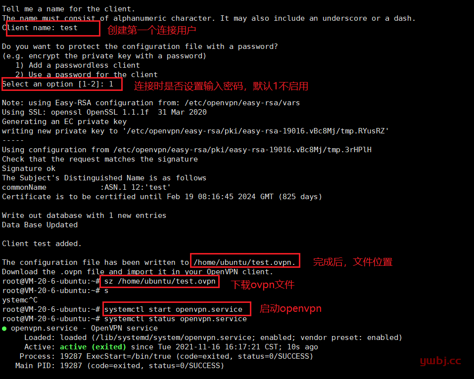
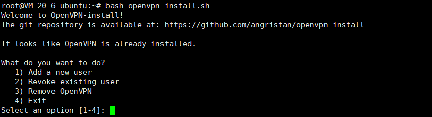
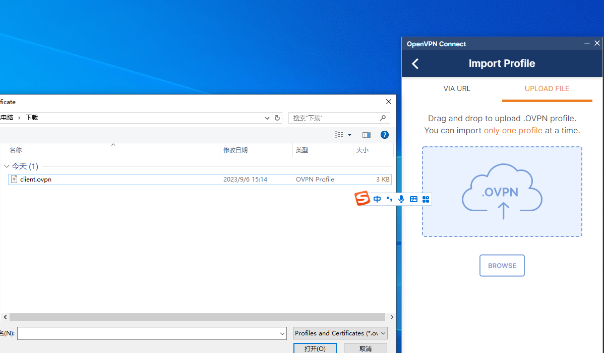

**安装教程**

```
推荐脚本
github脚本下载地址1：https://github.com/Nyr/openvpn-install
github脚本下载地址2：https://github.com/angristan/openvpn-install
参考文档 https://www.ywbj.cc/?p=663
```

```
#下载
curl -O https://raw.githubusercontent.com/angristan/openvpn-install/master/openvpn-install.sh
#添加执行权限
chmod +x openvpn-install.sh
#执行脚本
./openvpn-install.sh
```

or

```
#下载
git clone git@github.com:angristan/openvpn-install.git
#执行脚本
bash openvpn-install/openvpn-install.sh
```


 完成后，最后设置添加用户，添加完成后，请自行下载连接文件至需要连接的客户端中。



安装完安装完成，再次运行脚本，可选择 1)添加用户 2)移除已存在的用户 3)协助软件 4)退出



客户端连接

下载地址：[官方客户端下载](https://openvpn.net/vpn-client/)
安装完成后，导入文件

