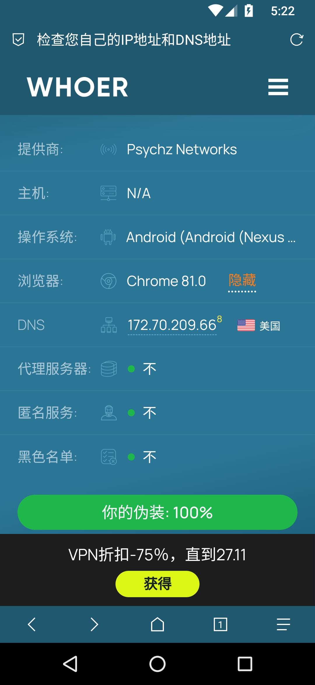

##### 前置条件

- 荣耀20
- VM OS Pro 破解版
- Android 7.1.2
- 代理方mojie.me

##### 步骤

1.在系统内安装Google Play

2.使用Google Play安装Tik Tok

3.系统美区处理

- 美区手机号，通过VM OS 的虚拟机设置将手机信息设置为了美区手机号
- 美区IP，代理为美国LA-优化2-GPT
- 美区语言，设置语言为英语，注意要把中文直接去掉
- 美区时区，设置时区为美区，需要调整和美区IP的时区一致，这里使用的洛杉矶时区
- 关闭位置信息

##### 检验

- 通过whoer.net

  

##### 问题

- 点击登录无任何反应,后使用APKPure下载,后使用新注册的谷歌邮箱注册Tik Tok账号登录

##### 账号

- 账号1

  ```
  username=yhotk01@gmail.com password=qazplm@98
  ```

- 账号2

  ```
  username=xxx@gmail.com password=xxx
  ```

- 账号3

  ```
  username=xxx@gmail.com password=xxx
  ```